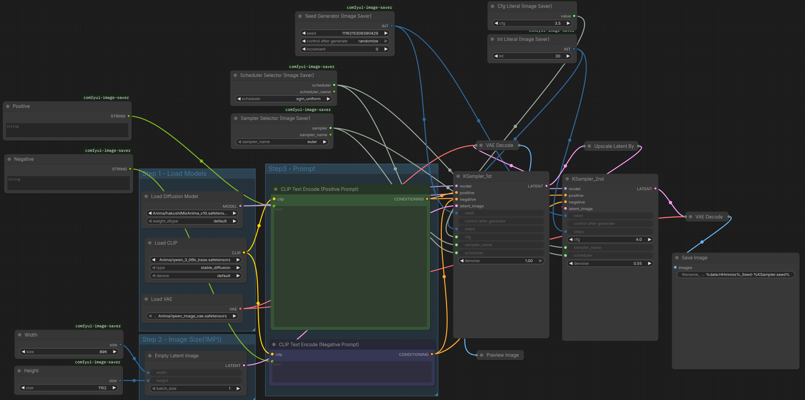

# Ranbell Image — インストールガイド

ハードウェア要件から初回スキャンまで、Ranbell Image の起動に必要なすべての手順を説明します。

---

## 目次

1. [ハードウェア要件](#1-ハードウェア要件)
2. [Ollama のセットアップ](#2-ollama-のセットアップ)
3. [WD14 タガーモデルのダウンロード](#3-wd14-タガーモデルのダウンロード)
4. [ComfyUI のセットアップ](#4-comfyui-のセットアップ)
5. [クローンと設定](#5-クローンと設定)
6. [アプリケーションの起動](#6-アプリケーションの起動)
7. [初回起動](#7-初回起動)
8. [トラブルシューティング](#8-トラブルシューティング)

---

## 1. ハードウェア要件

| コンポーネント | 最小構成 | 推奨構成 |
|---|---|---|
| GPU | NVIDIA、8GB VRAM* | NVIDIA、**16GB VRAM** |
| RAM | 16 GB | 32 GB |
| ストレージ | 20 GB 空き | SSD、50 GB+ 空き |
| OS | Linux（動作確認済み） | NVIDIA ドライバー導入済み Linux |

> \* 8GB VRAM は Ollama と ComfyUI を**別マシンで動かす場合のみ**実用的です。同一ホストですべてを動かす場合、実質的な最小 VRAM は 16GB です。
>
> **参考環境：** RTX 4060 Ti 16GB、同一ホストで Ollama（gemma4:e2b）と ComfyUI を実行。開発・テストはこの環境で行っています。
>
> 24GB+ VRAM がある場合、`gemma4:e4b` を使うとプロンプト錬成の品質が向上します。`qwen2.5-vl` も動作するとの報告がありますが、未テストです。

**ホストに必要なソフトウェア：**

- [Docker](https://docs.docker.com/get-docker/) + [Docker Compose](https://docs.docker.com/compose/install/) v2
- [NVIDIA Container Toolkit](https://docs.nvidia.com/datacenter/cloud-native/container-toolkit/install-guide.html)（Docker への GPU パススルー用）
- [Ollama](https://ollama.ai/)（ホスト上で動かします — Docker 内では動きません）
- [ComfyUI](https://github.com/comfyanonymous/ComfyUI)（ホスト上で動かします — Docker 内では動きません）

---

## 2. Ollama のセットアップ

Ranbell Image は埋め込み生成・視覚言語解析・プロンプト錬成・適合度スコアリングのすべてに Ollama を使用します。

**Ollama をインストール：** https://ollama.ai/ の手順に従ってください。

インストール後、必要なモデルをダウンロードします：

```bash
# 埋め込みモデル — セマンティック検索とインスパイアモードに使用
ollama pull embeddinggemma:300m

# 視覚言語モデル — プロンプト錬成・画像解析・適合度スコアリングに使用
ollama pull gemma4:e2b
```

> **モデルについて：**
> - `embeddinggemma:300m` は 768 次元のベクトルを生成します（約 1GB）
> - `gemma4:e2b` は VRAM 約 5GB を使用し、テキストと画像の両方を入力できます
> - 24GB+ VRAM 環境では `gemma4:e4b` がより高品質な錬成結果を出します
> - `qwen2.5-vl` も代替 VLM として使えますが、未テストです

Ollama が正常に動作しているか確認：

```bash
curl http://localhost:11434/api/tags
```

---

## 3. WD14 タガーモデルのダウンロード

**WD14 は必須です。** これがないと、タグ検索・アノマリー検出・プロンプト錬成の Danbooru 語彙が使えません。

Ranbell Image は HuggingFace の `SmilingWolf/wd-eva02-large-tagger-v3` モデルを使用します。

```bash
pip install huggingface_hub

huggingface-cli download SmilingWolf/wd-eva02-large-tagger-v3 \
  model.onnx selected_tags.csv \
  --local-dir /your/models/wd14
```

`/your/models/wd14` はモデルを保存したいディレクトリのパスに変更してください。このパスは次のステップで参照します。

> ダウンロードサイズは約 2.5 GB です。

---

## 4. ComfyUI のセットアップ

**ComfyUI は錬成（Synthesis）機能に必須です。**

https://github.com/comfyanonymous/ComfyUI の手順に従ってインストールしてください。

ComfyUI はホスト上でポート **8188** で動いている状態で Ranbell Image を起動してください。

### 基本ワークフローの作成

Ranbell Image はあなたの ComfyUI ワークフローにプロンプトを自動で注入します。**標準ノードのみ**を使った**どんなワークフローでも動作します**（カスタムノード不要）。

**プロンプト注入の仕組み：** Ranbell Image はワークフローのグラフを KSampler ノードから逆向きに辿り、ポジティブとネガティブの `CLIPTextEncode` ノードを自動で特定します。標準的なワークフローなら設定不要で動作します。

**ComfyUI で以下の標準ノードを使った最小構成ワークフローを作成してください：**

```
CheckpointLoaderSimple
    ↓ MODEL
KSampler ←── CLIPTextEncode（ポジティブプロンプト）
    ↑           ↑
    └── CLIP ───┘
         └────── CLIPTextEncode（ネガティブプロンプト）
    ↓ LATENT
VAEDecode
    ↓ IMAGE
SaveImage
```

1. ブラウザで ComfyUI を開く
2. 上記のワークフローを組む（またはデフォルトワークフローを読み込む）
3. **API フォーマットで書き出し：** メニュー → *Save (API Format)* → `.json` ファイルとして保存
4. 保存した `.json` ファイルをワークフローディレクトリに配置



> 生成された画像は ComfyUI の出力ディレクトリに保存されます。Ranbell Image が自動でインデックスに追加するため、このディレクトリを次のステップで `/mnt/image/generated` としてマウントします。

---

## 5. クローンと設定

```bash
git clone https://github.com/ranbell/ranbell_image.git
cd ranbell_image

cp docker-compose.override.yml.example docker-compose.override.yml
```

`docker-compose.override.yml` をテキストエディタで開いて設定します。

### 環境変数

| 変数名 | 説明 |
|---|---|
| `API_TOKEN` | 認証トークン。ブラウザが初回ロード時に自動取得するため手動設定不要。デフォルト: `RANBELL_IMAGE_API_TOKEN` |
| `OLLAMA_URL` | Ollama のURL（埋め込みは常にこちら）。デフォルト: `http://host.docker.internal:11434` |
| `EMBED_MODEL` | 埋め込みモデル名。デフォルト: `embeddinggemma:300m` |
| `VLM_MODEL` | テキスト / VLM モデル名。Ollama 時は `gemma4:e2b`、Bonsai 時は `bonsai` など |
| `LLM_PROVIDER` | `ollama`（既定）または `openai`（OpenAI 互換: Bonsai / llama.cpp など） |
| `OPENAI_BASE_URL` | OpenAI 互換サーバのベース URL。デフォルト: `http://host.docker.internal:8080/v1` |
| `OPENAI_API_KEY` | API キー（未検証サーバは任意文字列で可）。デフォルト: `not-needed` |
| `EMBED_DIM` | 埋め込みモデルの出力次元数。モデルと**必ず一致させること**。デフォルト: `768` |
| `EMBED_DIM_SMALL` | 高速プリフェッチ用の縮小次元数。デフォルト: `256` |
| `COMFYUI_URL` | ComfyUI のURL。デフォルト: `http://host.docker.internal:8188` |
| `WD14_MODEL_DIR` | コンテナ内の WD14 モデルのマウントパス。`/mnt/models/wd14` に設定 |

### ボリュームマウント

> ⚠️ **重要：** ソース画像ディレクトリには必ず `:ro`（読み取り専用）を付けてください。生成画像ディレクトリは書き込み可能にします（`:ro` を付けない）。**ソース画像と生成画像は必ず別ディレクトリ**に分けてください。

```yaml
volumes:
  # ソース画像ディレクトリ — サブディレクトリ名がアプリのフォルダラベルになる
  - /your/artworks:/mnt/image/source/artworks:ro
  - /your/photos:/mnt/image/source/photos:ro
  # 必要に応じてソースフォルダを追加

  # 生成画像の出力ディレクトリ — 書き込み可能、ソース画像とは別のフォルダに
  - /your/ai_output:/mnt/image/generated

  # ComfyUI ワークフロー JSON ファイル
  - /your/comfy_workflows:/mnt/comfy/workflows:ro

  # WD14 モデル
  - /your/models/wd14:/mnt/models/wd14:ro
```

---

## 6. アプリケーションの起動

**Option A — ghcr.io のビルド済みイメージを使う（最速）：**

```bash
docker compose pull
docker compose up -d
```

**Option B — ローカルでビルドする：**

```bash
docker compose up -d --build
```

3つのサービスがすべて起動したか確認します：

```bash
docker compose ps
# qdrant     running
# backend    running
# frontend   running
```

ブラウザで **http://localhost:3100** を開きます。

**初回起動時**、アプリが自動でセットアップ状態を確認し、未設定の項目があれば **管理 → 診断** タブを自動で開きます。診断タブでは以下を確認できます：

- Ollama 接続状況（埋め込み・AI 機能に必須）
- ComfyUI 接続状況（画像生成に必須）
- WD14 モデルファイルの有無（見つからない場合はダウンロードリンクを表示）
- INVOKE Vocab インポート状況（召喚機能に必須）
- ComfyUI ワークフロー件数

WD14 がインストール済みで Ollama に接続できる状態であれば、INVOKE Vocab のインポートが自動で開始されます。設定変更後は診断タブの **再チェック** ボタンで再確認できます。

### API トークンの設定

トークンは自動で設定されます。初回ページロード時にアプリがバックエンドからトークンを取得し、ブラウザのセッションストレージに保存します。手動での設定は不要です。

`docker-compose.override.yml` で `API_TOKEN` を変更した場合は、コンテナを再起動（`docker compose up -d`）してブラウザのタブを閉じ、再度開くと新しいトークンが自動で反映されます。

---

## 7. 初回起動

アプリを開いたら、以下の順番で操作してください：

### 1. 画像ディレクトリをスキャンする

ヘッダーの **SCAN** ボタンをクリックします。マウントした画像ファイルをすべて登録し、メタデータ（生成パラメーター・プロンプト・モデル名など）を抽出します。バックグラウンドで実行されます — コントロールルーム（`/` キー）で進捗を確認できます。

### 2. AI バックフィルを実行する（セマンティック検索に必須）

**Admin** パネル（歯車アイコン）を開く → AI バックフィルセクション → バックフィル開始。

これにより全画像のベクトル埋め込みが生成され、以下が使えるようになります：
- セマンティック検索
- すべてのインスパイアモード
- アナライザーの UMAP とタグネットワーク

処理時間はコレクションのサイズと GPU の速度に依存します。10,000 枚のコレクションで中程度の GPU なら 20〜60 分程度。

### 3. 適合度スコアリングを実行する（任意 — 時間があるときに）

**Admin** パネル → 適合度バックフィル。

VLM が各画像の生成プロンプトへの一致度（0〜1.0）を評価します。これは**最も時間のかかる処理**です — 大規模コレクションでは数時間かかることがあります。

コントロールルーム（`/` キー）からいつでも**キャンセル可能**で、後から再開できます。

### 4. INVOKE Vocab のインポート（召喚機能に必須）

Invoke（召喚）パネルはタグの意味検索に WD14 タグの埋め込みデータを必要とします。WD14 インストール済みかつ Ollama に接続できる状態であれば、**初回起動時に自動でインポートが開始**されます。

手動で実行する場合: **Admin** パネル → **診断** タブ → **インポート実行** ボタンをクリック。

インポートは WD14 タグ約 15,000 件を Ollama の埋め込みモデルで処理します。数分で完了し、コントロールルームのジョブキューに表示されます。実行は一度だけで構いません。

---

## 8. トラブルシューティング

**まず診断タブを確認してください**

**Admin** パネル（歯車アイコン）を開き、**診断** タブを選択してください。Ollama・ComfyUI・WD14 モデルファイル・INVOKE Vocab・ワークフローのすべてを一覧確認できます。変更後は **再チェック** ボタンで再確認できます。

**コンテナから Ollama に接続できない**

Ollama がホストで動いていること、`docker-compose.override.yml` の URL が正しいことを確認してください：
```yaml
OLLAMA_URL: http://host.docker.internal:11434
```
Linux では `host.docker.internal` は `docker-compose.yml` の `extra_hosts` 設定によりホストマシンに解決されます。これが機能しない場合は、ホストの実際の LAN IP アドレスを直接指定してみてください。

**コンテナ内で GPU が認識されない**

NVIDIA Container Toolkit がインストール・設定されているか確認してください：
```bash
docker run --rm --gpus all nvidia/cuda:12.0-base nvidia-smi
```
失敗する場合は [NVIDIA Container Toolkit インストールガイド](https://docs.nvidia.com/datacenter/cloud-native/container-toolkit/install-guide.html) を参照してください。

**WD14 モデルが読み込まれない**

以下を確認してください：
1. `WD14_MODEL_DIR: /mnt/models/wd14` が environment セクションにある
2. `- /your/models/wd14:/mnt/models/wd14:ro` ボリュームマウントがある
3. そのディレクトリに `model.onnx` と `selected_tags.csv` の両方がある

**ComfyUI ワークフローへのプロンプト注入が機能しない**

ワークフロー JSON が **API フォーマット**で書き出されているか確認してください（デフォルトの GUI フォーマットではなく）。ComfyUI のメニューから *Export (API)* を使って保存してください。API フォーマットではノード ID が辞書のキーとして含まれます。
