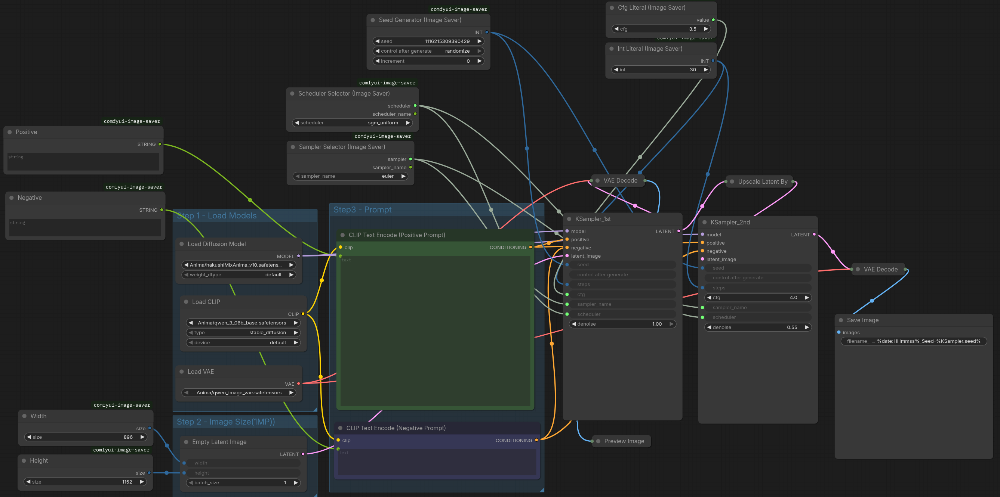

# Ranbell Image — Installation Guide

This guide walks you through every step needed to run Ranbell Image, from hardware requirements to first scan.

---

## Table of Contents

1. [Hardware Requirements](#1-hardware-requirements)
2. [Install Ollama](#2-install-ollama)
3. [Download WD14 Tagger Model](#3-download-wd14-tagger-model)
4. [Set Up ComfyUI](#4-set-up-comfyui)
5. [Clone and Configure](#5-clone-and-configure)
6. [Start the Application](#6-start-the-application)
7. [First Run](#7-first-run)
8. [Troubleshooting](#8-troubleshooting)

---

## 1. Hardware Requirements

| Component | Minimum | Recommended |
|---|---|---|
| GPU | NVIDIA, 8 GB VRAM* | NVIDIA, **16 GB VRAM** |
| RAM | 16 GB | 32 GB |
| Storage | 20 GB free | SSD, 50 GB+ free |
| OS | Linux (tested) | Linux with NVIDIA drivers |

> \* 8 GB VRAM is viable only if Ollama and ComfyUI run on a **separate dedicated machine**. When all services run on one host, 16 GB is the practical minimum.
>
> **Reference environment:** RTX 4060 Ti 16 GB, running Ollama (gemma4:e2b) and ComfyUI on the same host. This is the configuration the application has been developed and tested against.
>
> If you have 24 GB+ VRAM, `gemma4:e4b` gives noticeably better synthesis quality. `qwen2.5-vl` may also work but has not been tested.

**Required software on the host:**

- [Docker](https://docs.docker.com/get-docker/) + [Docker Compose](https://docs.docker.com/compose/install/) v2
- [NVIDIA Container Toolkit](https://docs.nvidia.com/datacenter/cloud-native/container-toolkit/install-guide.html) (for GPU passthrough into Docker)
- [Ollama](https://ollama.ai/) (runs on host, not in Docker)
- [ComfyUI](https://github.com/comfyanonymous/ComfyUI) (runs on host, not in Docker)

---

## 2. Install Ollama

Ranbell Image uses Ollama for all AI inference: generating image embeddings, vision-language analysis, prompt synthesis, and alignment scoring.

**Install Ollama** following the instructions at https://ollama.ai/

Then pull the required models:

```bash
# Embedding model — used for semantic search and inspire modes
ollama pull embeddinggemma:300m

# Vision-language model — used for prompt synthesis, image analysis, alignment scoring
ollama pull gemma4:e2b
```

> **Model notes:**
> - `embeddinggemma:300m` produces 768-dimensional vectors (~1 GB download)
> - `gemma4:e2b` requires ~5 GB VRAM and handles both text and image input
> - For 24 GB+ VRAM: `gemma4:e4b` gives better synthesis results
> - `qwen2.5-vl` may work as an alternative VLM but is untested

Verify Ollama is running and accessible:

```bash
curl http://localhost:11434/api/tags
```

---

## 3. Download WD14 Tagger Model

**WD14 is required.** Without it, tag-based search, anomaly detection, and the Danbooru vocabulary in prompt synthesis will not work.

Ranbell Image uses the `SmilingWolf/wd-eva02-large-tagger-v3` model from HuggingFace.

```bash
pip install huggingface_hub

huggingface-cli download SmilingWolf/wd-eva02-large-tagger-v3 \
  model.onnx selected_tags.csv \
  --local-dir /your/models/wd14
```

Replace `/your/models/wd14` with the directory where you want to store the model. You will reference this path in the next step.

> The download is approximately 2.5 GB.

---

## 4. Set Up ComfyUI

**ComfyUI is required** for the Synthesis feature (prompt-to-image generation).

Install ComfyUI following the instructions at https://github.com/comfyanonymous/ComfyUI

ComfyUI must be running on your host at port **8188** before starting Ranbell Image.

### Creating a Basic Workflow

Ranbell Image auto-injects prompts into your ComfyUI workflow. It works with **any standard workflow** — no custom nodes are required.

**How prompt injection works:** Ranbell Image traces the workflow graph from the KSampler node to automatically find the positive and negative `CLIPTextEncode` nodes. The text in those nodes is replaced with the synthesized prompt. No manual configuration is needed for standard workflows.

**Create a minimal workflow in ComfyUI using these standard nodes:**

```
CheckpointLoaderSimple
    ↓ MODEL
KSampler ←── CLIPTextEncode (positive prompt)
    ↑           ↑
    └── CLIP ───┘
         └────── CLIPTextEncode (negative prompt)
    ↓ LATENT
VAEDecode
    ↓ IMAGE
SaveImage
```

1. Open ComfyUI in your browser
2. Build the workflow above (or load the default workflow)
3. **Export as API format:** click the menu → *Save (API Format)* → this saves a `.json` file
4. Place the `.json` file in your ComfyUI workflows directory

<!-- TODO: Add screenshot here — docs/screenshots/comfyui_workflow.png -->
<!-- Please capture: the ComfyUI workflow graph showing CheckpointLoaderSimple, two CLIPTextEncode nodes, KSampler, VAEDecode, and SaveImage, with the connections clearly visible -->


> The generated images will be saved to ComfyUI's output directory. Mount this directory as `/mnt/image/generated` in `docker-compose.override.yml` (see next step) so Ranbell Image can index them automatically.

---

## 5. Clone and Configure

```bash
git clone https://github.com/ranbell/ranbell_image.git
cd ranbell_image

cp docker-compose.override.yml.example docker-compose.override.yml
```

Open `docker-compose.override.yml` in a text editor and configure it:

### Environment variables

| Variable | Description |
|---|---|
| `API_TOKEN` | Authentication token. The browser fetches this automatically on first load — no manual setup required. Default: `RANBELL_IMAGE_API_TOKEN` |
| `OLLAMA_URL` | URL of your Ollama instance. Default: `http://host.docker.internal:11434` |
| `EMBED_MODEL` | Embedding model name. Default: `embeddinggemma:300m` |
| `VLM_MODEL` | Vision-language model name. Default: `gemma4:e2b` |
| `EMBED_DIM` | Output dimension of the embedding model. Must match your model exactly. Default: `768` |
| `EMBED_DIM_SMALL` | Truncated dimension for fast prefetch search. Default: `256` |
| `COMFYUI_URL` | URL of your ComfyUI instance. Default: `http://host.docker.internal:8188` |
| `WD14_MODEL_DIR` | Mount path for WD14 model inside the container. Set to `/mnt/models/wd14` |

### Volume mounts

> ⚠️ **Critical:** source image directories must use `:ro` (read-only). The generated images directory must be writable (no `:ro`). Keep them in **separate directories** — Ranbell Image will scan everything under `/mnt/image/`.

```yaml
volumes:
  # Source image directories — the subdirectory name becomes the folder label in the app
  - /your/artworks:/mnt/image/source/artworks:ro
  - /your/photos:/mnt/image/source/photos:ro
  # Add as many source folders as needed

  # Generated images output — must be writable, separate from source images
  - /your/ai_output:/mnt/image/generated

  # ComfyUI workflow JSON files
  - /your/comfy_workflows:/mnt/comfy/workflows:ro

  # WD14 model
  - /your/models/wd14:/mnt/models/wd14:ro
```

---

## 6. Start the Application

**Option A — Use pre-built images from ghcr.io (fastest):**

```bash
docker compose pull
docker compose up -d
```

**Option B — Build locally:**

```bash
docker compose up -d --build
```

Wait for all three services to start:

```bash
docker compose ps
# qdrant     running
# backend    running
# frontend   running
```

Open **http://localhost:3100** in your browser.

### API Token

The token is configured automatically. On first page load, the app fetches the token from the backend and stores it in the browser's session storage — no manual setup required.

If you change `API_TOKEN` in `docker-compose.override.yml`, restart the containers (`docker compose up -d`) and close and reopen the browser tab. The new token will be picked up automatically.

---

## 7. First Run

After the application opens, perform these steps in order:

### 1. Scan your image directories

Click the **SCAN** button in the header. This registers all image files and extracts their metadata (generation parameters, prompts, model names). The scan runs in the background — watch progress in the Control Room (`/`).

### 2. Run AI backfill (required for semantic search)

Open the **Admin** panel (gear icon) → find the AI Backfill section → start the backfill.

This generates vector embeddings for every image, enabling:
- Semantic search
- All Inspire modes
- Analyzer UMAP and tag network

Time depends on collection size and GPU speed. A collection of 10,000 images typically takes 20–60 minutes on a mid-range GPU.

### 3. Run Alignment scoring (optional — run when you have time)

Open the **Admin** panel → Alignment Backfill.

This uses the VLM to score how well each image matches its generation prompt, producing a quality metric (0–1.0) you can filter by. It is **the most time-consuming operation** — plan for several hours on a large collection.

You can **cancel at any time** from the Control Room (`/` shortcut) and resume later. There is no data loss if cancelled mid-run.

---

## 8. Troubleshooting

**Ollama is unreachable from the container**

Ensure Ollama is running on your host and the URL in `docker-compose.override.yml` is correct:
```yaml
OLLAMA_URL: http://host.docker.internal:11434
```
On Linux, `host.docker.internal` resolves to the host machine via the `extra_hosts` entry in `docker-compose.yml`. If this does not work, try using your host's actual LAN IP address.

**GPU is not detected inside the container**

Verify that NVIDIA Container Toolkit is installed and configured:
```bash
docker run --rm --gpus all nvidia/cuda:12.0-base nvidia-smi
```
If this fails, follow the [NVIDIA Container Toolkit installation guide](https://docs.nvidia.com/datacenter/cloud-native/container-toolkit/install-guide.html).

**WD14 model is not loading**

Check that:
1. `WD14_MODEL_DIR: /mnt/models/wd14` is set in the environment section
2. The volume mount `- /your/models/wd14:/mnt/models/wd14:ro` is present
3. The directory contains both `model.onnx` and `selected_tags.csv`

**ComfyUI workflow prompt injection is not working**

Ensure your workflow JSON was exported in **API format** (not the default GUI format). In ComfyUI, use the menu to *Export (API)*. The API format contains node IDs as dictionary keys; the GUI format does not.
