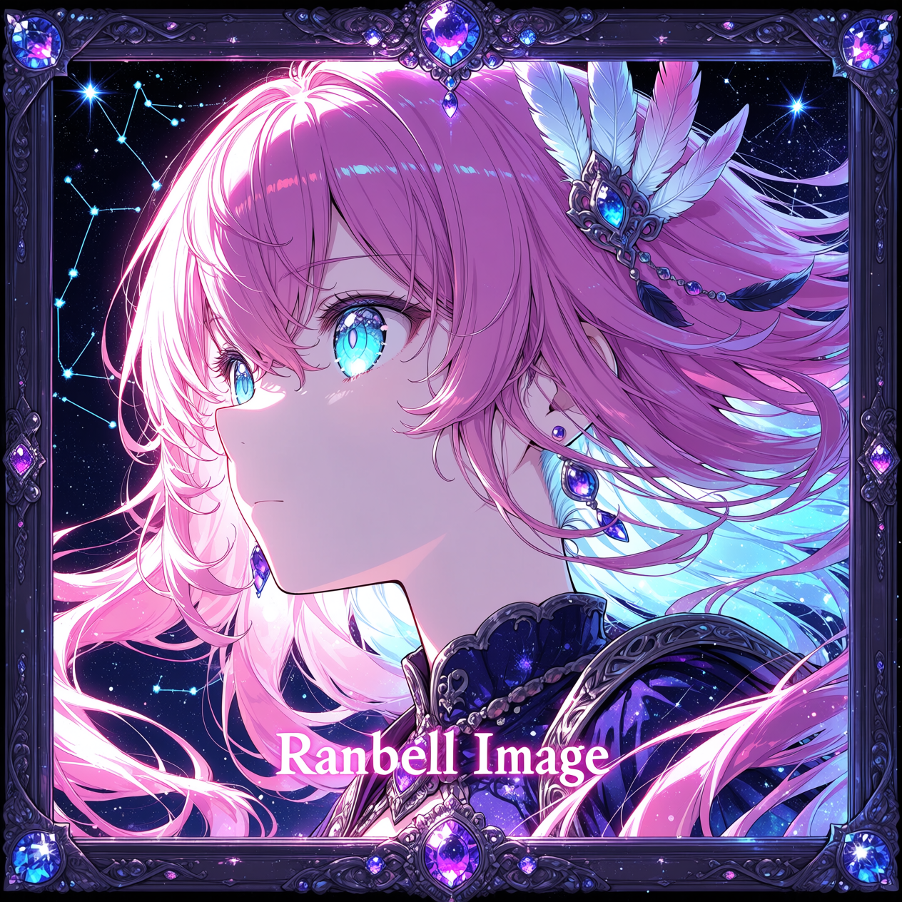
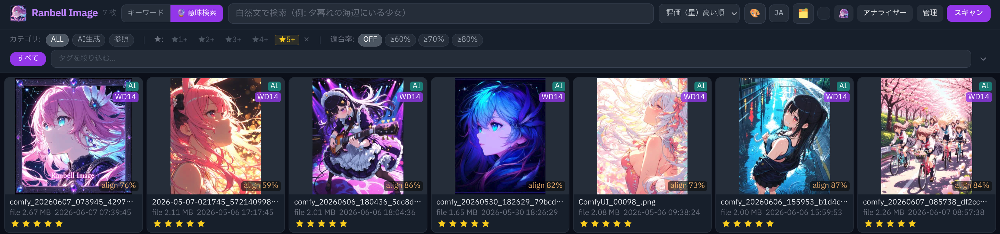
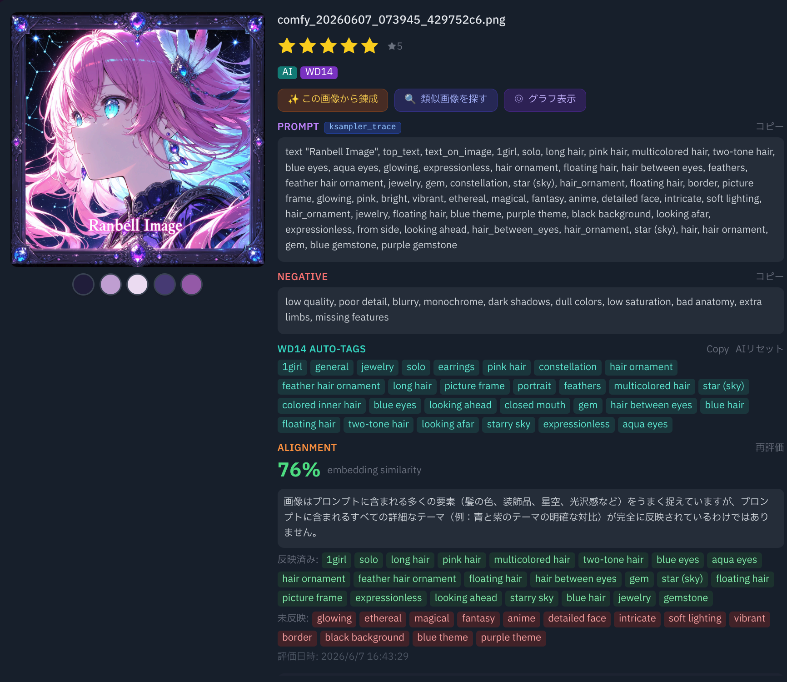
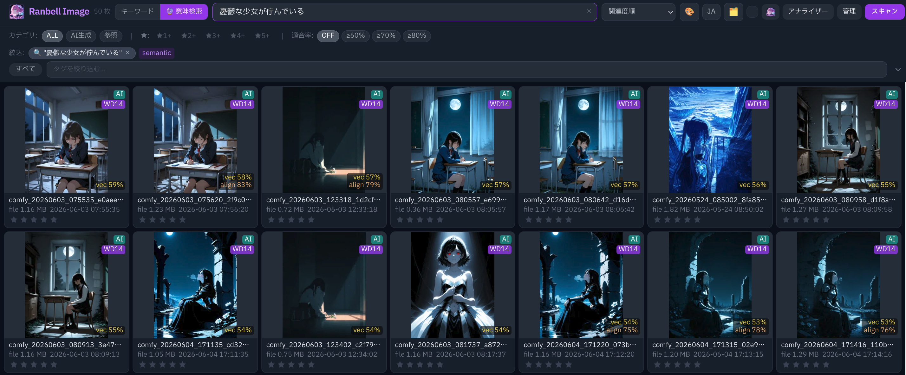
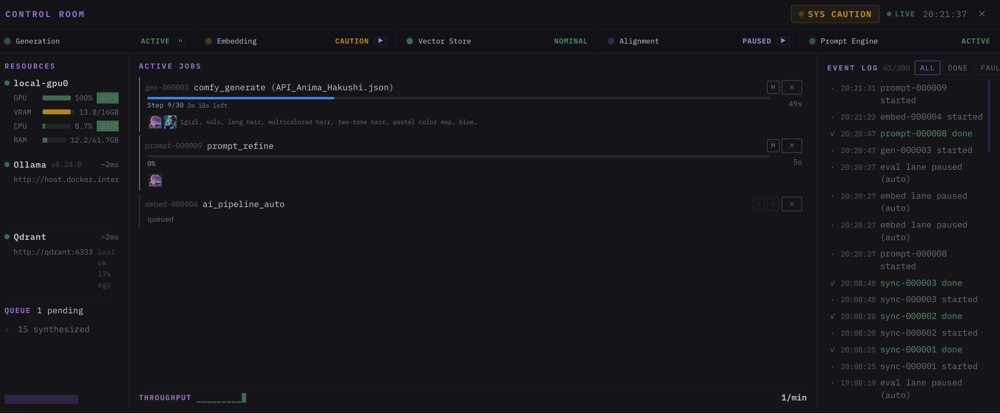
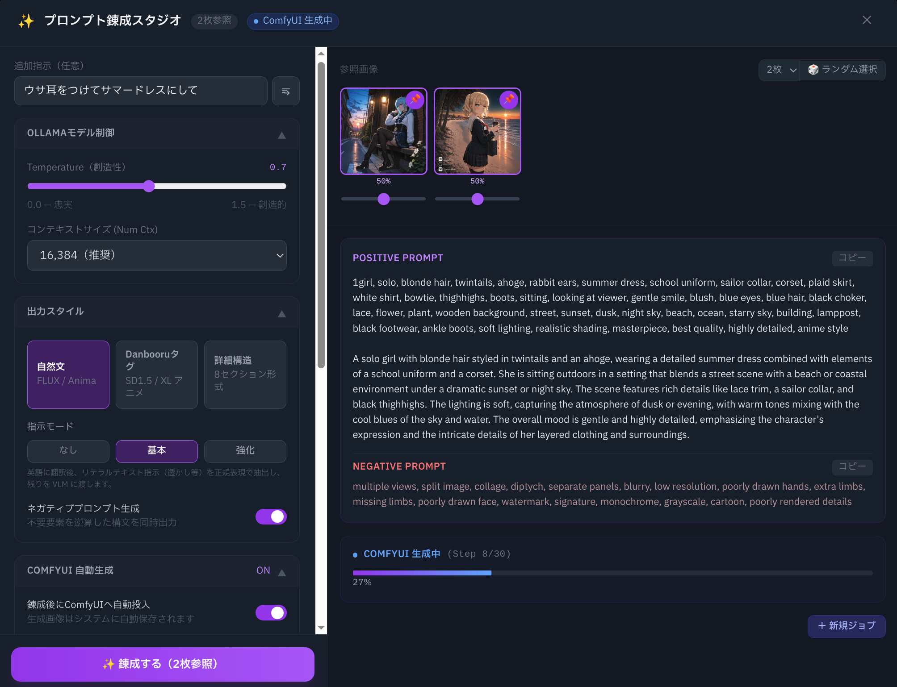
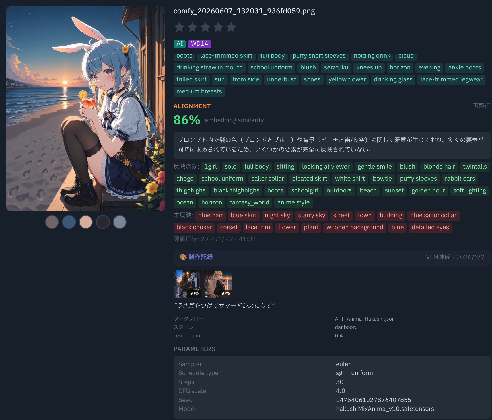
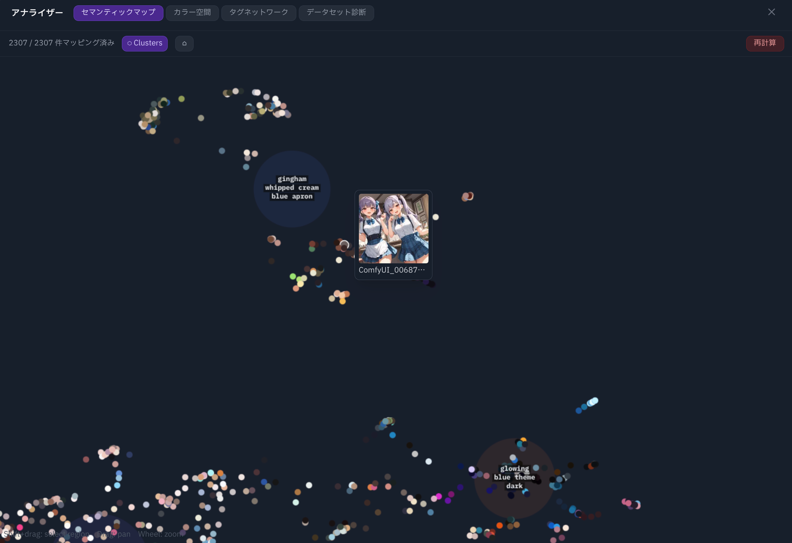
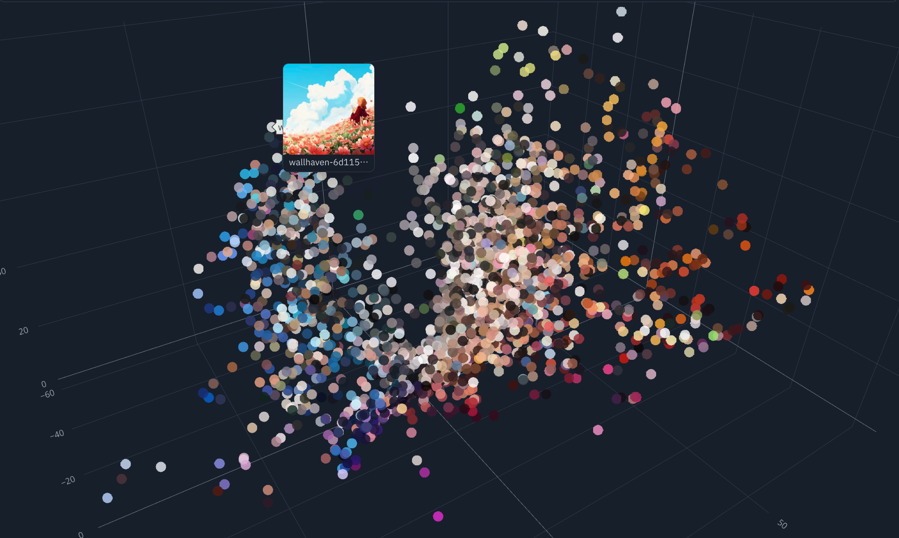

<div align="center">



# Ranbell Image

**ローカル AI 画像スタジオ — 意味で探し、感覚で錬成する。**

[](https://github.com/ranbell/ranbell_image/releases)
[](LICENSE)
[](docker-compose.yml)
[](https://github.com/ranbell/ranbell_image/pkgs/container/ranbell-image-backend)
[](https://qdrant.tech/)
[](https://ollama.ai/)
[](https://github.com/comfyanonymous/ComfyUI)
[](https://huggingface.co/SmilingWolf)

**English version → [README.md](README.md)**

</div>

---



---

## Ranbell Image とは

「ファイル名ではなく、雰囲気で画像を探せたら」という思いつきから始まりました。

[Qdrant](https://qdrant.tech/) というベクターデータベースに出会い、セマンティック検索の可能性を知ったとき、検索だけではなく色々できるかも？と感じました。最初は検索の実験でしかなかったものが、機能を重ねるうちに、AI 画像クリエイターのための創作スタジオになりました。

Ranbell Image は**完全ローカル動作**のアプリケーションです。画像はあなたのマシンの外に出ません。

> *このアプリは [Claude](https://claude.ai)（Anthropic）との緊密な共同作業によって設計・実装されました。アーキテクチャの決定から機能設計、すべてのコードに至るまで、その協働から生まれています。ドメイン知識を持つ人間と、それを実装できる AI が組み合わさったときに何が生まれるか、その一例です。*

---

## 主な機能

### 🔍 探索 — なんとなくの雰囲気で検索

すべての画像は [Ollama](https://ollama.ai/) による埋め込みベクターとして Qdrant に格納されます。検索は意味のレベルで機能します。

- **セマンティック検索** — `「憂鬱な少女が佇んでいる」` と自然言語で入力すると、そういう雰囲気の画像を見つけてきます
- **キーワード検索** — プロンプト・説明・モデル名の全文検索
- **タグ検索** — [WD14](https://huggingface.co/SmilingWolf) が全画像を 1,000 以上の Danbooru カテゴリで自動タグ付け。AND/OR 絞り込みとオートコンプリート対応
- **カラー検索** — Hex カラーを指定すると CIE L\*a\*b\* 空間での知覚的に正確なカラーマッチング。反対色の除外オプション付き
- **フィルターの組み合わせ** — セマンティック + タグ + カラー + 評価 + 適合度スコアを同時に使用可能


---

### 🎛️ コントロールルーム — すべてのジョブの指令センター

`/` キーまたは上部ボタンでコントロールルームを開きます。

スキャン・埋め込み生成・プロンプト錬成・画像生成のすべてがジョブとして管理されます。

- 個々のジョブのキャンセル・一時停止・再開・並び替え
- レーン単位の一時停止（SYNC / EMBED / EVAL / GEN）
- ISA-101 スタイルのステータスランプ（Qdrant・Ollama・ComfyUI・GPU）
- 全ジョブ履歴を一元管理



---

### ⚗️ 錬成 — プロンプト錬金術スタジオ

参照画像を 1〜6 枚選び、短い指示を書くだけで、VLM がプロンプトを生成します。

**例：** キャラクター画像を 2 枚ピン留めして *「ウサ耳をつけてサマードレスにして」* と書くだけ。WD14 が参照画像から視覚的な語彙を抽出し、Ollama が正確なプロンプトを合成します。

モデルに合わせた出力スタイルを選択できます：

| スタイル | 例 | 向いているモデル |
|---|---|---|
| **Danbooru** | `rabbit_ears, 1girl, summer_dress, outdoors` | タグ学習モデル（SD 1.5、SDXL、Pony） |
| **自然言語** | `A girl with rabbit ears in a summer dress, standing in a garden` | NL 優先モデル（FLUX、Anima） |
| **ハイブリッド** | `rabbit_ears, 1girl \| standing in a garden, warm afternoon light` | 両方のモデルファミリー |

- ComfyUI ワンクリック送信（ワークフローへのプロンプト注入を自動化）
- ストリーミング出力（生成過程のトークンをリアルタイムで表示）
- 適合度スコアリング（VLM が画像とプロンプトの一致度を 0〜1.0 で評価）




---

### ✨ インスパイア — 9 つの探索モード

| モード | 何を使うか | 向いている用途 |
|---|---|---|
| **セレンディピティ** | Qdrant ベクター検索 | 「似てるけど違う何か」を見つける |
| **錬金術** | Qdrant ベクター演算（A + B − C） | 「この構図＋あの色合い−都会っぽさ」 |
| **モーフ** | Qdrant LERP（5 段階） | A と B の間にある美意識を見る |
| **アノマリー** | WD14 タグ共起分析 | 珍しい組み合わせから知的な発見を |
| **インバージョン** | Qdrant + VLM（Ollama） | 昼↔夜・明↔暗など対極の世界を探す |
| **ディスカバリー** | Qdrant DiscoverQuery | 「この画像の対極は何か？」 |
| **ブレンド** | Qdrant 加重重心 | 複数の雰囲気を割合を指定して混ぜる |
| **アウトライアー** | Qdrant + UMAP 密度 | コレクション内で最も孤立した画像を探す |
| **グループ検索** | Qdrant GroupBy | モデル・カテゴリ別に結果をグルーピング |

**→ [詳細技術リファレンス: docs/tech/inspire-brainstorm.ja.md](docs/tech/inspire-brainstorm.ja.md)**


---

### 📊 アナライズ — コレクション全体を俯瞰する

**セマンティックマップ（UMAP）**
768 次元の埋め込みを 2D 散布図に圧縮。近い作品は近くに配置されます。K-means でクラスターを自動検出。ポイントをホバーするとサムネイルを表示。クリックで検索。

**カラー 3D**
各画像の支配色を CIE L\*a\*b\* 3 次元空間にプロット。回転して見ることで、自分のカラーパレットの偏りが一目でわかります。

**タグネットワーク**
タグを節点、共起を辺とする力指向グラフ。密集したクラスターが自分の「視覚的な語彙」を示します。ノードをクリックすると検索に移動。




---

## クイックスタート

**前提条件:** Docker + Docker Compose v2、NVIDIA GPU（16GB VRAM 推奨）

```bash
git clone https://github.com/ranbell/ranbell_image.git
cd ranbell_image

cp docker-compose.override.yml.example docker-compose.override.yml
# docker-compose.override.yml を編集（下記参照）
```

> ⚠️ **起動前に `docker-compose.override.yml` を必ず編集してください：**
>
> - 元画像フォルダ: `/mnt/image/source/<ラベル名>` として `:ro`（読み取り専用）でマウント。`<ラベル名>` がアプリ内のフォルダ表示名になります。
> - 生成画像フォルダ: `/mnt/image/generated` として **`:ro` なし**（書き込み可）でマウント。元画像フォルダとは必ず別ディレクトリにしてください。

```bash
# ghcr.io のビルド済みイメージを使う（推奨）
docker compose pull && docker compose up -d

# またはローカルビルド
docker compose up -d --build
```

ブラウザで **http://localhost:3100** を開きます。

**初回起動後:** ヘッダーの **SCAN** ボタンをクリックし、その後 **Admin** パネルから AI バックフィルを実行してセマンティック検索を有効化します。詳細は [INSTALLATION.ja.md](INSTALLATION.ja.md) を参照してください。

---

## 感謝

**[Qdrant](https://qdrant.tech/)** — このプロジェクト全体がQdrantによって存在しています。セマンティックベクター検索をこれほど優雅に扱えるものに初めて出会ったとき、これで何か作らなければという気持ちになりました。「意味で画像を検索できたら」という思いつきが、今あなたが見ているすべてになりました。Qdrant チームに心より感謝します。

**[Ollama](https://ollama.ai/)** — ローカルで動く LLM/VLM 推論の決定版。Ranbell Image のすべての埋め込み生成・画像解析・プロンプト錬成・適合度評価は Ollama を通じて流れています。

**[WD14 Tagger — SmilingWolf](https://huggingface.co/SmilingWolf)** — EVA02-large モデルは大規模な Danbooru タグ予測を驚くほどの精度で行います。タグ検索・アノマリー検出・プロンプト錬成の Danbooru 語彙の根幹を担っています。

**[ComfyUI](https://github.com/comfyanonymous/ComfyUI)** — 最も柔軟な画像生成環境。Ranbell Image は ComfyUI の HTTP API を通じてインスパイア→錬成→生成→コレクションへの還流というクリエイティブループを完結させます。

**[UMAP](https://umap-learn.readthedocs.io/)** — 768 次元の埋め込みを操作可能な 2D マップに変換する技術は、本当に驚異的です。

---

## ライセンス

[MIT License](LICENSE)
