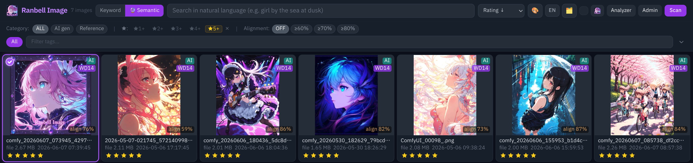
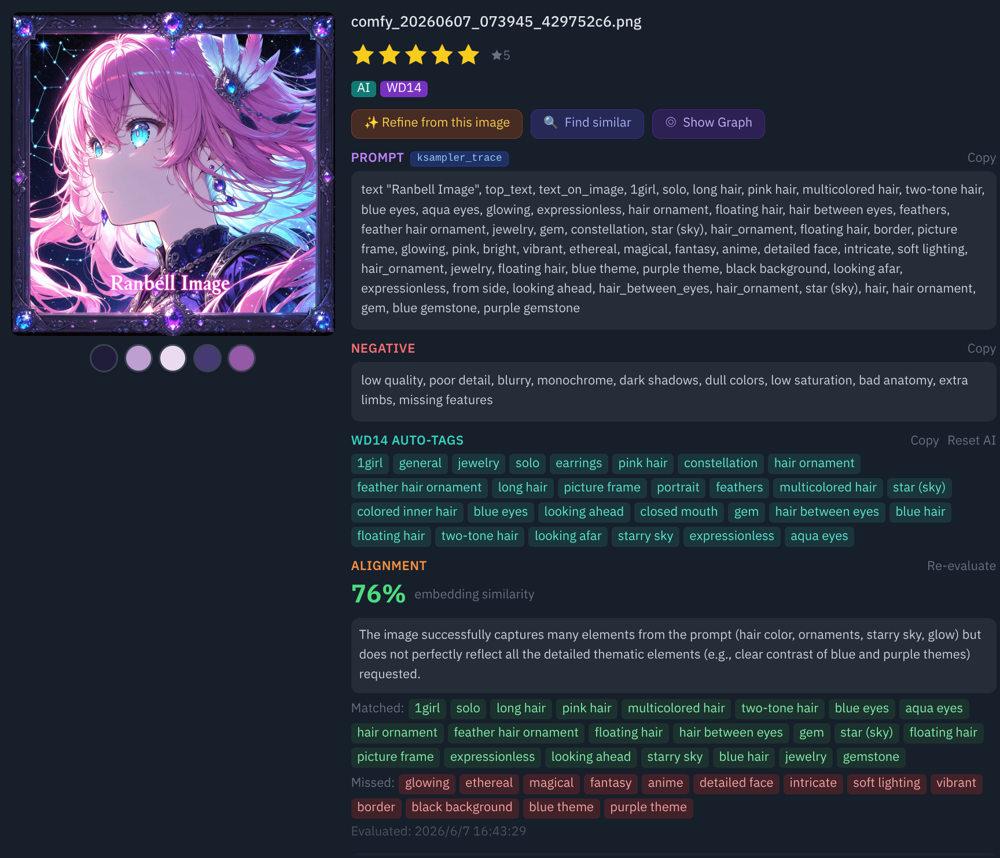
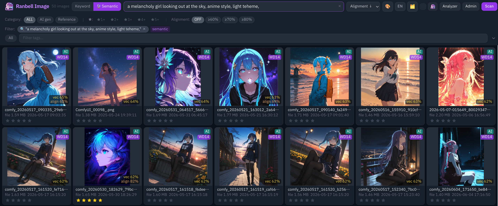
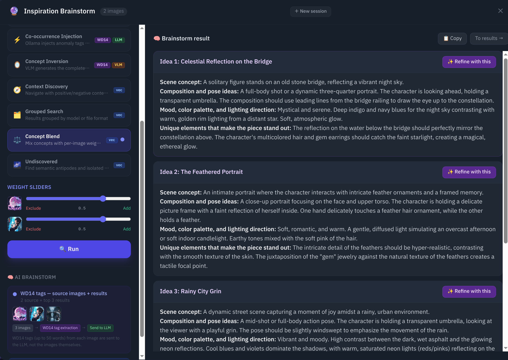
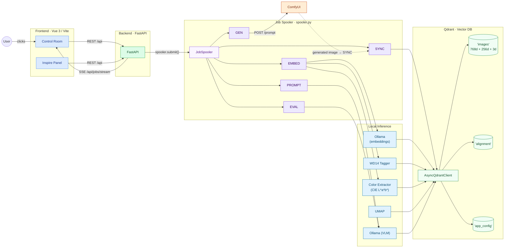
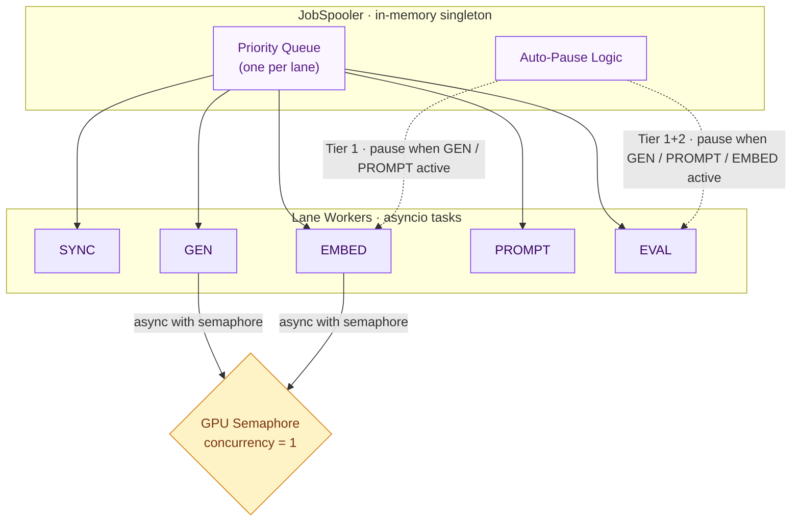

<div align="center">


# Ranbell Image

**Local AI image Studio — discover by meaning, synthesize by instinct.**

[](https://github.com/ranbell/ranbell_image/releases)
[](LICENSE)
[](docker-compose.yml)
[](https://github.com/ranbell/ranbell_image/pkgs/container/ranbell-image-backend)
[](https://qdrant.tech/)
[](https://ollama.ai/)
[](https://github.com/comfyanonymous/ComfyUI)
[](https://huggingface.co/SmilingWolf)

**日本語版はこちら → [README.ja.md](README.ja.md)**

</div>

---



---

## What is Ranbell Image?

It started with a single question: *"What if I could search my image collection by meaning instead of filename?"*

After discovering [Qdrant](https://qdrant.tech/) — a vector database that makes semantic similarity feel effortless — I had to build something with it. What began as a search experiment grew, feature by feature, into a full creative pipeline for artists and AI image creators.

Ranbell Image is a **self-hosted, local-first** application that turns your image collection into a living, searchable, navigable space. It runs entirely on your machine. Your images never leave your system.

> *This application was designed and built in close collaboration with [Claude](https://claude.ai) (Anthropic). Architecture decisions, feature design, and every line of code emerged from that collaboration — a real example of what becomes possible when domain knowledge meets AI that can build.*


---

## Features

### 🔍 Discover — Search Beyond Filenames



Your images are indexed as **semantic vectors** (via [Ollama](https://ollama.ai/) embeddings stored in Qdrant). Search works at the level of meaning, not metadata.

Under the hood, Ranbell Image uses **Matryoshka Representation Learning (MRL)** — a technique where a single 768-dimensional embedding also encodes valid lower-dimensional representations nested inside it. A compact 256-dim prefix is used for fast approximate prefetch across the entire collection, and the full 768-dim vector is used to rerank the candidates precisely. Like the nested dolls it's named after, more detail lives within the same structure.

- **Semantic search** — type `"a melancholy girl looking out at the rain"` and find images that *feel* like that, regardless of what their files are named or tagged
- **Keyword search** — full-text search across prompts, descriptions, and model names
- **Tag search** — [WD14](https://huggingface.co/SmilingWolf) automatically tags every image with 1000+ Danbooru categories; filter with AND/OR logic, autocomplete supported
- **Color search** — pick any hex color; images are indexed in CIE L\*a\*b\* space for perceptually accurate matching; optionally exclude opposite hues
- **All filters compose** — combine semantic + tags + color + rating + alignment score simultaneously

---

### 🎛️ Control Room — Command Center for All Jobs


Press `/` or click the top-bar button to open the Control Room.

Every background operation in Ranbell Image — scanning, embedding generation, prompt synthesis, image generation — runs as a **job** with live status. The Control Room gives you full command:

- **Cancel, pause, resume, or reorder** any individual job
- **Pause entire lanes**: SYNC (scanning), EMBED (embedding), EVAL (alignment), GEN (generation)
  — useful for prioritizing GPU time when generating images
- **ISA-101 style status lamps** showing real-time health of Qdrant, Ollama, ComfyUI, and GPU
- All job history in one place — no hunting through logs

---

### ⚗️ Synthesis — Prompt Alchemy Studio


Select 1–6 reference images, write a short instruction, and let the VLM synthesize a new prompt that blends your references with your intent.

**Example:** pin three images of a character and write *"add bunny ears and a summer dress"* — the studio extracts the visual vocabulary from your references via WD14, then uses Ollama to generate a precise, ready-to-use prompt.

Choose your output style to match your model:

| Style | Example output | Best for |
|---|---|---|
| **Danbooru** | `rabbit_ears, 1girl, summer_dress, outdoors, smile` | Tag-trained models (SD 1.5, SDXL, Pony) |
| **Natural language** | `A girl with rabbit ears wearing a white summer dress, standing in a sunlit garden` | NL-first models (FLUX, Anima) |
| **Hybrid** | `rabbit_ears, 1girl, summer_dress \| standing in a sunlit garden, warm afternoon light` | Both model families |

- **One-click ComfyUI submit** — the synthesized prompt is auto-injected into your workflow and queued for generation
- **Streaming output** — watch the prompt form in real time, including the model's chain-of-thought
- **Alignment scoring** — after generation, the VLM grades how well the produced image matches the prompt (0–100%)

> 📖 [Creator's Guide — Prompt Alchemy](docs/guide/prompt-alchemy.md) · [Technical Reference](docs/tech/prompt-alchemy.md)

---

### ✨ Inspire — 9 Creative Exploration Modes



When you know the vibe but not the destination, the Inspire panel helps you navigate your collection in ways that go far beyond search.

> 📖 [Creator's Guide — Inspire & Brainstorm](docs/guide/inspire-brainstorm.md) · [Technical Reference](docs/tech/inspire-brainstorm.md)

| Mode | You provide | Engine | Best for |
|---|---|---|---|
| **Serendipity** | 1 reference image | Qdrant (vector search) | Discovering what's nearby — similar but not identical |
| **Alchemy** | Add images + subtract images | Qdrant (A + B − C vector arithmetic) | "The composition of this, the color palette of that, minus the noise" |
| **Morph** | 2 images | Qdrant (LERP, 5 steps) | Visualizing the spectrum between two aesthetics |
| **Anomaly** | 1–3 images | WD14 tag co-occurrence analysis | Finding images with unusual, rare tag combinations |
| **Inversion** | 1 image + axis | Qdrant + VLM (Ollama) | Generating the semantic opposite (day↔night, happy↔melancholy, etc.) |
| **Discovery** | 1 image | Qdrant (DiscoverQuery contrast) | "What is the anti-image of this?" |
| **Blend** | 2–4 images + weights | Qdrant (weighted centroid) | Mixing moods with precise control |
| **Outlier** | (none) | Qdrant + UMAP density | Surfacing the truly unique images in your collection |
| **Group Search** | text query | Qdrant (GroupBy) | Comparing how different models or categories interpret the same query |

**Serendipity** finds images in the sweet spot between "too similar" and "too different" — useful for breaking creative ruts.

**Alchemy** performs actual vector arithmetic on your image embeddings. Add the soft lighting of one image, subtract the urban setting of another, and find images in your collection that match that combination.

**Morph** shows you the five images that form a gradient from image A to image B in embedding space — great for discovering transition aesthetics.

**Anomaly** uses WD14 tag co-occurrence to find images with rare or unusual element combinations — the images your intuition wouldn't have reached.

**Inversion** uses the VLM to understand which semantic axis to negate (visual brightness, time of day, emotional tone, clothing, location, and more), then finds images at the opposite end of that axis in your collection.

**Outlier** identifies the most isolated points in your semantic map — the images furthest from everything else. Often the most unique or experimental work you've made.

---

### 📊 Analyze — See Your Collection as a Whole


Three visualizations that show your collection from angles you've never seen before:

**Semantic Map (UMAP)**
All images projected from 768 dimensions to a 2D scatter plot. Similar images cluster together. K-means clustering auto-labels groups and identifies their dominant tags. Hover any point to see the thumbnail. Click to search.

**Color 3D**
Every image plotted in three-dimensional L\*a\*b\* color space by its dominant color. Rotate the plot to see the palette distribution of your entire collection — which hues you gravitate toward, which are missing.

**Tag Network**
A force-directed graph where nodes are tags and edges represent co-occurrence. Dense clusters reveal the visual vocabulary at the heart of your collection. Sparse nodes are outliers. Click any tag to search.

---

## Documentation

Two entry points for each major feature — pick whichever matches your goal:

| Feature | I want to use it | I want to understand how it works |
|---|---|---|
| **Inspire & Brainstorm** | [Creator's Guide →](docs/guide/inspire-brainstorm.md) | [Technical Reference →](docs/tech/inspire-brainstorm.md) |
| **Prompt Alchemy** | [Creator's Guide →](docs/guide/prompt-alchemy.md) | [Technical Reference →](docs/tech/prompt-alchemy.md) |

The **Creator's Guides** explain what each mode does, when to use it, and how inputs map to outputs — with diagrams, no implementation details.

The **Technical References** cover the full algorithm specifications: pseudocode, mathematical foundations (L2 normalization, iterative normalization, LERP, sign inversion), Qdrant query patterns (DiscoverQuery, GroupBy, MRL two-phase), and the VLM 3-stage pipeline.

Additional reference: 
- [Qdrant collection design →](docs/tech/qdrant.md) 
- [Job Spooler & Task Scheduling →](docs/tech/spooler.md)

---

## Quick Start

**Prerequisites:** Docker + Docker Compose v2, NVIDIA GPU (16GB VRAM recommended)

```bash
git clone https://github.com/ranbell/ranbell_image.git
cd ranbell_image

# Configure your environment
cp docker-compose.override.yml.example docker-compose.override.yml
# Edit docker-compose.override.yml — see the note below
```

> ⚠️ **Important — edit `docker-compose.override.yml` before starting:**
>
> - Source image folders: mount each as `/mnt/image/source/<label>` with `:ro` (read-only).
>   The `<label>` name becomes the folder label shown in the app.
> - Output folder (for generated images): mount as `/mnt/image/generated` — **without** `:ro`, writable.
>   Keep this separate from your source image directories.

```bash
# Start using pre-built images from ghcr.io
docker compose pull && docker compose up -d

# — or build locally —
docker compose up -d --build
```

Open **http://localhost:3100** in your browser.

**First run:** click **SCAN** in the header, then open the **Admin** panel to run AI backfill (generates embeddings for semantic search). See [INSTALLATION.md](INSTALLATION.md) for the full setup guide.

---

## Detailed Installation

For complete setup instructions including Ollama, WD14 tagger, and ComfyUI workflow configuration, see **[INSTALLATION.md](INSTALLATION.md)**.

---

## Built on the Shoulders of Giants

**[Qdrant](https://qdrant.tech/)** — This entire project exists because of Qdrant.
The moment I discovered how elegantly it handles semantic vector search at scale, I knew I had to build something with it. What started as "can I search my images by meaning?" became everything you see here. Thank you, Qdrant team, for building something so powerful and so approachable.

**[Ollama](https://ollama.ai/)** — Local LLM and VLM inference that simply works.
Every embedding, every image analysis, every synthesized prompt, and every alignment score in Ranbell Image flows through Ollama. Running it locally means zero data leaves your machine.

**[WD14 Tagger — SmilingWolf](https://huggingface.co/SmilingWolf)** — The EVA02-large model delivers surprisingly accurate Danbooru tag prediction at scale. It forms the backbone of tag-based search, anomaly detection, and the danbooru vocabulary in prompt synthesis.

**[ComfyUI](https://github.com/comfyanonymous/ComfyUI)** — The most flexible image generation environment available. Ranbell Image integrates via ComfyUI's HTTP API to close the creative loop: inspiration → synthesis → generation → back into the collection.

**[UMAP](https://umap-learn.readthedocs.io/)** — Turning 768-dimensional embeddings into a navigable 2D map of an entire image collection is genuinely remarkable. Thank you.

---

## Architecture

### System Overview



### Job Orchestration



---

## Japanese Documentation

詳しい日本語の説明は **[README.ja.md](README.ja.md)** をご覧ください。

---

## Disclaimer

This project was built for personal use. No guarantees of correctness, stability, or security are made. Issues and pull requests are welcome, though response time depends on availability.

---

## License

[MIT License](LICENSE)
