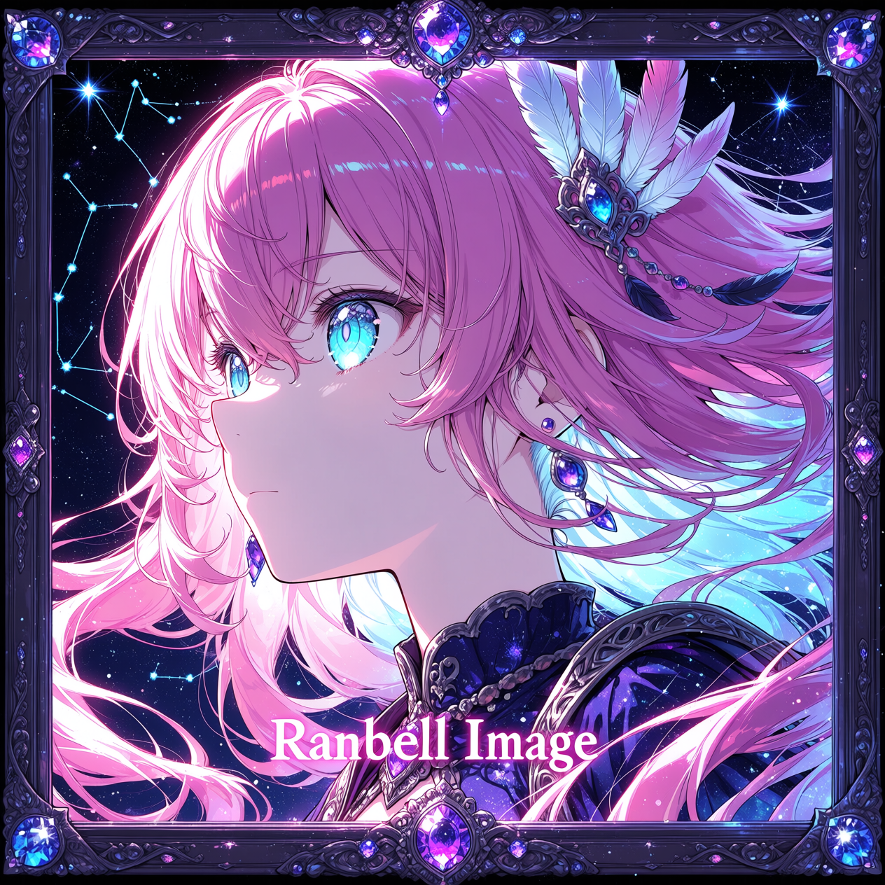

# Ranbell Image

**Local AI image studio — discover by meaning, synthesize by instinct.**


**日本語版はこちら → [README.ja.md](README.ja.md)**


---

## 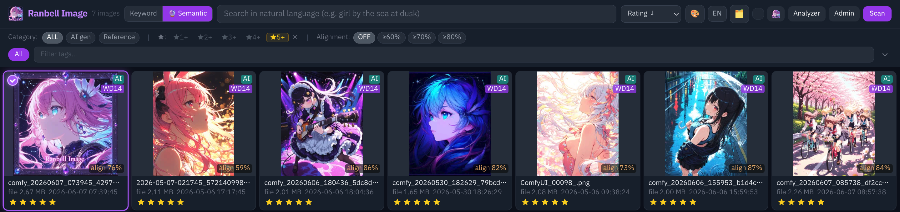
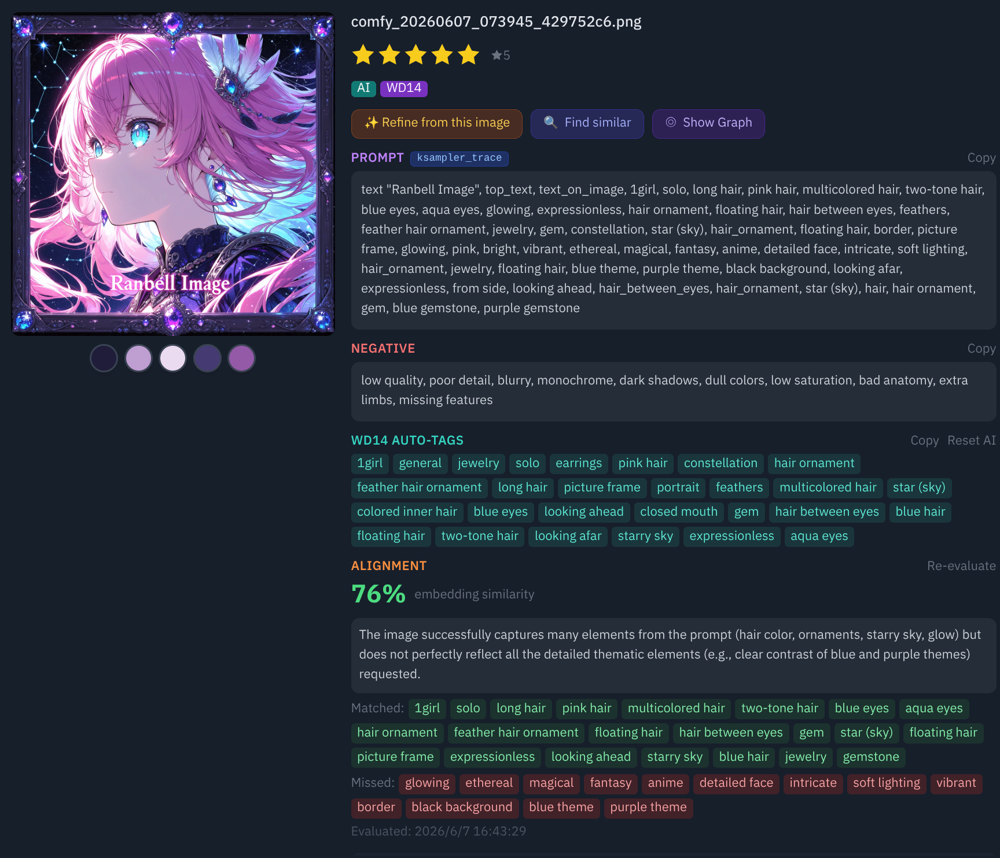


## What is Ranbell Image?

It started with a single question: *"What if I could search my images by mood, not by filename?"*

After discovering [Qdrant](https://qdrant.tech/) and what semantic search could do, it felt like there was more here than search. What began as an experiment grew, feature by feature, into a studio for AI image creators.

Ranbell Image is a **fully local** application. Your images never leave the machine.

> *This application was designed and built in close collaboration with [Claude](https://claude.ai) (Anthropic). Architecture decisions, feature design, and every line of code emerged from that collaboration — a real example of what becomes possible when domain knowledge meets AI that can build.*

---


## Features


### 🎬 Muse — Shoot a picture by talking

You don't write a prompt. **You direct**, as the showrunner.

Start by picking one or two of 30 Muses (actresses).

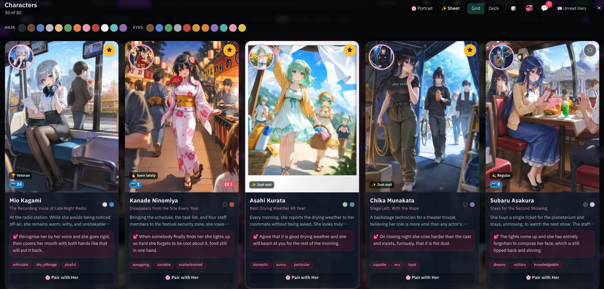

Say "walk down the park path chatting with each other" and the actress (and, if you called a crew, the crew) writes that state into a ledger, then turns it into an image prompt.

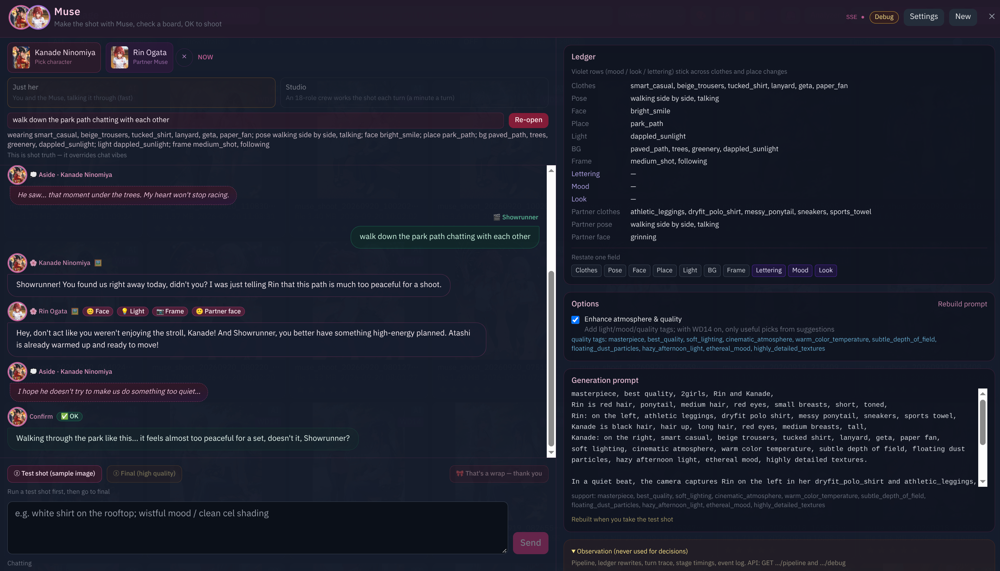

Look at the test shot — *is this okay?* If it is, go to the final with **the same seed**.

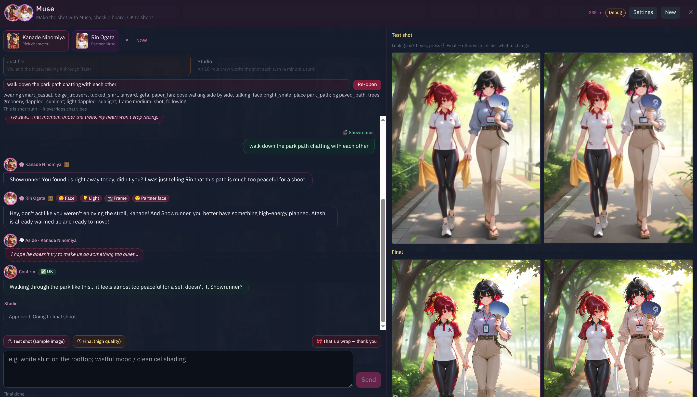

#### What else it does

- **The ledger holds the shot** — clothes, pose, expression, place, light, background, and framing are fields, rewritten as a diff on every turn. Say it again and it lands on the next turn
- **Solo, duet, or a full crew** — one actress, two (each with her own lines and side of the frame), or one of six crew presets
- **Test shot → final** — each test press draws a fresh seed; the final keeps **the seed you approved** and only raises the steps
- **It knows which model family a workflow belongs to** — Anima and Krea2 want different steps, and only one of them takes a negative prompt. cfg and resolution are whatever the workflow was saved with
- **After the shoot** — she writes a secret diary nobody sees, posts something short in the green room, and now and then goes out with friends. Next time, those memories are in her preamble

The Muse guide and technical reference are in Japanese:

> 📖 [Creator's Guide — Muse](docs/guide/muse.md) · [Technical Reference](docs/tech/muse.md)

---


### 🔍 Discover — Search by mood

Every image is stored in Qdrant as an [Ollama](https://ollama.ai/) embedding. Search works at the level of meaning.

- **Semantic search** — type `"a melancholy girl standing still"` and it finds images that *feel* like that
- **Keyword search** — full-text search across prompts, descriptions, and model names
- **Tag search** — [WD14](https://huggingface.co/SmilingWolf) tags every image with 1,000+ Danbooru categories; AND/OR filters and autocomplete
- **Color search** — pick a hex color; matching is perceptually accurate in CIE Lab space, with an option to exclude opposite hues
- **Filters compose** — semantic + tags + color + rating + alignment score at the same time

## 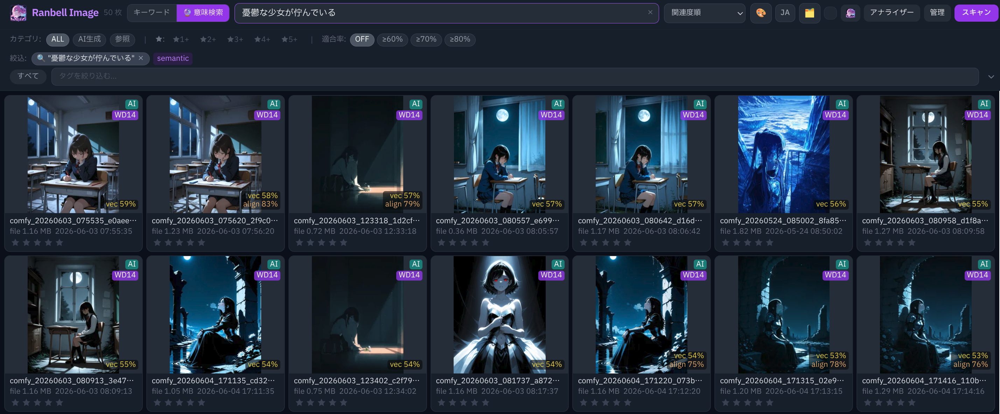


### ⚗️ Synthesis — Prompt Alchemy Studio

Pick 1–6 reference images, set influence weights, write a short instruction, and the VLM builds a prompt that follows your intent.

**Example:** pin two character images at 70% / 30% and write *"add bunny ears and a summer dress."* WD14 pulls visual vocabulary from each image in proportion to its weight, resolves contradictions (hair color, say) in favor of the heavier image, and Ollama synthesizes the prompt.

Choose an output style to match your model:


| Style        | Best for                     | Shape of the output       |
| ------------ | ---------------------------- | ------------------------- |
| **natural**  | Newer models (FLUX, Anima)   | Tags + a prose block      |
| **danbooru** | Tag-trained SD-family models | Comma-separated tags only |
| **detailed** | Structured prompts           | An 8-section write-up     |


- **Weight-aware WD14 injection** — tag budget and conflict resolution respect the weights in every style
- One-click ComfyUI submit (the prompt is injected into the workflow)
- Streaming output (tokens as they land)
- Alignment scoring (the VLM grades image vs. prompt, 0–100%)

> 📖 [Creator's Guide — Prompt Alchemy](docs/guide/prompt-alchemy.md) · [Technical Reference](docs/tech/prompt-alchemy.md)

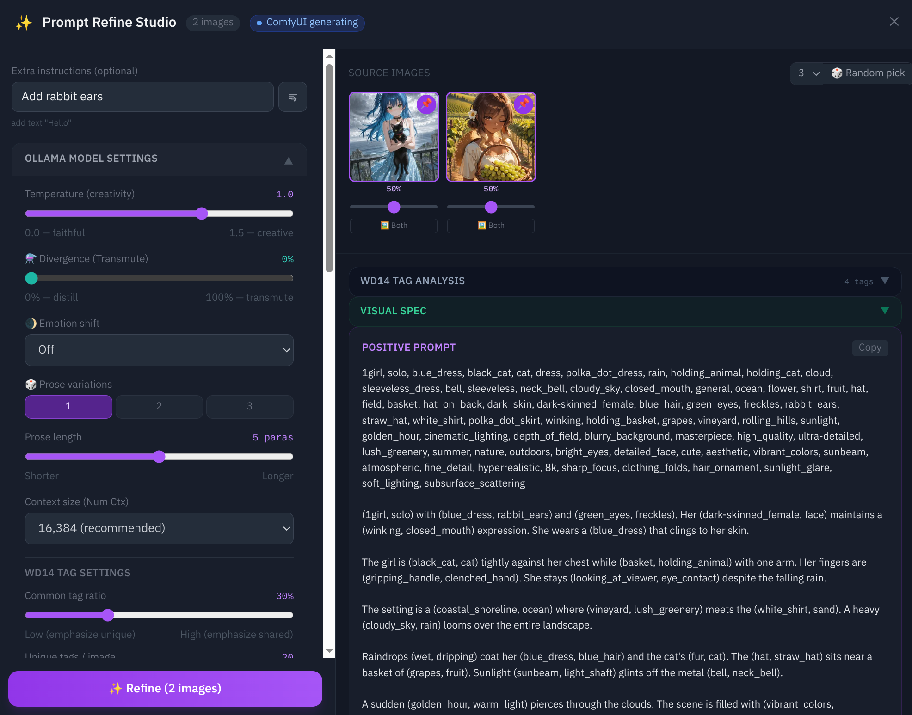
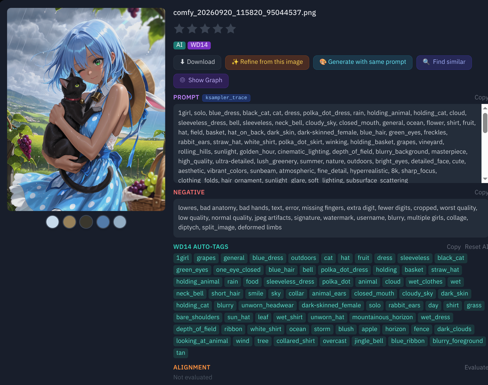

---


### Invoke — Summon seeds from nothing

Five spirits take your mood, colors, and rough intent, and each grows a seed (prompt + image) **in parallel**, from its own philosophy. Adopt one into a full generation, or respin.


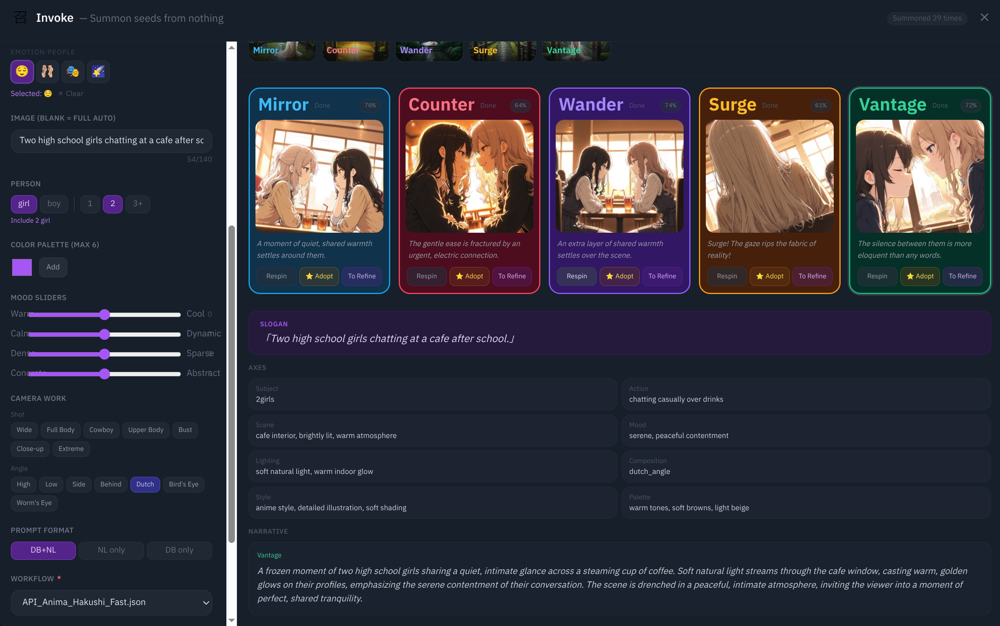


| Kanji | Name              | Role                                                          |
| ----- | ----------------- | ------------------------------------------------------------- |
| **映** | Mirror — Faithful | Realizes the intent on the centerline. Does not drift         |
| **逆** | Counter — Rebel   | Shows the shadow of the desire. Inverts exactly one axis      |
| **漂** | Wander — Stranger | Weaves in a rare guest element as if it had always been there |
| **奔** | Surge — Lunatic   | Accepts the impossible. Commits to low-co-occurrence tags     |
| **瞰** | Vantage — Oracle  | Full creative freedom. Striking results first                 |


- **Light mode**: 39 emojis, 4-axis mood sliders (warm/cool · still/moving · dense/sparse · concrete/abstract), color palette, person spec
- **Pro mode**: Direct prompt editing, topic-to-tags, per-spirit seeds
- **Live progress**: SSE streaming for prompt → image → score
- **Adopt / Respin / Send to generation**: keep it, roll that spirit again, or hand it off

> 📖 [Creator's Guide — Invoke](docs/guide/invoke.md) · [日本語版](docs/guide/invoke.ja.md)

---


### ✨ Inspire — 9 exploration modes


| Mode             | What it uses                   | Best for                                     |
| ---------------- | ------------------------------ | -------------------------------------------- |
| **Serendipity**  | Qdrant vector search           | Finding "similar, but not the same"          |
| **Alchemy**      | Qdrant vector math (A + B − C) | "This composition + that palette − the city" |
| **Morph**        | Qdrant LERP (5 steps)          | The taste that sits between A and B          |
| **Anomaly**      | WD14 tag co-occurrence         | Rare combinations, intellectual finds        |
| **Inversion**    | Qdrant + VLM (Ollama)          | Opposites: day↔night, light↔dark             |
| **Discovery**    | Qdrant DiscoverQuery           | "What is the anti-image of this?"            |
| **Blend**        | Qdrant weighted centroid       | Mixing moods by ratio                        |
| **Outlier**      | Qdrant + UMAP density          | The most isolated image in the collection    |
| **Group Search** | Qdrant GroupBy                 | Results grouped by model or category         |


> 📖 [Creator's Guide — Inspire & Brainstorm](docs/guide/inspire-brainstorm.md) · [Technical Reference](docs/tech/inspire-brainstorm.md)

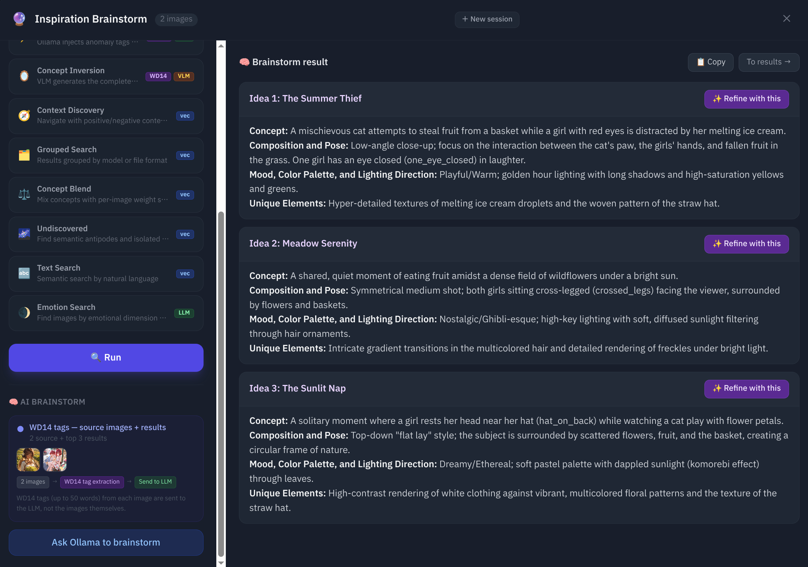
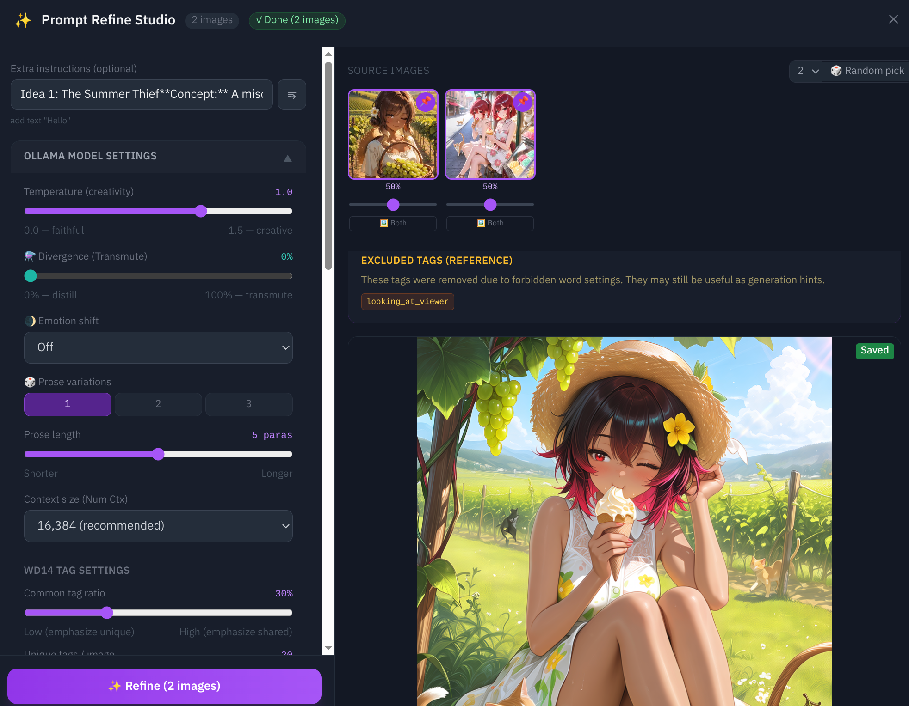

---


### 📊 Analyze — See the collection as a whole

**Semantic map (UMAP)**
768-d embeddings compressed to a 2D scatter. Neighbors sit together. K-means finds clusters. Hover for a thumbnail. Click to search.

**Color 3D**
Each image's dominant color plotted in CIE Lab. Rotate it and the bias in your palette is obvious.

**Tag network**
Tags as nodes, co-occurrence as edges, force-directed. Dense clusters are your visual vocabulary. Click a node to search.

## 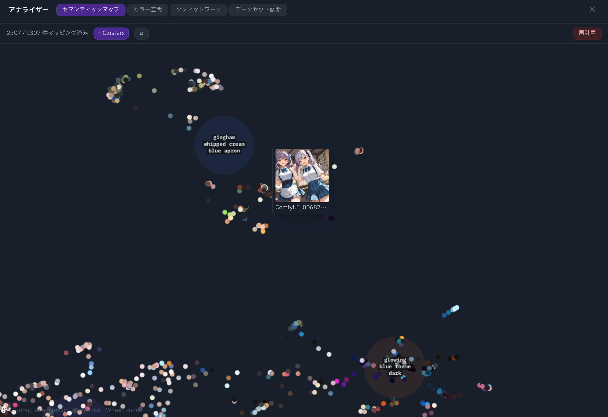
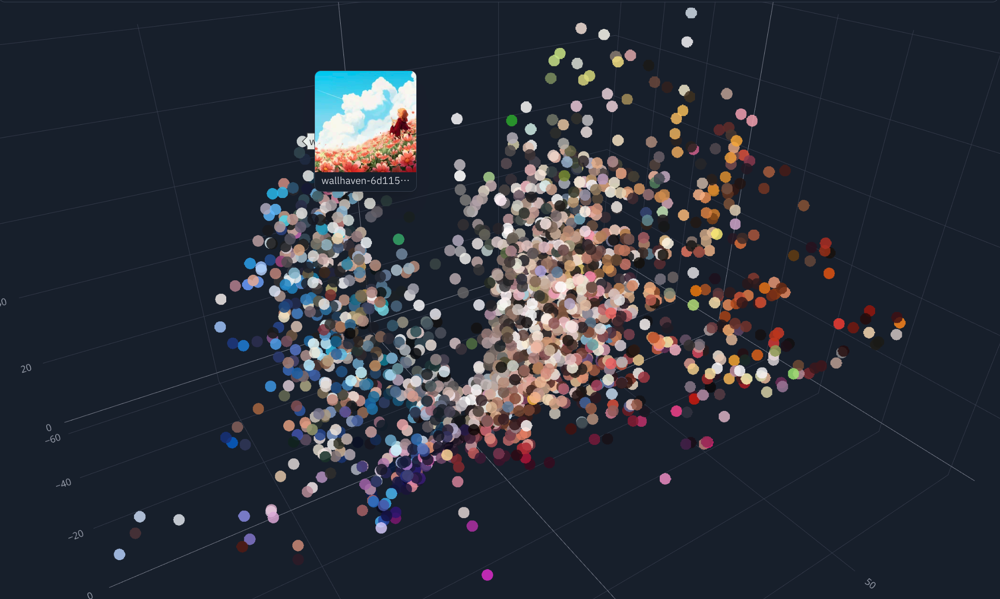
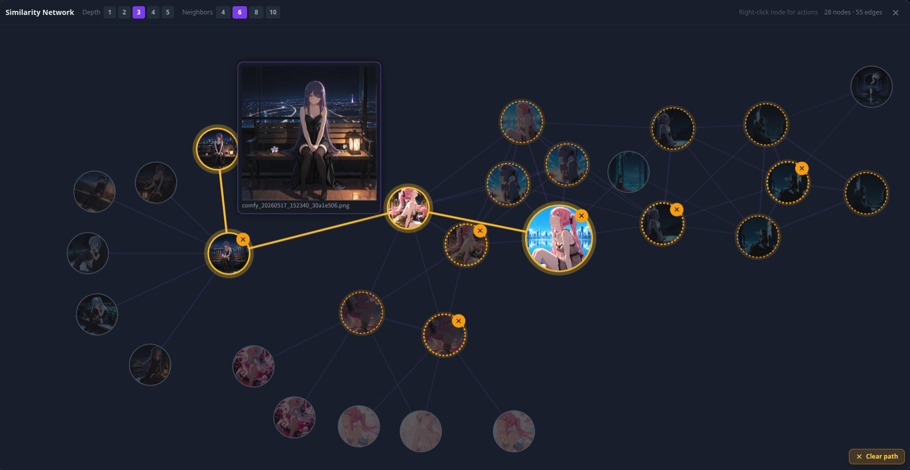


### 🎛️ Control Room — command center for every job

Press `/` or the top-bar button to open the Control Room.

Scanning, embeddings, prompt alchemy, and image generation all run as jobs.

- Cancel, pause, resume, or reorder any job
- Pause a whole lane (SYNC / EMBED / EVAL / GEN)
- ISA-101 style status lamps (Qdrant, Ollama, ComfyUI, GPU)
- All job history in one place

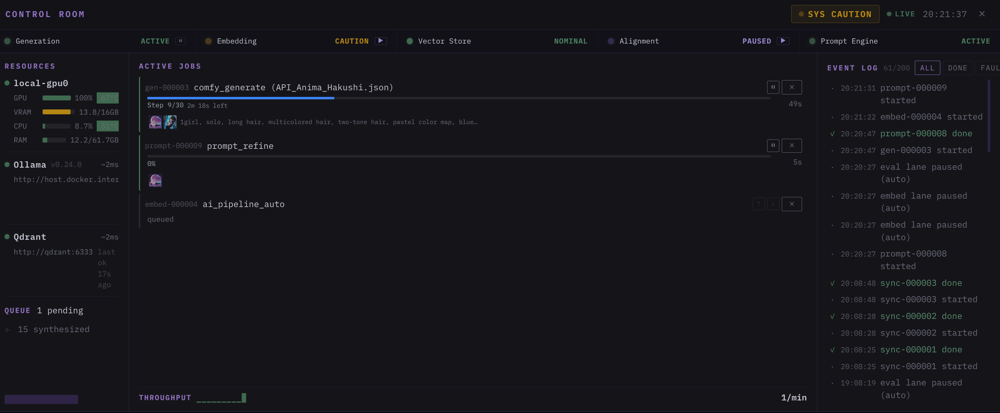

---


## Documentation

Each feature has two kinds of docs. Pick the door that matches what you need.


| Feature                     | I want to use it                                                            | I want to understand how it works                        |
| --------------------------- | --------------------------------------------------------------------------- | -------------------------------------------------------- |
| **Muse** (shoot by talking) | [Creator's Guide →](docs/guide/muse.md)                             | [Technical Reference →](docs/tech/muse.md)       |
| **Invoke**                  | [Creator's Guide →](docs/guide/invoke.md) | Coming soon                                              |
| **Inspire & Brainstorm**    | [Creator's Guide →](docs/guide/inspire-brainstorm.md)                       | [Technical Reference →](docs/tech/inspire-brainstorm.md) |
| **Prompt Alchemy**          | [Creator's Guide →](docs/guide/prompt-alchemy.md)                           | [Technical Reference →](docs/tech/prompt-alchemy.md)     |


The **Creator's Guides** cover how to use each mode, when to pick it, and how inputs map to outputs — with diagrams, no implementation details.

The **Technical References** cover algorithm specs, the math (L2 normalization, iterative normalization, LERP, sign inversion), Qdrant query patterns (DiscoverQuery, GroupBy, MRL two-phase), and the VLM 3-stage pipeline.

Also:

- [Qdrant collection design →](docs/tech/qdrant.md)
- [Job Spooler & Task Scheduling →](docs/tech/spooler.md)

---


## System Requirements

> ⚠️ **Install and start the three services below on your machine before launching Ranbell Image.**


### Required services


| Service                                                  | Role                                                         | Default endpoint         |
| -------------------------------------------------------- | ------------------------------------------------------------ | ------------------------ |
| **Docker + Docker Compose v2**                           | App and Qdrant                                               | —                        |
| **[Ollama](https://ollama.ai/)**                         | Local LLM / VLM — prompt alchemy, image analysis, embeddings | `http://localhost:11434` |
| **[ComfyUI](https://github.com/comfyanonymous/ComfyUI)** | Image generation backend                                     | `http://localhost:8188`  |


An **NVIDIA GPU with 16 GB VRAM or more** is effectively required (comfortable VLM inference and generation).

### Verified models (Ollama)

These are the models used in development and confirmed to work:


| Role                                    | Model                                           | Install                             |
| --------------------------------------- | ----------------------------------------------- | ----------------------------------- |
| VLM — image analysis & prompt synthesis | `gemma4:e2b`                                    | `ollama pull gemma4:e2b`            |
| Embedding — semantic search             | `embeddinggemma:300m` ⚠️ required               | `ollama pull embeddinggemma:300m`   |
| **Muse — conversation, ledger, safety** | `gemma4:26b-a4b-it-qat` ⚠️ effectively required | `ollama pull gemma4:26b-a4b-it-qat` |


> ⚠️ **The embedding model must be** `embeddinggemma:300m`**.** The system uses Matryoshka embeddings for multi-resolution semantic search. Ordinary embedding models do not support this and cannot be substituted.
>
> Other Ollama-compatible models may work as a VLM, but they have not been tested.


### 🎬 Requirements for Muse

> ⚠️ **Muse is where the gap between "it runs" and "it works" is widest.** Nothing errors out with a smaller LLM or a different checkpoint — **but a shoot is only worth keeping with the combination below.**


|                 | What you need                                   | What happens without it                                                                                                          |
| --------------- | ----------------------------------------------- | -------------------------------------------------------------------------------------------------------------------------------- |
| **LLM**         | **Gemma 4 26B (A4B)** — `gemma4:26b-a4b-it-qat` | Neither the conversation nor the ledger lands where you aimed it. **With a smaller model a shoot does not come together at all** |
| **Image model** | An **Anima-family or Krea2-family** workflow    | Muse writes prompts with natural-language prose in them. A checkpoint that cannot read prose will not draw what it says          |


**Why Gemma 4 26B is needed**

- With a smaller LLM, **an instruction often fails to reach the picture.** The conversation carries on while the ledger stays still, which makes the failure **hard to notice**
- A studio shoot calls the LLM several times per turn — clerk, writer, actress, verify. One weak link and the whole turn degrades

**VRAM** — 26B (Q4_0) is about **15.6 GB**. It runs on a 16 GB card, **but not at the same time as image generation**: Muse always drops the LLM out of VRAM immediately before a render (`unload_vlm`, on by default). **24 GB or more leaves real headroom.**

**Workflows** — put the ComfyUI API-format json in `/mnt/comfy/workflows` (`COMFYUI_WORKFLOWS_DIR`). A filename containing `krea` is recognised as the Krea2 family, which **switches the step count and whether a negative prompt is sent** (Anima 20/30 steps with a negative; Krea2 4/8 steps without). cfg and resolution are taken from the workflow itself in both families.

---


## Quick Start

**Prerequisites:** see [System Requirements](#system-requirements) above.

```bash
git clone https://github.com/ranbell/ranbell_image.git
cd ranbell_image

cp docker-compose.override.yml.example docker-compose.override.yml
# Edit docker-compose.override.yml — see the note below
```

> ⚠️ **Edit** `docker-compose.override.yml` **before you start:**
>
> - Source image folders: mount each as `/mnt/image/source/<label>` with `:ro` (read-only). The `<label>` becomes the folder name in the app.
> - Generated-image folder: mount as `/mnt/image/generated` **without** `:ro` (writable). Keep this separate from your source directories.

```bash
# Pre-built images from ghcr.io (recommended)
docker compose pull && docker compose up -d

# — or build locally —
docker compose up -d --build
```

Open **[http://localhost:3100](http://localhost:3100)** in your browser.

**First run:** the app checks setup and opens **Admin → Diagnostics** if anything is missing (WD14 models, Ollama, INVOKE Vocab, ComfyUI workflows). Follow that, then click **SCAN** and run AI backfill from Admin. Full walkthrough: [INSTALLATION.md](INSTALLATION.md).

**Upgrading:** always update `docker-compose.yml` before you pull — new images with an old compose file run with yesterday's volumes (including the backup mounts) and service settings. Your `docker-compose.override.yml` is never overwritten. See [Upgrading an existing install](INSTALLATION.md#upgrading-an-existing-install).

---


## Thanks

**[Qdrant](https://qdrant.tech/)** — this whole project exists because of Qdrant. The first time semantic vector search felt this graceful, I knew I had to build something with it. "Search images by meaning" became everything you see here. Thank you, Qdrant team.

**[Ollama](https://ollama.ai/)** — the local LLM/VLM that actually works. Every embedding, image analysis, prompt, and alignment score in Ranbell Image flows through it.

**[WD14 Tagger — SmilingWolf](https://huggingface.co/SmilingWolf)** — the EVA02-large model does large-scale Danbooru tagging with surprising accuracy. It underpins tag search, anomaly detection, and the danbooru vocabulary in prompt alchemy.

**[ComfyUI](https://github.com/comfyanonymous/ComfyUI)** — the most flexible generation environment. Ranbell Image closes the loop through its HTTP API: inspire → alchemy → generate → back into the collection.

**[UMAP](https://umap-learn.readthedocs.io/)** — turning 768-d embeddings into a map you can actually move around is still remarkable.

---


## Architecture


### System overview

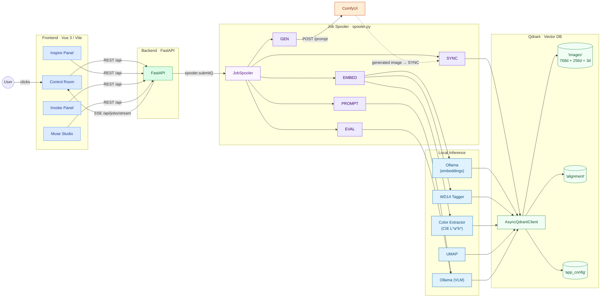
```mermaid
graph LR
    User(("User"))

    subgraph FE ["Frontend · Vue 3 / Vite"]
        UI["Control Room"]
        IP["Inspire Panel"]
        INV["Invoke Panel"]
        MUSE["Muse Studio"]
    end

    subgraph BE ["Backend · FastAPI"]
        API["FastAPI"]
    end

    subgraph SP ["Job Spooler · spooler.py"]
        Spl["JobSpooler"]
        SYNC["SYNC"]
        EMBED["EMBED"]
        GEN_L["GEN"]
        PROMPT_L["PROMPT"]
        EVAL_L["EVAL"]
    end

    subgraph INF ["Local Inference"]
        EMB["Ollama<br/>(embeddings)"]
        VLM_N["Ollama (VLM)"]
        WD14_N["WD14 Tagger"]
        LAB_N["Color Extractor<br/>(CIE L*a*b*)"]
        UMAP_N["UMAP"]
    end

    COMFY_N["ComfyUI"]

    subgraph DB ["Qdrant · Vector DB"]
        QC["AsyncQdrantClient"]
        IMG[("'images'<br/>768d + 256d + 3d")]
        ALN[("'alignment'")]
        CFG[("'app_config'")]
    end

    User -->|"clicks"| UI
    UI & IP & INV & MUSE -- "REST /api" --> API
    API -- "SSE /api/jobs/stream" --> UI
    API -- "spooler.submit()" --> Spl
    Spl --> SYNC & EMBED & GEN_L & PROMPT_L & EVAL_L
    SYNC --> QC
    EMBED --> EMB & WD14_N & LAB_N
    GEN_L -- "POST /prompt" --> COMFY_N
    PROMPT_L & EVAL_L --> VLM_N
    EMB & WD14_N & LAB_N & UMAP_N --> QC
    VLM_N --> QC
    COMFY_N -.->|"generated image → SYNC"| SYNC
    QC --> IMG & ALN & CFG

    classDef fe fill:#dbeafe,stroke:#3b82f6,color:#1e3a8a
    classDef api fill:#dcfce7,stroke:#16a34a,color:#14532d
    classDef spooler fill:#faf5ff,stroke:#7c3aed,color:#581c87
    classDef lane fill:#ede9fe,stroke:#7c3aed,color:#3b0764
    classDef infer fill:#e0f2fe,stroke:#0369a1,color:#0c4a6e
    classDef gen fill:#ffedd5,stroke:#c2410c,color:#7c2d12
    classDef db fill:#f0fdf4,stroke:#15803d,color:#14532d

    class UI,IP,INV,MUSE fe
    class API api
    class Spl spooler
    class SYNC,EMBED,GEN_L,PROMPT_L,EVAL_L lane
    class EMB,VLM_N,WD14_N,LAB_N,UMAP_N infer
    class COMFY_N gen
    class QC,IMG,ALN,CFG db
```


### Job orchestration

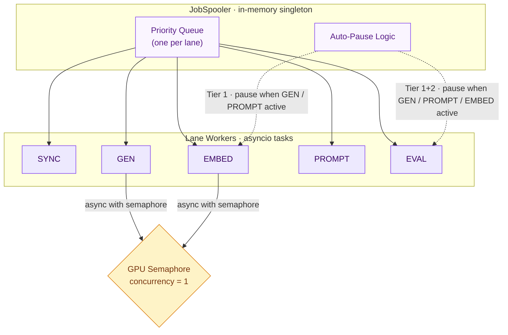
```mermaid
graph TD
    subgraph Spooler ["JobSpooler · in-memory singleton"]
        PQ["Priority Queue<br/>(one per lane)"]
        AP["Auto-Pause Logic"]
    end

    GPU{"GPU Semaphore<br/>concurrency = 1"}

    subgraph Workers ["Lane Workers · asyncio tasks"]
        sw["SYNC"]
        ew["EMBED"]
        gw["GEN"]
        pw["PROMPT"]
        ev["EVAL"]
    end

    PQ --> sw & ew & gw & pw & ev
    gw & ew -->|"async with semaphore"| GPU
    AP -.->|"Tier 1 · pause when GEN / PROMPT active"| ew
    AP -.->|"Tier 1+2 · pause when GEN / PROMPT / EMBED active"| ev

    classDef worker fill:#ede9fe,stroke:#7c3aed,color:#3b0764
    classDef spooler fill:#faf5ff,stroke:#7c3aed,color:#581c87
    classDef gpu fill:#fef3c7,stroke:#d97706,color:#78350f

    class sw,ew,gw,pw,ev worker
    class PQ,AP spooler
    class GPU gpu
```


---


## License

[MIT License](LICENSE)