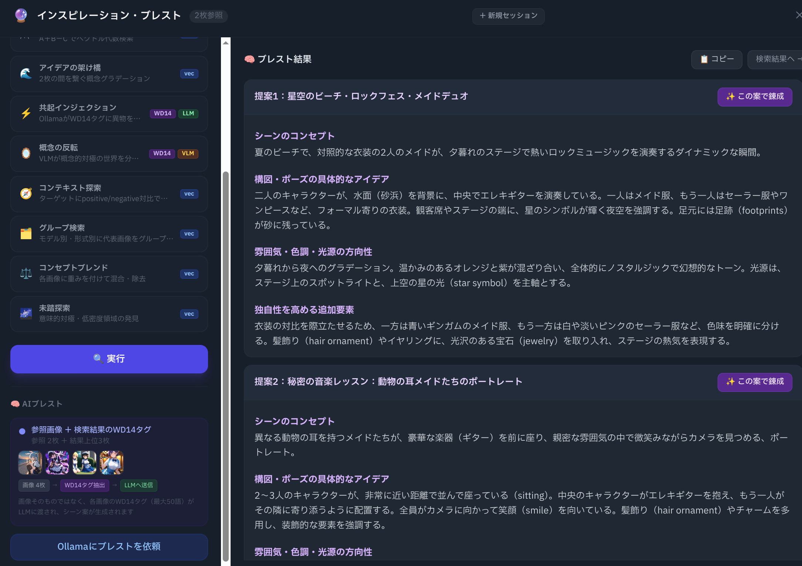
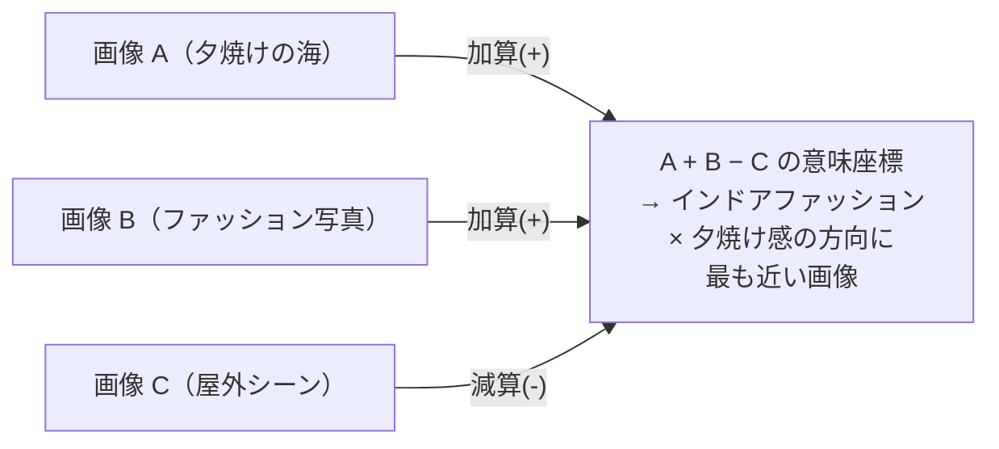
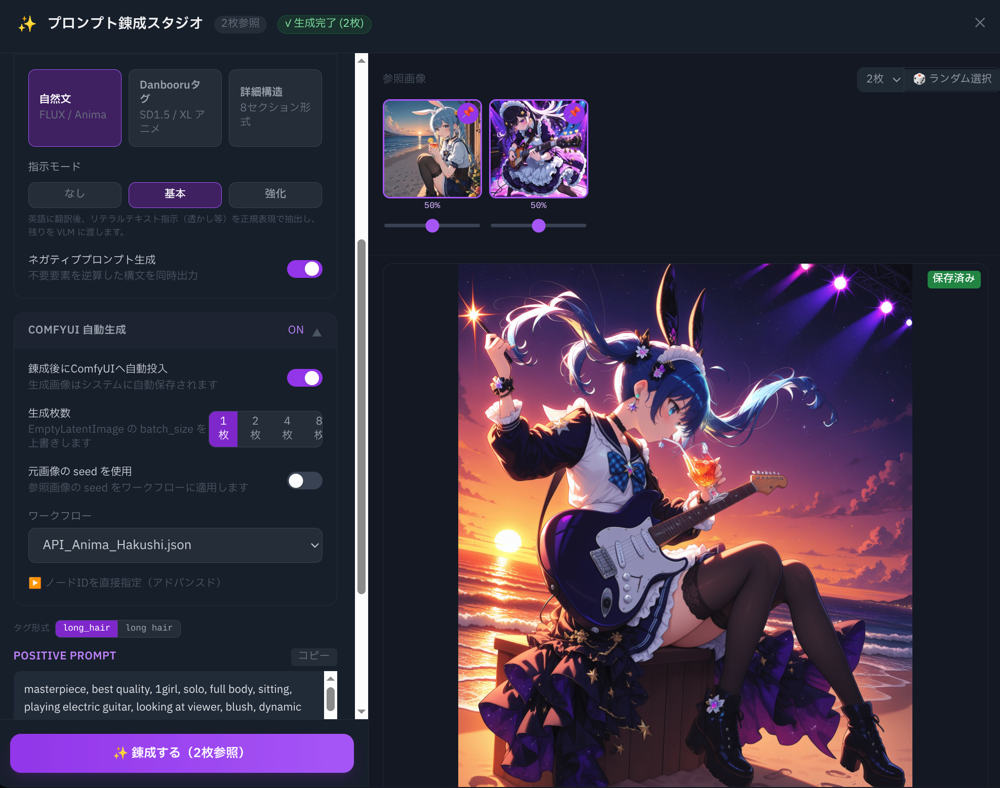
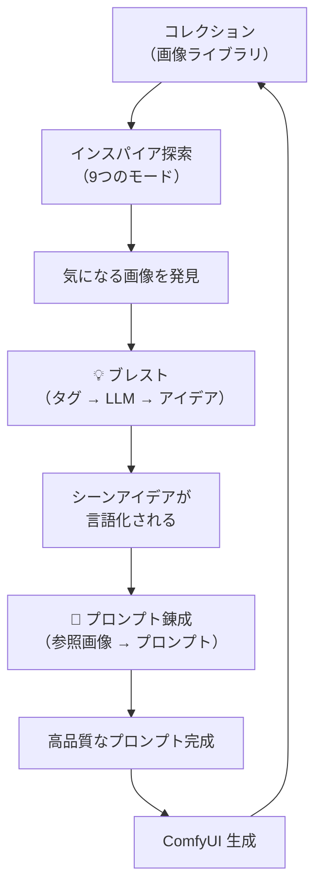

# インスパイア & ブレスト — クリエイターガイド

**Ranbell Image v0.2.0**

---

## インスパイアとは

コレクションのすべての画像は、AI が **「意味の座標」** に変換して保存しています。似た世界観の画像は近くに、全く違う画像は遠くに配置されます。

```
          意味空間（2D イメージ）

     夜景クラスター
      ● ● ●
     ●●●●●
          ●                    自然風景クラスター
                           ● ● ●
  ポートレートクラスター  ●●●●●●
  ● ● ●                  ● ● ●
  ●●●●●●
   ●●●                               ★ ← アウトライアー
             ファンタジークラスター
                ● ● ●
               ●●●●●
```

インスパイアモードは、このマップ上で「距離を計算」「方向を指定」「中間を探す」といった操作を行います。キーワード検索では届かない、**感覚的なつながり**で画像を探せます。



---

## どのモードを選ぶ？

```
何がしたい？
│
├── 似た画像を探したい
│   ├── 「適度な距離感で」............ ✨ セレンディピティ
│   ├── 「概念を足し引きして」......... ⚗️ 錬金術
│   ├── 「比率を指定してミックス」...... ⚖️ ブレンド
│   └── 「方向性を細かく制御」......... 🧭 ディスカバー
│
├── 変化・グラデーションを見たい
│   └── 「AとBの中間を5段階で」....... 🌊 モーフ
│
├── 意外な発見がほしい
│   ├── 「文脈を保ちつつ驚きを」....... ⚡ アノマリー
│   ├── 「正反対の世界を探す」......... 🪞 インバージョン
│   └── 「コレクションの極地を発掘」.... 🌌 アウトライアー
│
├── テキストで探したい
│   └── 「モデル別に比較したい」....... 🗂️ グループ検索
│
└── 次のアイデアに変換したい
    └── ................................. 💡 ブレスト
```

---

## 各モード詳解

---

### ✨ セレンディピティ — 「知ってたけど忘れてた」を探す

**入力:** 参照画像 1〜6 枚  
**出力:** 「適度に似ている」画像群

```
コレクション 1,000 件を類似度でソート

  高い                          低い
  |█████|░░░░░|          |
  0%   P25           P75     100%
        └─────────────┘
        ここからランダムにサンプリング
        （近すぎず遠すぎない「セレンディピティ帯」）
```

**向いている場面:**
- マンネリ打破。いつも使いがちな参照画像と「違う角度」の発見
- コレクションに埋もれていた画像の発掘
- 「ほぼ同じじゃなく、でも全然違うわけでもない」ゾーンの探索

---

### ⚗️ 錬金術 — 「概念を実際に足し引きする」

**入力:** 加算画像（最大 3 枚）+ 減算画像（最大 3 枚）  
**出力:** その組み合わせが指す意味空間の領域に最も近い画像



**向いている場面:**
- 「この雰囲気で、あれを追加して、でもこれは排除したい」
- 言葉より画像で意図を伝えたいとき

---

### 🌊 モーフ — 「AとBの間を歩く」

**入力:** 2 枚の画像（A と B）  
**出力:** 5 段階 × 各ステップ 4 枚

```
A ─────────────────────────────────────── B
  │  20%  │  40%  │  60%  │  80%  │ 100%  │
  └─[4枚]─┘─[4枚]─┘─[4枚]─┘─[4枚]─┘─[4枚]─┘
   段階的に B の世界観へと移行する画像たち
```

**向いている場面:**
- 昼↔夜、リアル↔スタイライズド、静寂↔喧騒の移行を見たい
- 全く異なる 2 画像の「視覚的な橋渡し」を探したい

---

### ⚡ アノマリー — 「文脈的に意外な要素を注入」

**入力:** 参照画像 1〜6 枚  
**出力:** LLM が提案した「珍しいタグ」を組み込んだ画像

```
参照画像の頻出タグ:
  1girl, school_uniform, outdoor, cherry_blossoms, ...

     ↓ LLM に渡す
       「このコンテキストで珍しいが意味的に自然なタグを 3 つ」

LLM の提案（例）: telescope, vintage_map, compass

     ↓ 元タグ + アノマリータグを合わせて検索

「桜と制服の文脈に、羅針盤を持ったキャラクター」が出てくる
```

結果には「LLM が注入したタグ」が表示されるので、驚きの理由を確認できます。

**向いている場面:**
- 構図・小道具のマンネリ打破
- 「テーマは同じなのに予想外」の画像との出会い

---

### 🪞 インバージョン — 「正反対の世界」を設計して探す

**入力:** 参照画像 1〜3 枚  
**出力:** 5 軸で反転した世界の画像 + 反転プロンプト（タグ・散文・ネガティブタグ）

**5 つの反転軸:**

```
  元の画像                        反転の世界
  ─────────────────────────────────────────
  明るい / 暖色     → Visual →   暗い / 寒色
  穏やか / 幸福     → Mood →     混沌 / 憂鬱
  若い / 笑顔       → Subject →  老い / 無表情
  細密              → Style →    ミニマル
  日常              → Narrative → 幻想
```

**重要:** キャラクターの外見的特徴（髪色・瞳・固有人物）は**反転しません**。「世界」が変わり、「キャラクター」は変わらないのが設計の意図です。

処理は最も重く、VLM が 3 ステージを順に実行します。進捗はリアルタイムでストリーミングされます。

**向いている場面:**
- 「もしこの画像の世界が全く逆だったら？」
- 好きな画像の「対極」をコレクションの中から見つける

---

### 🧭 ディスカバー — 「方向性に圧力をかけて探索」

**入力:** ターゲット画像 1 枚 + ポジティブ/ネガティブ画像ペア  
**出力:** ターゲットに近く、かつ指定方向に引き寄せられた画像

```
  標準検索: 「X に最も近いものを返す」

  ディスカバー: 「X に近く、かつ P に似て N に似ていないもの」

          N（避ける方向）
          ↑
  ← P ←  X  →  探索される領域  →  P（向かいたい方向）
```

**向いている場面:**
- 「この画像に近いけど、あの方向に寄せて、この要素は避けて」
- 探索の方向性を複数の画像で指し示したいとき

---

### 🗂️ グループ検索 — 「テキスト × モデル別比較」

**入力:** テキストクエリ（例: "夕暮れの海岸"）  
**出力:** モデル・ファイル形式などでグループ化された結果

```
クエリ: "夕暮れの海岸"
  ├── DreamShaper グループ [3枚]
  ├── SDXL Turbo グループ   [3枚]
  ├── Anima グループ        [3枚]
  └── FLUX グループ         [3枚]
```

**向いている場面:**
- 「同じコンセプトを各モデルがどう表現したか」横断比較
- 次の生成でどのモデルを使うかの判断材料

---

### ⚖️ ブレンド — 「比率を明示してミックス」

**入力:** 2〜4 枚の画像、各 −1.0〜+1.0 のウェイト  
**出力:** 指定した比率の合成ベクトルに最も近い画像

```
  画像 A (夕焼け雰囲気)   ██████████  +0.6
  画像 B (ポートレート)   █████░░░░░  +0.3
  画像 C (モノクロ感)     ██░░░░░░░░  +0.1
                              ↓
  60% の夕焼け雰囲気 + 30% のポートレート + 10% のモノクロ感
```

**錬金術との違い:**

| | 錬金術 | ブレンド |
|--|--|--|
| 操作 | 足す / 引く（二値） | -1.0〜+1.0（連続値） |
| 向いている用途 | 「概念の加減算」 | 「比率の細かい調整」 |

---

### 🌌 アウトライアー — 「コレクションの極地を発掘」

**入力:** なし（参照画像不要）  
**出力:** コレクション中で最も「外れている」画像

```
2つのサブモード:

  アンチポード（数学的な対極）
    全画像の重心ベクトルの「真逆」に最も近い画像
    → コレクションの「典型」から最も遠い作品

  孤立島（密度ベース）
    周囲 2.0 ユニット以内に隣接画像が最も少ない画像
    → どのクラスターにも属さない「一点物」
```

**向いている場面:**
- コレクションの中で最もユニーク・実験的な作品を探したい
- 主流から際立った個性を持つ作品との出会い

---

## 💡 ブレスト — 「発見」を「アイデア」に変換する



インスパイアで見つけた画像群を素材に、LLM がシーンアイデアを 3〜5 つ提案します。

```
インスパイアで発見した画像群
        │
        │ WD14 タグを収集
        │ アノマリー / インバージョンのタグも自動統合
        ▼
     語彙セット（タグの集合）
        │
        │ LLM に渡して「シーンアイデア 3〜5 つ」を依頼
        │ リアルタイムストリーミング
        ▼
  提案 1: 「廃墟の図書館で本を読む少女、月明かりだけの空間」
  提案 2: 「砂漠の夜市、燃えるランタンと旅人のシルエット」
  提案 3: 「雨の日の温室、蒸気と緑の匂いが漂う午後」
        │
        │「錬成スタジオへ送信」
        ▼
  プロンプト錬成 → ComfyUI 生成
```

日本語・英語のどちらで提案を受けるかも選べます。

---

## 創作サイクル全体像



生成した画像はコレクションに追加され、**次のインスパイア探索の素材**になります。使えば使うほど、意味空間の解像度が上がります。

---

## クイックリファレンス

| やりたいこと | モード |
|---|---|
| 参照画像と「適度に似た」画像を探す | ✨ セレンディピティ |
| 視覚的な概念を足したり引いたりする | ⚗️ 錬金術 |
| 2 画像の間のグラデーションを見る | 🌊 モーフ |
| 文脈的に意外な要素を含む画像を発見 | ⚡ アノマリー |
| 参照画像の「正反対の世界」を設計して探す | 🪞 インバージョン |
| 方向性に圧力をかけて制御した探索 | 🧭 ディスカバー |
| テキストクエリでモデル別に比較 | 🗂️ グループ検索 |
| 比率を明示して複数画像をミックス | ⚖️ ブレンド |
| コレクションで最も「外れている」画像を探す | 🌌 アウトライアー |
| 発見した画像からシーンアイデアを生成 | 💡 ブレスト |
