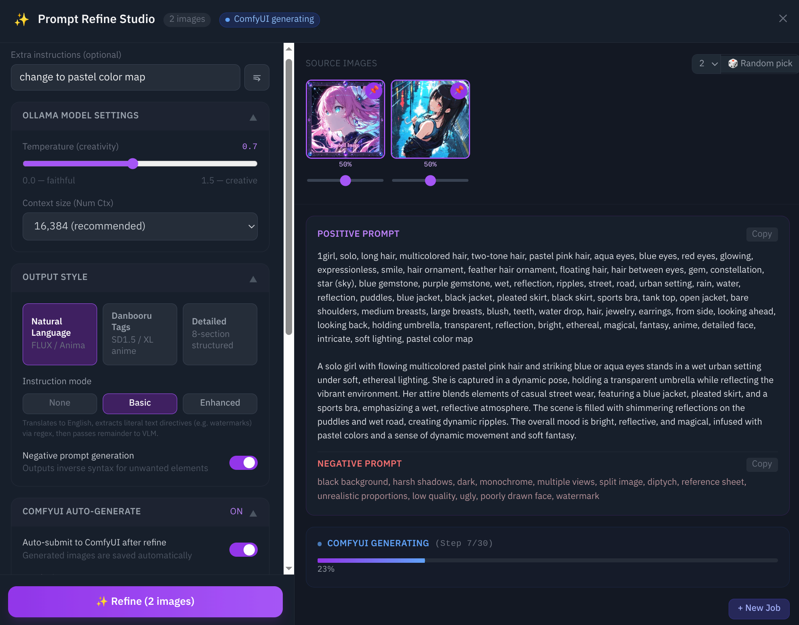

# Inspire & Brainstorm — Creator's Guide

**Ranbell Image v0.1.0**

---

## What Is Inspire?

Every image in your collection is converted by the AI into a **"semantic coordinate"** — and stored internally that way. Images with similar visual worlds sit close together; completely different images sit far apart.

```
          Semantic space (2D projection)

     Night scenes cluster
      ● ● ●
     ●●●●●
          ●                    Nature cluster
                           ● ● ●
  Portraits cluster       ●●●●●●
  ● ● ●                  ● ● ●
  ●●●●●●
   ●●●                               ★ ← Outlier
             Fantasy cluster
                ● ● ●
               ●●●●●
```

Inspire modes work by **computing distances**, **specifying directions**, and **finding midpoints** on this map. You can discover connections that keyword search can never reach.



---

## Which Mode Should I Use?

```
What do you want to do?
│
├── Find images similar to mine
│   ├── "With some breathing room"............. ✨ Serendipity
│   ├── "Add and subtract concepts"............ ⚗️ Alchemy
│   ├── "Mix with explicit proportions"........ ⚖️ Blend
│   └── "Steer the direction precisely"........ 🧭 Discovery
│
├── See a transition or gradient
│   └── "Five steps from A to B".............. 🌊 Morph
│
├── Discover surprises
│   ├── "Unexpected but contextually grounded". ⚡ Anomaly
│   ├── "Find the opposite world".............. 🪞 Inversion
│   └── "Unearth the collection's extremes".... 🌌 Outlier
│
├── Search with text
│   └── "Compare results by model"............. 🗂️ Group Search
│
└── Turn discoveries into ideas
    └── ........................................... 💡 Brainstorm
```

---

## Mode-by-Mode Guide

---

### ✨ Serendipity — "Images I forgot I had"

**Input:** 1–6 reference images  
**Output:** Images in the "moderately similar" range

```
Top 1,000 results ranked by similarity score

  High                                   Low
  |█████|░░░░░░░░░░░░░░░░░░░░░░|          |
  0%   P25           P75     100%
        └─────────────┘
        Random sample taken from this band
        (not too close, not too far — the serendipity zone)
```

**Best for:**
- Breaking out of creative ruts
- Rediscovering buried images in your collection
- Getting a fresh angle on a familiar reference theme

---

### ⚗️ Alchemy — "Actually add and subtract visual concepts"

**Input:** Images to add (up to 3) + images to subtract (up to 3)  
**Output:** Images nearest to the resulting composite coordinate

```
  Image A (sunset beach)         ┐
  Image B (fashion photograph)   ├──→  A + B − C coordinate
  Image C (outdoor setting)      ┘          ↓
   ↑ add               ↑ subtract   Indoor fashion with a sunset
                                    atmosphere → nearest images
```

**Best for:**
- "I want the feel of this, combined with that, minus the other thing"
- Expressing creative intent that's hard to put into words

---

### 🌊 Morph — "Walk between two worlds"

**Input:** 2 images (A and B)  
**Output:** 5 steps × 4 images per step

```
A ─────────────────────────────────────────── B
  │  20%  │  40%  │  60%  │  80%  │ 100%  │
  └─[4]───┘─[4]───┘─[4]───┘─[4]───┘─[4]───┘
   Images that form a visual gradient from A to B
```

**Best for:**
- Exploring transitions: day → night, realistic → stylized, quiet → energetic
- Finding what visually bridges two very different images you like

---

### ⚡ Anomaly — "Inject unexpected elements that still make sense"

**Input:** 1–6 reference images  
**Output:** Images containing LLM-suggested "rare but contextual" elements

```
Dominant tags from reference images:
  1girl, school_uniform, outdoor, cherry_blossoms, ...

     ↓ sent to LLM
       "Suggest 3 tags that would be rare but contextually natural here"

LLM proposes (example): telescope, vintage_map, compass

     ↓ original tags + anomaly tags → embed → search

Results: a character in uniform holding a compass, cherry blossoms still present
```

The anomaly tags are shown in the results so you can see exactly what the LLM injected.

**Best for:**
- Breaking compositional habits
- Finding images where the theme is familiar but the elements are unexpected

---

### 🪞 Inversion — "Design the opposite world and find it"

**Input:** 1–3 reference images  
**Output:** Images embodying the inverted world + an inversion prompt (tags, prose, negative tags)

**The five inversion axes:**

```
  Original image                   Inverted world
  ──────────────────────────────────────────────
  bright / warm tones → Visual →   dark / cool tones
  calm / joyful       → Mood →     chaotic / melancholy
  young / smiling     → Subject →  older / expressionless
  detailed            → Style →    minimal
  everyday            → Narrative → fantastical
```

**Important:** Character-defining features (hair color, eyes, specific persons) are **not inverted**. The world changes; the character doesn't. This is by design.

Processing is the heaviest of all modes — the VLM runs three sequential stages. Progress streams to you in real time.

**Best for:**
- "What if the world in this image were completely different?"
- Finding a visual counterpart to an image you already like

---

### 🧭 Discovery — "Apply directional pressure to your search"

**Input:** 1 target image + positive/negative image pairs  
**Output:** Images near the target, steered toward the specified direction

```
  Standard search: "What's nearest to X?"

  Discovery: "What's nearest to X, while also being more like P than N?"

          N (direction to avoid)
          ↑
  ← N ←  X  →  results land here  →  P (direction to lean toward)
```

**Best for:**
- "Near this image, but nudged in that direction, and away from this thing"
- When you want to steer results using images rather than doing full vector math yourself

---

### 🗂️ Group Search — "Text search with per-model comparison"

**Input:** Text query (e.g., "twilight coastline")  
**Output:** Results partitioned by generation model, file type, etc.

```
Query: "twilight coastline"
  ├── DreamShaper group  [3 images]
  ├── SDXL Turbo group   [3 images]
  ├── Anima group        [3 images]
  └── FLUX group         [3 images]
```

**Best for:**
- "How did each model interpret the same concept?"
- Deciding which model to use for a specific style direction

---

### ⚖️ Blend — "Mix with explicit proportions"

**Input:** 2–4 images, each with a weight in [−1.0, +1.0]  
**Output:** Images nearest to the weighted combination

```
  Image A (sunset mood)       ██████████  +0.6
  Image B (portrait feel)     █████░░░░░  +0.3
  Image C (monochrome tone)   ██░░░░░░░░  +0.1
                                    ↓
  60% sunset mood + 30% portrait feel + 10% monochrome tone
```

**Blend vs. Alchemy:**

| | Alchemy | Blend |
|--|--|--|
| Controls | Add / subtract (binary) | −1.0 to +1.0 (continuous) |
| Best for | "Conceptual add/subtract" | "Proportional fine-tuning" |

---

### 🌌 Outlier — "Unearth the extremes of your collection"

**Input:** Nothing (no reference needed)  
**Output:** The most "isolated" images in your collection

```
Two sub-modes:

  Antipode (mathematical opposite)
    Average all images into a centroid → negate it → find nearest images
    → The images furthest from your collection's "typical" center

  Isolated (density-based)
    Images with fewest neighbors within a radius of 2.0 units in 2D space
    → The true one-of-a-kinds that belong to no cluster
```

**Best for:**
- Finding your most unique or experimental work
- Surfacing pieces that represent stylistic departures from your main body of work

---

## 💡 Brainstorm — Convert Discoveries into Ideas

Brainstorm takes the images you found and asks the LLM to generate 3–5 creative scene ideas that build on what those images suggest.

```
Images discovered via Inspire
        │
        │ collect WD14 tags
        │ auto-merge Anomaly / Inversion tags if available
        ▼
     Tag vocabulary
        │
        │ ask LLM for "3–5 scene proposals"
        │ streamed in real time
        ▼
  Idea 1: "A girl reading in a moonlit ruined library, no other light source"
  Idea 2: "A desert night market, burning lanterns and a traveler's silhouette"
  Idea 3: "A rainy afternoon greenhouse, steam and the scent of green"
        │
        │ "Send to Synthesis Studio"
        ▼
  Prompt Alchemy → ComfyUI generation
```

Output language can be English or Japanese.

---

## The Full Creative Cycle

```
  ┌──────────────────────────────────────────────────────────┐
  │                                                          │
  │  Collection (your image library)                         │
  │       │                              ▲                  │
  │       │  Inspire                     │ added back       │
  │       │  (9 modes of exploration)    │                  │
  │       ▼                              │                  │
  │   Interesting image found            │                  │
  │       │                              │                  │
  │       │  💡 Brainstorm               │                  │
  │       │  (tags → LLM → ideas)        │                  │
  │       ▼                              │                  │
  │   Ideas put into words               │                  │
  │       │                              │                  │
  │       │  🔮 Prompt Alchemy           │                  │
  │       │  (reference → prompt)        │                  │
  │       ▼                              │                  │
  │   High-quality prompt ready          │                  │
  │       │                              │                  │
  │       │  ComfyUI generation          │                  │
  │       └──────────────────────────────┘                  │
  │                                                          │
  └──────────────────────────────────────────────────────────┘
```

Every generated image is added back to the collection, increasing the density and richness of the semantic map for future exploration.

---

## Quick Reference

| Goal | Mode |
|---|---|
| Find images "moderately similar" to a reference | ✨ Serendipity |
| Add and subtract visual concepts | ⚗️ Alchemy |
| See a visual gradient between two images | 🌊 Morph |
| Discover images with unexpected but fitting elements | ⚡ Anomaly |
| Design and find the "opposite world" of a reference | 🪞 Inversion |
| Steer a search in a specific direction | 🧭 Discovery |
| Text query with per-model comparison | 🗂️ Group Search |
| Mix multiple images with explicit proportions | ⚖️ Blend |
| Find the most extreme or isolated images | 🌌 Outlier |
| Turn discovered images into scene ideas | 💡 Brainstorm |
