# 召喚（Invoke）— クリエイターガイド

**Ranbell Image v0.2.0**

---

## 召喚とは何か

「何を作りたいか、まだ言葉にならない」——そのときのための機能です。

召喚は「種を無から生み出す」パネルです。あなたが与えるのは雰囲気・色・ざっくりしたイメージだけ。5つのスピリットがそれぞれの哲学で解釈を行い、5通りの種を並列で生成します。どれかを採用し、本生成へ送るか、もう一度振り直すか——選択はあなたの手に委ねられます。

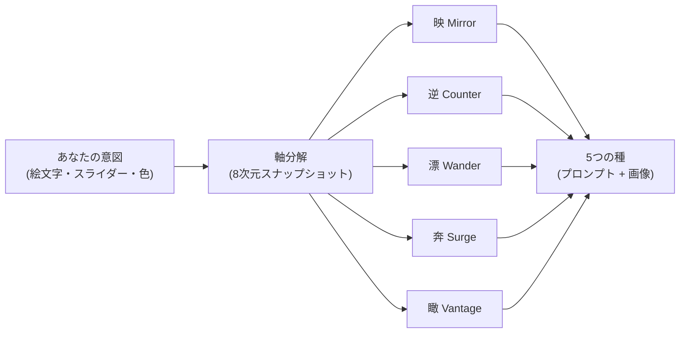

---

## 5つのスピリット

| 漢字 | 英名 | 役割 | 金フレーム / 黒曜石フレーム |
|:----:|------|------|----------------------------|
| **映** | Mirror — Faithful | 意図を一切ぶらさず、軸の中心線を忠実に実現する | 金（適合度 ≥ 85%） |
| **逆** | Counter — Rebel | 欲望の「影」を見せる。意図から1軸だけ反転して、陰影と対比を生む | 黒曜石（適合度 ≤ 15%） |
| **漂** | Wander — Stranger | 意味的に近いが珍しい「ゲストタグ」を自然に織り込む。最初からそこにいたかのように | 金（適合度 ≥ 85%） |
| **奔** | Surge — Lunatic | 不可能を受け入れる。低共起タグを全力で使い、失敗した画像すら正解とみなす | 黒曜石（適合度 ≤ 15%） |
| **瞰** | Vantage — Oracle | 完全な創作の自由。ユーザーの意図を深く読んで、印象に残る結果を作ることに全集中する | 金（適合度 ≥ 85%） |

> **フレームの色について**  
> 映・漂・瞰 は「意図に近い = 良い結果」なので適合度が高いほど金フレームで祝われます。  
> 逆・奔 は「意図から離れること = 成功」なので、適合度が低いほど黒曜石フレームで報われます。

---

## パネルを開く

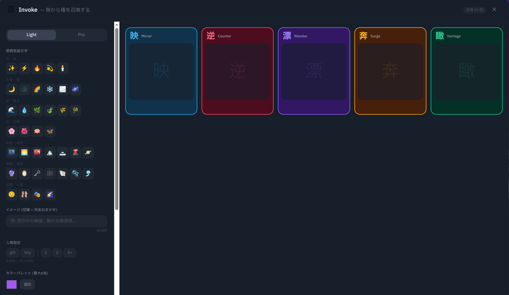

パネルは**左右2ペイン**に分かれています。

| ペイン | 内容 |
|--------|------|
| **左（入力ゾーン）** | モード切替・入力フィールド一式・召喚ボタン。幅 340px 固定 |
| **右（出力ゾーン）** | 上部：今日のビジョン（Daily Oracle）/ 下部：セッション結果（スピリットカード） |

ヘッダー右端の `召` アイコン、またはナビゲーションバーから呼び出せます。

---

## ライトモード（Light）

初期状態はライトモードです。コントロールは上から順に並んでいます。

### 雰囲気絵文字

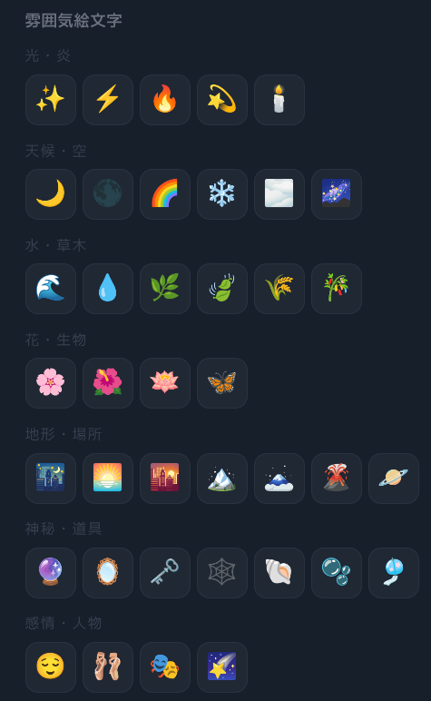

39種の絵文字を7カテゴリから選べます。複数選択可能です。

| カテゴリ | 例 |
|----------|----|
| 光・炎 | ☀️ 🌙 🔥 ✨ |
| 天気・空 | ⛅ 🌧️ 🌈 ❄️ |
| 水・植物 | 🌊 🍃 🌿 🌸 |
| 花・生き物 | 🌺 🦋 🐈 🐦 |
| 地形・場所 | 🏔️ 🌲 🏙️ 🏖️ |
| 神秘・道具 | 🔮 📜 ⚙️ 🗝️ |
| 感情・人 | 💫 🎭 👁️ 💭 |

選んだ絵文字はムードと雰囲気の軸分解に使われます。何も選ばなければ「おまかせ」になります。

---

### イメージテキスト

自由記述欄（最大 140 文字）です。ざっくりした説明でも、単語の羅列でも構いません。

```
例: "夕暮れの廃墟、静寂、わずかな光"
例: "blue, melancholy, girl, rain"
```

**空白のまま召喚する**こともできます。絵文字とスライダーだけで完全におまかせすると、予想外の種が生まれることがあります。

---

### 人物指定

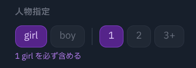

必ず人物を含めたいときに使います。

- **性別**: `girl` / `boy`（どちらも押さなければ指定なし）
- **人数**: `1` / `2` / `3+`（押さなければ指定なし）

両方とも押さなければ「人物なし」ではなく「人物については指定なし」という扱いです。スピリットが必要と判断すれば人物を加えます。

---

### カラーパレット

<!-- スクリーンショット: カラーパレット（色選択UI） -->
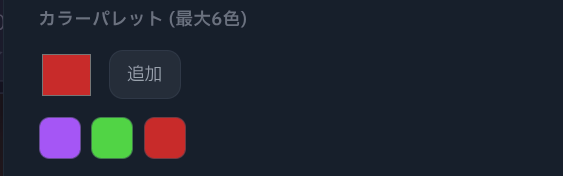

カラーピッカーで色を最大 **6色** まで追加できます。指定した色がプロンプトのパレット軸に反映されます。

---

### 雰囲気スライダー

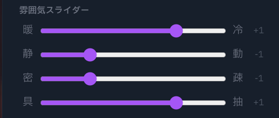

4つの軸を各 −2 〜 +2 で調整します。センター（0）はニュートラルです。

| 軸 | 左（−2） | 右（+2） |
|----|----------|----------|
| 暖 / 冷 | 冷たい・青い雰囲気 | 暖かい・オレンジの雰囲気 |
| 静 / 動 | 静止・静寂・停滞 | 躍動・動き・エネルギー |
| 密 / 疎 | 密集・複雑・情報量が多い | 余白・シンプル・ミニマル |
| 具 / 抽 | 具体的・写実的・リアル | 抽象的・概念的・幾何学的 |

### カメラワーク

ショットサイズとアングルをあらかじめ固定できます。選択した値は構図軸に**ロック**として注入されるため、5スピリット全員がその構図を守ります。何も選ばなければ「おまかせ」（AI が決定）になります。

**ショットサイズ**（7択）

| ボタン | タグ | 説明 |
|--------|------|------|
| ワイド | `wide_shot` | 広角・背景を広く見せる |
| 全身 | `full_body` | キャラクター全体を収める |
| カウボーイ | `cowboy_shot` | 腿〜上の範囲 |
| 上半身 | `upper_body` | 腰〜上 |
| バスト | `bust` | 胸〜上 |
| クローズアップ | `close_up` | 顔を大きく |
| 超アップ | `extreme_close_up` | 目・口など部分を極端に拡大 |

**アングル**（7択）

| ボタン | タグ | 説明 |
|--------|------|------|
| 俯瞰 | `from_above` | 上から見下ろす |
| あおり | `from_below` | 下から見上げる |
| 横 | `from_side` | 真横 |
| 後ろ | `from_behind` | 背面 |
| ダッチ | `dutch_angle` | カメラを斜めに傾けた緊張感のある構図 |
| 鳥瞰 | `aerial_view` | 真上・空撮風 |
| 虫の目 | `worm_eye_view` | 地面すれすれの超あおり |

ボタンはトグル式です。もう一度押すと解除されます。

---

## プロモード（Pro）

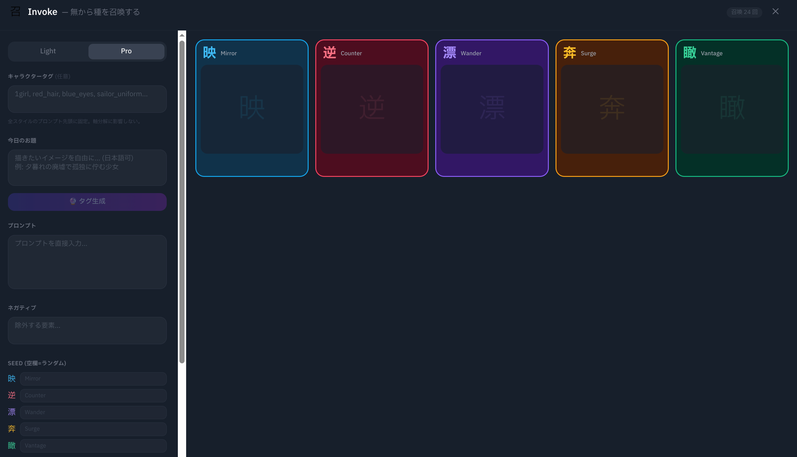

左上の `Light / Pro` トグルで切り替えます。ライトモードの入力を一括でバイパスし、プロンプトを直接コントロールできます。

---

### キャラクタータグ

全スピリット共通でプロンプトの先頭に付加されるタグです。特定のキャラクターや固有の外見を固定したいときに使います。

```
例: 1girl, blue_eyes, long_hair, school_uniform
```

---

### 今日のお題 → タグ生成

フリーテキストで「今日のテーマ」を書いて、**🔮 タグ生成** ボタンを押すと Ollama が Danbooru タグと自然言語の説明に変換します。

```
テーマ例: "廃墟の図書館で本を読む少女"
   ↓ タグ生成
タグ例:  ruins, library, 1girl, reading, book, dust, soft_light
説明例: "A girl quietly reading in a ruined library, shafts of light through broken windows"
```

生成結果はそのまま下のプロンプト欄に反映されます。手動で編集することもできます。

---

### プロンプト直接編集

ポジティブプロンプトとネガティブプロンプトを直接入力できます。これらは5スピリット**全員に共通**のベースとして使われます（各スピリットはここに自分の個性を追加します）。

---

### スピリット別シード

スピリットごとにシードを固定できます。空白のままにするとランダムになります。特定の種を「少しだけ変えて再生成」したいときに便利です。

---

## 共通設定

ライトモード・プロモードに関わらず、常に表示されている設定です。

### プロンプト形式

| 選択肢 | 内容 |
|--------|------|
| **DB + 文**（デフォルト） | Danbooru タグと英語の情景描写を両方生成 |
| **文のみ** | 自然言語の説明のみ（FLUX・Anima 系に向いている） |
| **DB のみ** | Danbooru タグのみ（SD 1.5 / SDXL / Pony 系に向いている） |

### ワークフロー

ComfyUI のワークフローを選択します（必須）。選択しないと召喚ボタンが有効になりません。

### スピリット選択

5つのスピリットを個別にオン/オフできます。1つ以上選択が必要です。特定のスピリットだけ比較したいときに絞り込めます。

---

## 召喚する

すべての設定が整ったら **召喚** ボタンを押します。

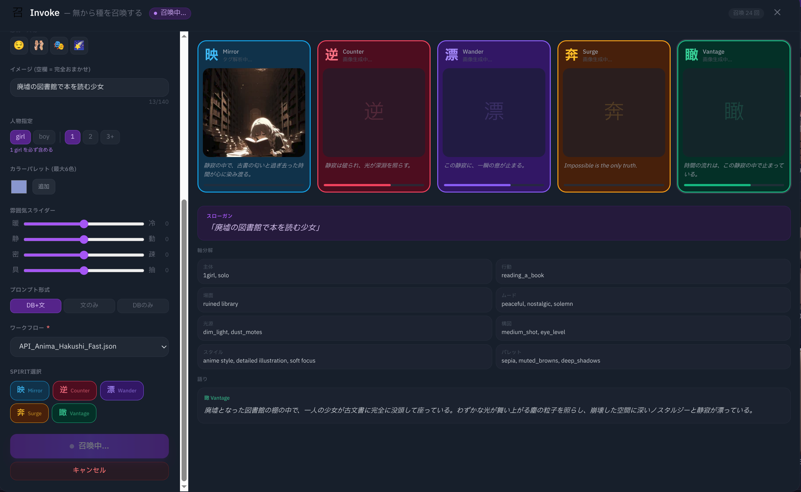

### ステータスの流れ

各スピリットカードは以下の順でステータスが進みます。

```
待機中  →  プロンプト生成中...  →  画像生成中...  →  タグ解析中...  →  完成
```

すべてのスピリットが「完成」または「エラー」になるとセッション完了です。

### モノローグ演出

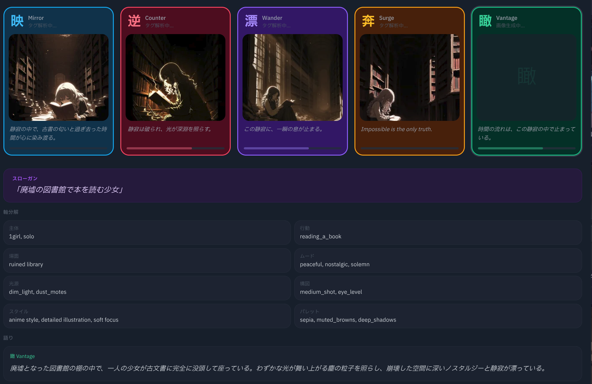

プロンプト生成が終わると、各スピリットの**内面のつぶやき（モノローグ）**がカードに表示されます。テキストはUIの言語設定に合わせて日本語または英語で生成されます。テキストの出現アニメーションはスピリットごとに異なります。

| スピリット | 演出 |
|-----------|------|
| 映 Mirror | 安定した一定速度でゆっくり現れる |
| 逆 Counter | 速度が不安定に揺れ、文字が小さくぶれる |
| 漂 Wander | 通常速度に、ときどき1文字だけ別文字に化ける |
| 奔 Surge | カオスな速度変化、濁点や合成文字が混入してから正しい文字に戻る |
| 瞰 Vantage | フェードインで700ms かけてじわじわ現れる |

### 適合度スコア

画像生成後に Ollama がユーザー意図との一致度を 0〜100% で評価します。スコアはカード右上のバッジに表示されます。

---

## キャンセル

生成中（**召喚ボタンがキャンセルに切り替わっている間**）は、いつでもセッションを中止できます。

**キャンセル** を押すと：
- 進行中のすべてのジョブが中断されます
- まだ「完成」になっていないスピリットはエラー状態になります
- 「完成」済みのスピリットの結果はそのまま残ります

---

## 完成後の操作

スピリットが「完成」になると、カード下部に3つのボタンが現れます。

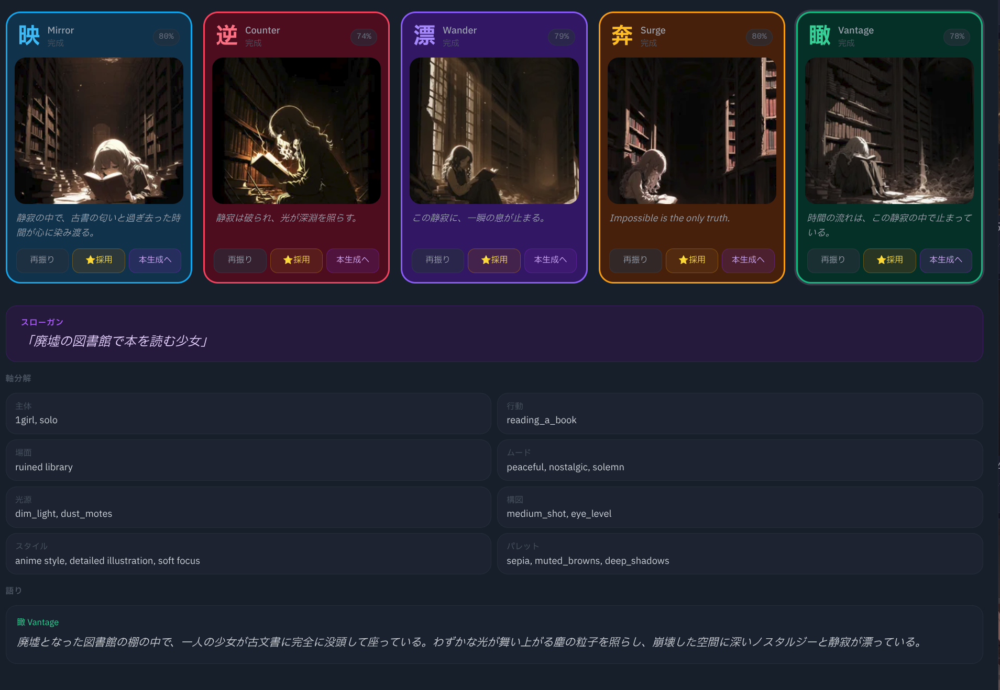

### 再振り（Respin）

そのスピリット**だけ**をもう一度生成します。軸分解は再実行されず、同じ軸スナップショットから新しいプロンプトを作り直します。他のスピリットの結果には影響しません。

### ⭐ 採用（Adopt）

生成画像をコレクションに取り込みます。採用すると genesis メタデータ（使用スピリット・セッション情報・軸スナップショット・兄弟スピリットの画像 hash・再振り回数など）が一緒に保存されます。

### 本生成へ（Send to Refine）

そのスピリットのプロンプト（ポジティブ・ネガティブ）を錬成スタジオへ転送します。フルパラメータでの本番生成に使ってください。

---

## 今日のビジョン（Daily Oracle）

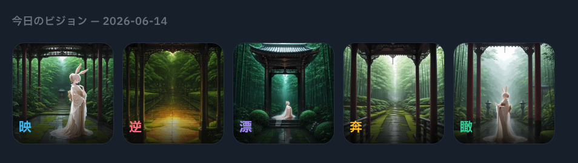

右ペイン上部に「今日のビジョン」が表示されます。これは毎日深夜に自動実行される**デイリーオラクル**が生成した 5スピリット分の種です。

- デフォルトは OFF になっているので、管理画面で有効にすると利用できます
- 日付ラベルと 5枚のサムネイルが並びます
- 各画像をクリックすると詳細画面から錬成スタジオに移動できます
- 自分で召喚しなくても毎朝新しい種が待っています

---

## スピリットをうまく使い分けるには

| やりたいこと | おすすめスピリット |
|---|---|
| イメージ通りの画像を確実に得たい | **映 Mirror** だけを有効にする |
| 同じ意図から正反対の画像を見てみたい | **映** と **逆** を並べる |
| 意外なゲスト要素を混ぜてほしい | **漂 Wander** を追加する |
| 完全にぶっ飛んだものも試したい | **奔 Surge** を有効にする |
| AI に全部委ねて驚きたい | **瞰 Vantage** のみで召喚する |
| 比較のために全パターンを見たい | 全スピリットを有効にする（デフォルト） |

> 📖 技術的な仕組みを知りたい方は技術リファレンス（近日公開）をご覧ください。
