# Invoke — Creator's Guide

**Ranbell Image v0.2.0**

---

## What is Invoke?

*"I know what I want to make — I just can't put it into words yet."* — Invoke is for exactly that moment.

Invoke is a **seed generation** panel. All you provide is a mood, some colors, and a rough impression. Five Spirits each interpret your intent through their own creative philosophy and generate five seeds in parallel. Pick one to adopt, send it to a full generation run, or respin just that Spirit and try again — the choice is yours.

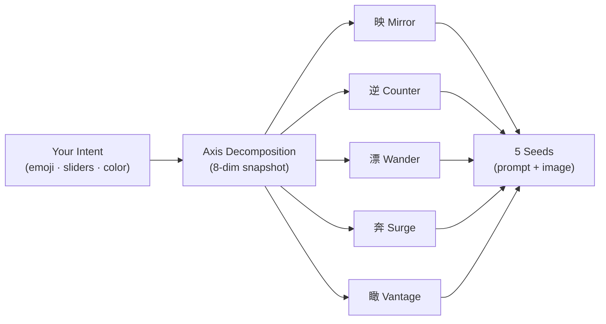

---

## The Five Spirits

| Kanji | Name | Role | Frame |
|:-----:|------|------|-------|
| **映** | Mirror — Faithful | Realizes your intent without deviation; stays exactly on the axis centerline | Gold (alignment ≥ 85%) |
| **逆** | Counter — Rebel | Shows the shadow of your desire; inverts exactly one axis to create contrast and depth | Obsidian (alignment ≤ 15%) |
| **漂** | Wander — Stranger | Weaves in rare "guest" elements that feel like they always belonged | Gold (alignment ≥ 85%) |
| **奔** | Surge — Lunatic | Embraces the impossible; commits fully to low-co-occurrence tags, treating even failed images as success | Obsidian (alignment ≤ 15%) |
| **瞰** | Vantage — Oracle | Complete creative freedom; reads your intent deeply and focuses entirely on producing a striking result | Gold (alignment ≥ 85%) |

> **About frame colors**
> Mirror, Wander, and Vantage aim *toward* your intent — the closer the match, the more their gold frame glows.
> Counter and Surge succeed *by moving away* — the lower the alignment, the more their obsidian frame rewards them.

---

## Opening the Panel

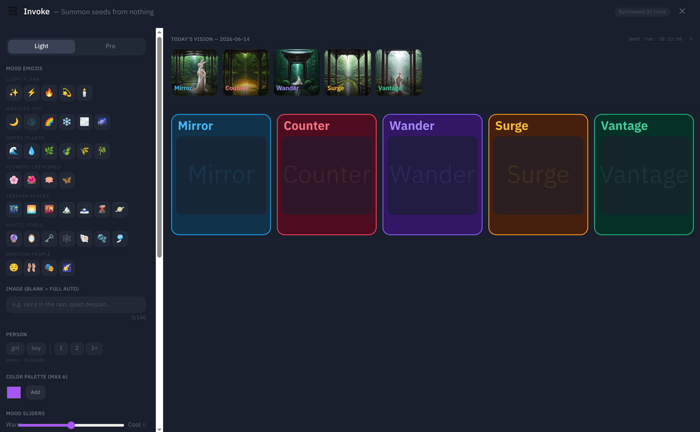

The panel is split into **two panes**.

| Pane | Contents |
|------|----------|
| **Left (Input Zone)** | Mode toggle · all input controls · Invoke button. Fixed width 340 px |
| **Right (Output Zone)** | Top: Daily Oracle / Bottom: session results (Spirit cards) |

Open the panel from the `召` icon at the top-right of the header, or from the navigation bar.

---

## Light Mode

The default state is Light mode. Controls appear top to bottom.

### Mood Emoji

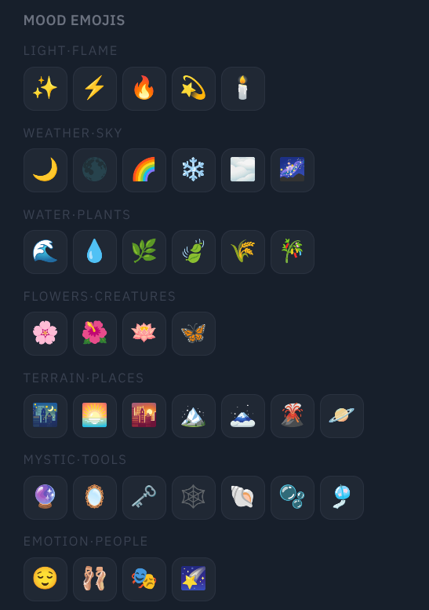

Choose from 39 emoji across 7 categories. Multiple selections are allowed.

| Category | Examples |
|----------|---------|
| Light · Fire | ☀️ 🌙 🔥 ✨ |
| Weather · Sky | ⛅ 🌧️ 🌈 ❄️ |
| Water · Plants | 🌊 🍃 🌿 🌸 |
| Flowers · Creatures | 🌺 🦋 🐈 🐦 |
| Terrain · Places | 🏔️ 🌲 🏙️ 🏖️ |
| Mystery · Objects | 🔮 📜 ⚙️ 🗝️ |
| Emotion · People | 💫 🎭 👁️ 💭 |

Selected emoji feed into the mood and atmosphere axis decomposition. Selecting nothing means *"your call"* — the Spirits decide.

---

### Image Text

A free-text field (up to 140 characters). Rough descriptions, single words, fragments — anything goes.

```
Example: "ruins at dusk, silence, a last sliver of light"
Example: "blue, melancholy, girl, rain"
```

You can also **invoke with this field empty**. Leaving everything to the emoji and sliders often produces the most unexpected seeds.

---

### Person Spec

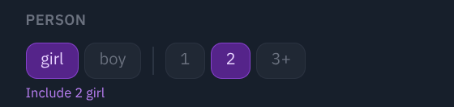

Use this when you specifically want a person in the image.

- **Gender**: `girl` / `boy` (neither = no specification)
- **Count**: `1` / `2` / `3+` (unset = no specification)

Selecting neither button does not mean *"no person"* — it means *"no preference."* If a Spirit judges that a person fits, it will add one.

---

### Color Palette

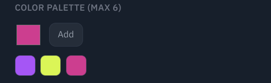

Add up to **6 colors** via the color picker. The colors you specify are reflected in the palette axis of each generated prompt.

---

### Mood Sliders

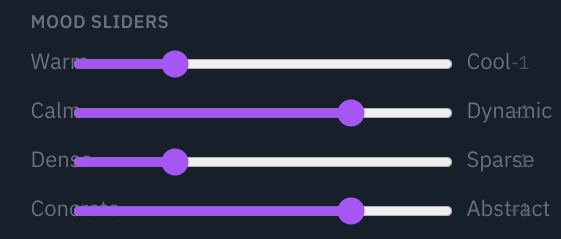

Four axes, each adjustable from −2 to +2. Center (0) is neutral.

| Axis | Left (−2) | Right (+2) |
|------|-----------|------------|
| Warm / Cool | Cool, blue atmosphere | Warm, orange atmosphere |
| Still / Dynamic | Stillness, silence, stasis | Energy, movement, vitality |
| Dense / Sparse | Crowded, complex, information-rich | Breathing room, simple, minimal |
| Concrete / Abstract | Realistic, representational, grounded | Abstract, conceptual, geometric |

### Camera Work

Lock in a shot size and angle before invoking. Whatever you select is injected as a **hard constraint** on the composition axis — all five Spirits will honor it. Leave unset for *"AI decides."*

**Shot Size** (7 options)

| Button | Tag | Description |
|--------|-----|-------------|
| Wide | `wide_shot` | Wide angle, emphasizes background |
| Full Body | `full_body` | Full character from head to toe |
| Cowboy | `cowboy_shot` | Thigh to top |
| Upper Body | `upper_body` | Waist to top |
| Bust | `bust` | Chest to top |
| Close-up | `close_up` | Face prominently framed |
| Extreme Close-up | `extreme_close_up` | Extreme crop of eyes, mouth, etc. |

**Angle** (7 options)

| Button | Tag | Description |
|--------|-----|-------------|
| From Above | `from_above` | Looking down |
| From Below | `from_below` | Looking up |
| Side | `from_side` | Directly to the side |
| Behind | `from_behind` | Back view |
| Dutch | `dutch_angle` | Camera tilted for dramatic tension |
| Aerial | `aerial_view` | Overhead, drone-like |
| Worm's Eye | `worm_eye_view` | Extreme low angle from ground level |

Buttons are toggles — press again to release.

---

## Pro Mode

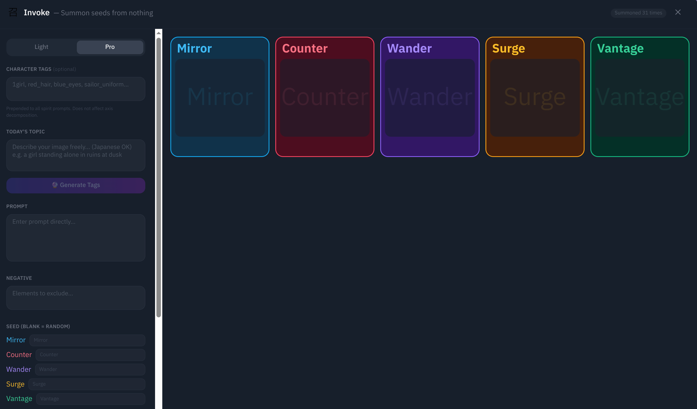

Switch using the `Light / Pro` toggle at the top-left. Pro mode bypasses the Light inputs entirely and gives you direct control over the prompt.

---

### Character Tags

Tags prepended to every Spirit's prompt. Use these when you want to lock in a specific character or appearance.

```
Example: 1girl, blue_eyes, long_hair, school_uniform
```

---

### Today's Theme → Tag Generation

Write a free-text theme for today, then press the **🔮 Generate Tags** button. Ollama converts it into Danbooru tags and a natural language description.

```
Theme: "a girl reading in a ruined library"
   ↓ Generate Tags
Tags:  ruins, library, 1girl, reading, book, dust, soft_light
Desc:  "A girl quietly reading in a ruined library, shafts of light through broken windows"
```

The result is automatically populated into the prompt fields below. You can edit it further by hand.

---

### Direct Prompt Editing

Edit the positive and negative prompts directly. These act as a **shared base** for all five Spirits — each Spirit then adds its own personality on top.

---

### Per-Spirit Seeds

Fix a seed for any individual Spirit. Leave blank for random. Handy when you want to regenerate *one* seed with just a small variation.

---

## Common Settings

These settings are always visible regardless of mode.

### Prompt Format

| Option | Output |
|--------|--------|
| **DB + Text** (default) | Both Danbooru tags and an English scene description |
| **Text only** | Natural language only — suited for FLUX, Anima-family models |
| **DB only** | Danbooru tags only — suited for SD 1.5 / SDXL / Pony-family models |

### Workflow

Select a ComfyUI workflow (required). The Invoke button stays disabled until one is chosen.

### Spirit Selection

Enable or disable any of the five Spirits individually. At least one must be active. Use this to compare specific Spirits side-by-side.

---

## Invoking

Once everything is set, press the **Invoke** button.

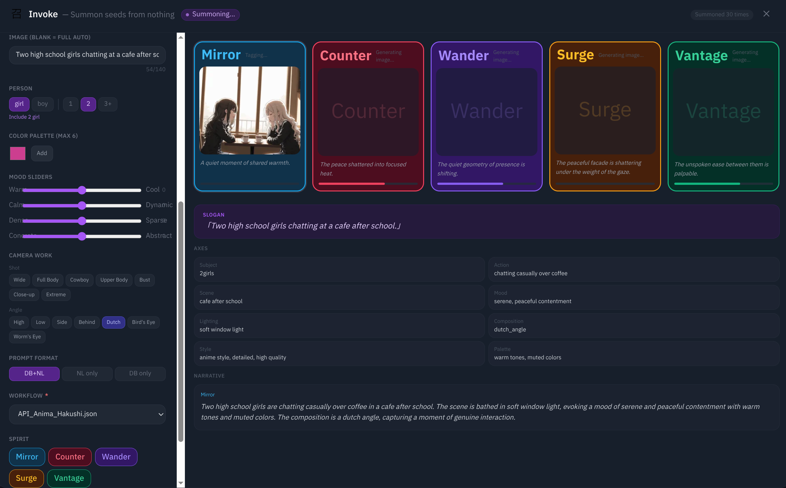

### Status Flow

Each Spirit card progresses through the following stages:

```
Waiting  →  Generating prompt...  →  Generating image...  →  Analyzing tags...  →  Done
```

The session is complete when every Spirit reaches **Done** or **Error**.

### Spirit Monologue

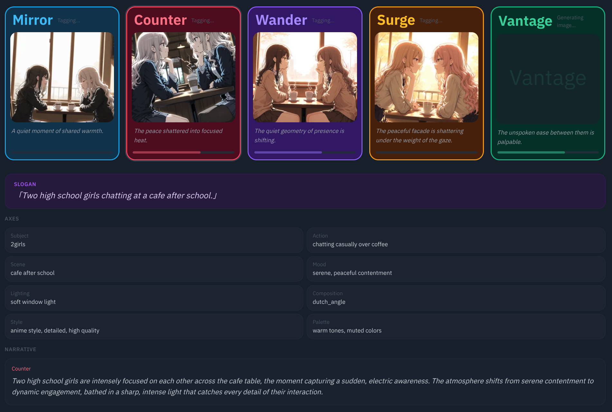

Once prompt generation finishes, each Spirit's **inner monologue** appears on its card. Text is generated in Japanese or English based on your UI language setting. Each Spirit has its own distinct text animation.

| Spirit | Animation |
|--------|-----------|
| Mirror | Smooth, steady reveal at a calm pace |
| Counter | Erratic speed, characters jitter small |
| Wander | Normal speed with occasional single-character substitutions |
| Surge | Chaotic speed swings; dakuten and composite characters bleed in before resolving correctly |
| Vantage | Fade-in, slowly materializing over 700 ms |

### Alignment Score

After image generation, Ollama rates how closely the image matches your original intent on a 0–100% scale. The score appears as a badge in the top-right corner of each card.

---

## Canceling

While generation is in progress (the button reads **Cancel**), you can stop the session at any time.

Pressing **Cancel**:
- Interrupts all in-progress jobs
- Marks any Spirit not yet at **Done** as Error
- Keeps the results of any already-completed Spirits intact

---

## What to Do After

When a Spirit reaches **Done**, three buttons appear at the bottom of its card.

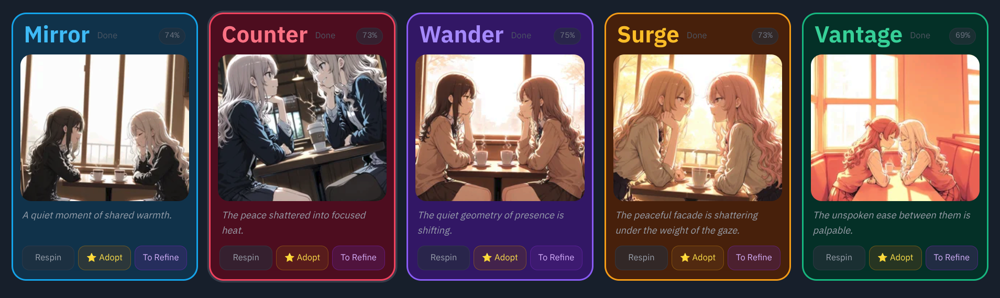

### Respin

Regenerates that Spirit **only**. The axis decomposition is not re-run — a new prompt is built from the same axis snapshot. Other Spirits are unaffected.

### ⭐ Adopt

Takes the generated image into your collection. Adoption saves full genesis metadata alongside the image: which Spirit was used, session info, the axis snapshot, sibling Spirit image hashes, respin count, and more.

### Send to Refine

Transfers that Spirit's prompts (positive and negative) to the Prompt Alchemy Studio for a full-parameter generation run.

---

## Daily Oracle

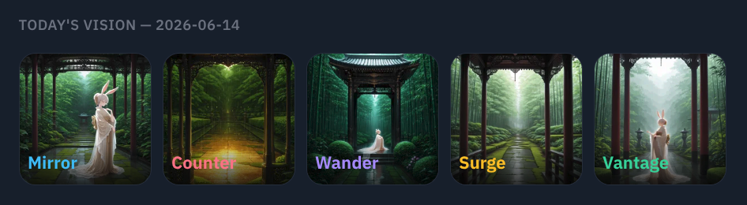

The top of the right pane shows **Today's Vision** — five seeds generated overnight by the **Daily Oracle**, which runs automatically each day at midnight.

- Off by default; enable it in the Admin panel to activate
- Shows a date label and five thumbnails
- Click any image to navigate from the detail view into the Prompt Alchemy Studio
- A fresh set of seeds is waiting for you every morning, even if you never invoke manually

---

## Choosing the Right Spirit

| Goal | Recommended Spirit(s) |
|------|-----------------------|
| Get an image as close to your vision as possible | **Mirror** only |
| See both your intent and its opposite side-by-side | **Mirror** + **Counter** |
| Add an unexpected guest element | **Wander** |
| Try something that might completely surprise you | **Surge** |
| Hand full creative control to the AI | **Vantage** only |
| Compare all interpretations at once | All Spirits enabled (default) |

> 📖 For the technical details behind how Invoke works, see the Technical Reference (coming soon).
