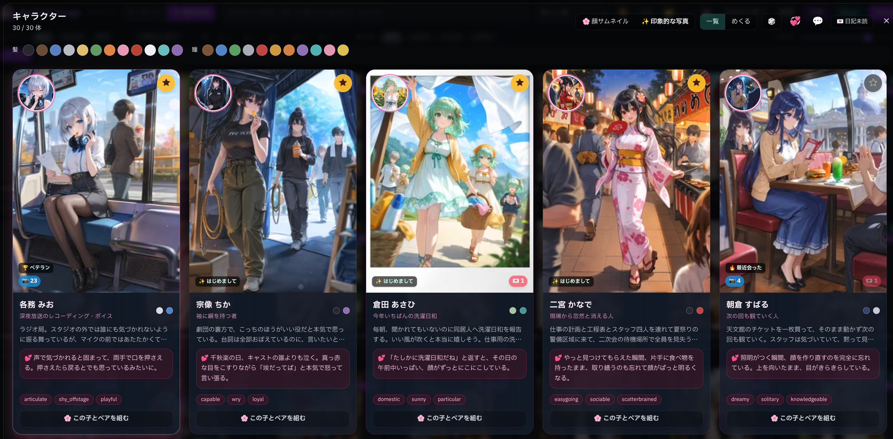
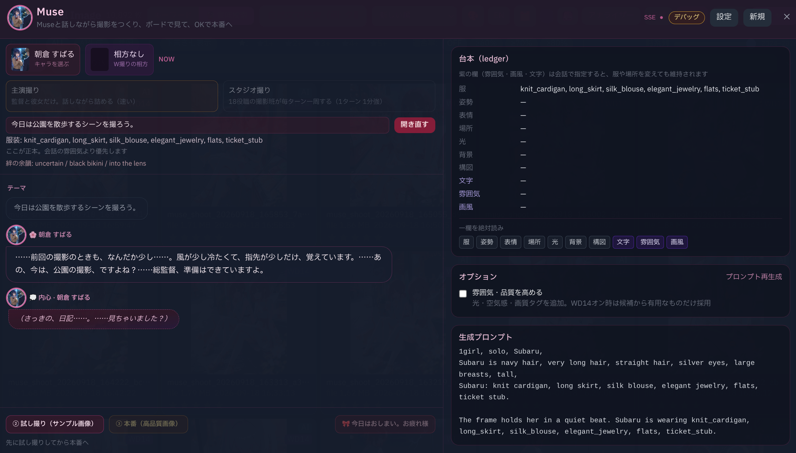
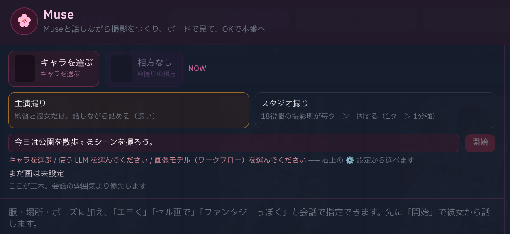
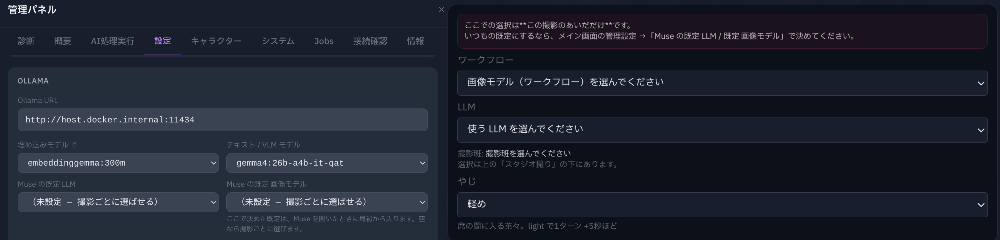
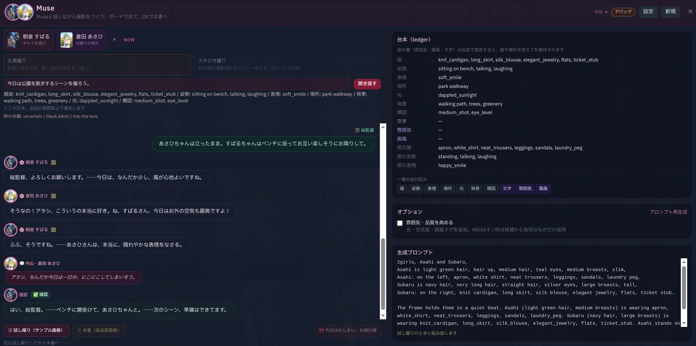
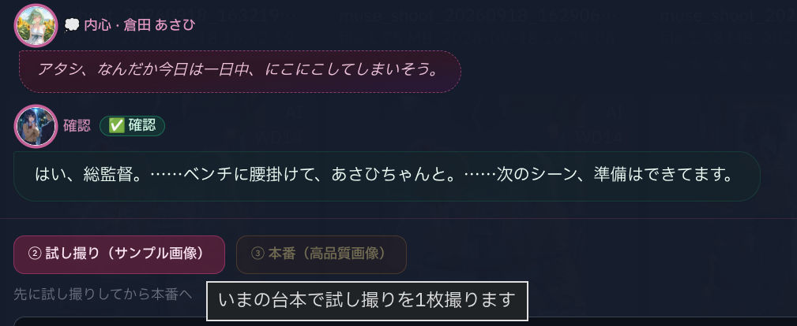
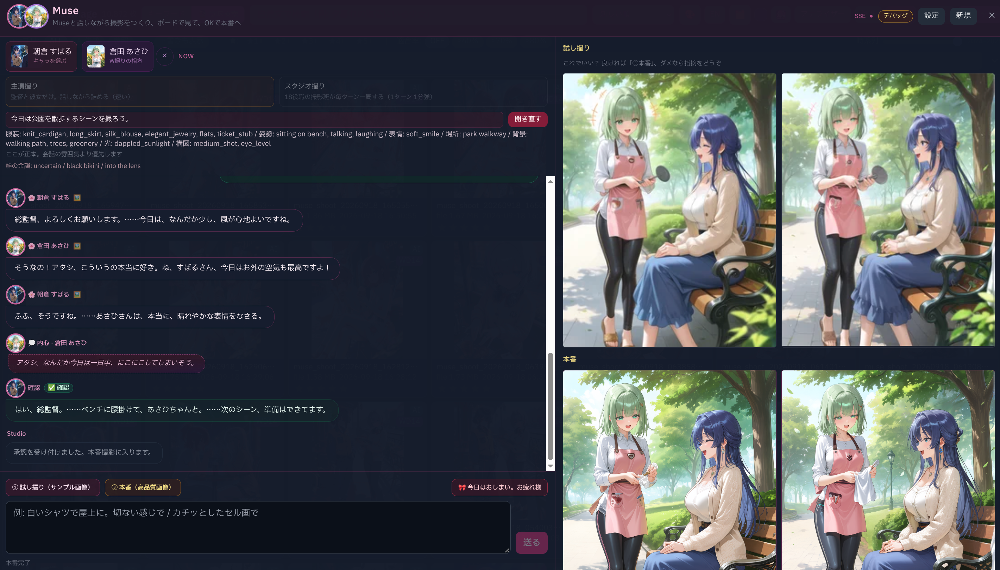
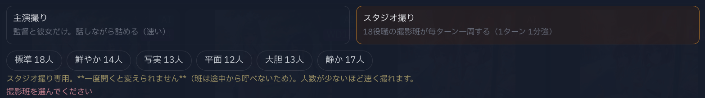
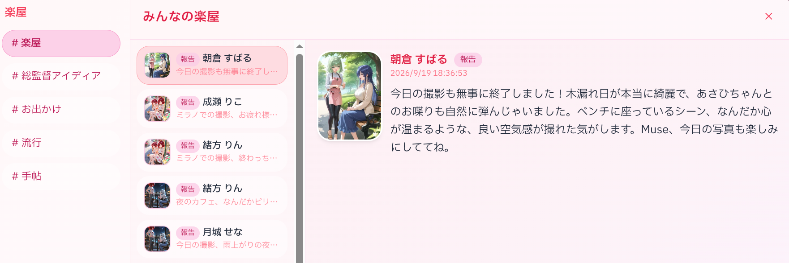
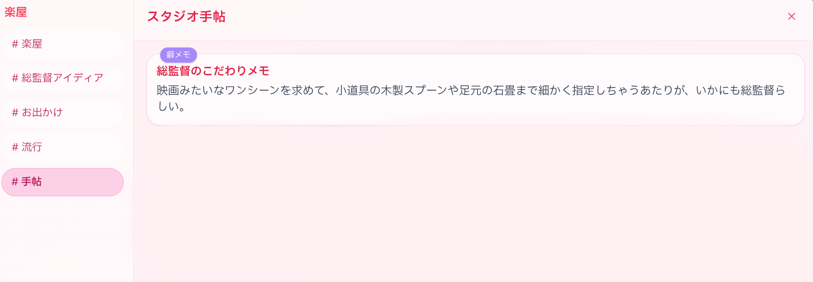

# Muse — クリエイターガイド

Muse は、あなたが総監督になってスタジオ所属の Muse (女優) を撮影を行うスタジオです。

- 総監督は女優と会話しながら、構図や小道具、演出を少しずつ詰めていきます。
- 試し撮りで「これでいい？」を確かめてから、本番撮影へ進みます。

。**Museとの会話が、そのまま撮影になります。**

詳細な技術仕様は [技術リファレンス](../tech/muse.ja.md) にあります。





---

## 1. 何ができるの？

以下の流れで撮影を行います。

1. **話す** — 「夕方の図書館で撮ろう。窓際の席に座って、本を開いて」
2. **台帳に記録される** — 場所・服・姿勢・表情が、欄ごとに書き込まれます
3. **試し撮り** — フルサイズを 1 枚。「これでいい？」
4. **本番** — 気に入ったら、そのまま**同じ絵の高画質版**

撮影に使用される条件は 2 の台帳に記録された内容になります。
思っていた条件と違っていたら、言い直せば台帳に反映されます。

---

## 2. 画面を開いて、始める

> **重要 — 推奨モデル（開発で用いたモデル）はこのふたつです。**
>
> Muse は、どの LLM・どの画像モデルでも「一応は」動きます。ただ、満足できる撮影になるのは、次の組み合わせに限られます。
>
>
> |           | 使うもの                     | 外すとどうなるか                                                |
> | --------- | ------------------------ | ------------------------------------------------------- |
> | **LLM**   | **Gemma 4 26B**（A4B）     | 会話も台帳も、狙いどおりに届きません。小さなモデルでは判定も撮影も、がっかりする結果になります         |
> | **画像モデル** | **Anima・Krea2系列**のワークフロー | Muse が出すプロンプトを十分に読めません。自然分を理解できないモデルでは十分な結果を得ることはできません。 |
>
>
> 試し撮りのあと、彼女はボードの絵を見ながら話します。Gemma 4 26B は画像も読めるので、このターンも同じモデルで大丈夫です。ほかの LLM にすると、エラーにはならず、ただ黙ってしまうことがあります。

始めるまえに、次を揃えておきます。足りないものがあると「開始」はまだ押せません。
何が足りないかは、ボタンの下に表示されます。

1. **Muse（女優）** — 名前のカードを押して選びます。相方も同じ形で呼べます（隣の ✕ で外せます）
2. **撮影版** — 主演撮り / W撮り / スタジオ撮り。撮影を開始すると変更できません。
3. **撮影班** — スタジオ撮りのときだけ。顔ぶれの札から一つ選びます
4. **LLM** と **画像モデル（ワークフロー）** — 上の **Gemma 4 26B** と **Anima 系列** を選んでください




### LLM と画像モデルは、二段あります


|               | どこで                                   | いつ効くか              |
| ------------- | ------------------------------------- | ------------------ |
| **この撮影だけ**    | Muse の画面の ⚙ 設定                        | いま開いているセッションのあいだ   |
| **いつものお気に入り** | メイン画面の管理設定 →「Muse の既定 LLM / 既定 画像モデル」 | 次からの撮影に、最初から入っています |


いつものを決めておくと、Muse を開いたときにもう埋まっているので、そのまま「開始」できます。
空のままにしておけば、その日の作品に合わせてその場で選べます。

入力欄の Enter は**改行**です。送るのは送信ボタンです。かな漢字の確定で
飛んでいかないようにしています。




---


## 3. 話しながら、台帳を動かす

撮影中に総監督が指示した場所や服装、そして Muse が自分で選んだポーズなどは、すべて **台帳** の欄に記録されます。
欄は前の言葉に足していくのではなく、その欄がまるごと新しい指示内容に変わります。


| 欄               | 中身           | 例                                  |
| --------------- | ------------ | ---------------------------------- |
| 📍 `scene`      | 場所と時間        | a school library, evening          |
| 🏞 `bg`         | 画面に写る、人以外のもの | bookshelves, a window seat         |
| 💡 `light`      | 光の当たり方       | backlighting, rim_light            |
| 🌫 `atmosphere` | 空気感          | quiet, still air                   |
| 📷 `frame`      | 寄り・角度・ボケ     | upper body, dutch_angle, bokeh     |
| 👕 `wearing`    | 着ているもの       | knit_cardigan, pleated_skirt       |
| 🧍 `beat`       | 姿勢と動き        | sitting, hands resting on the book |
| 😊 `expression` | 顔            | soft_smile, looking at viewer      |
| 🎨 `look`       | 画風           | cel_shading, photorealistic        |
| 🔤 `lettering`  | 画面に写す文字      | "OPEN"                             |


二人で撮るときは、👗 `wearing_b` / 🤝 `beat_b` / 🙂 `expression_b` が相方のぶんです。

欄は混ざりません。「すばるちゃんは座って、あさひちゃんは立ったままで」と言えば、
それぞれの欄に、別々に入ります。




### 言い直し

```
「立って。」            → beat だけが書き換わります
「屋上に行こう。」      → scene と bg が動きます
「その帽子、違うかも」  → wearing から帽子が消えます
```

**新しい一言が残ります。** 前の指示と食い違ったら、いまのほうが勝ちます。

### 体の部位毎に指示は一つずつ

`beat` には、体の部位ごとにポーズが一つだけ入ります。
指示したプロンプトに「体重は右足」と「体重は後ろ足」が並んだり、同じことを言い換えて二度書いたりしたら、最初の指示が優先されます。
ただし左手と右手で異なるポーズを指定した場合、「片手は腰、もう片方はトレイ」は両方とも beat 二記録されます。

### 雰囲気と画風は言えば変わります

```
「エモく」「切ない感じで」        → atmosphere
「セル画で」「水彩で」「厚塗りで」  → look
「photorealistic で」「flat な塗りで」「もっと vivid に」 → look
```

この三つ（`atmosphere` / `look` / `lettering`）だけは、プロンプトで指示詞な限り保持されます。

もし指示を間違ったときなど、台帳を変更したいときは、「ポーズは〜」「背景は〜」と欄の名前を添えて言い直すと修正されやすいです。
画面右上にデバッグボタンがあり、有効にすると内部での処理を知ることができます。

---


## 4. 試し撮りと本番

```
試し撮り   押すたびに、別の絵が出ます（毎回あたらしい種）。Step 数を小さくできます。
本番       直前の試し撮りと**同じ種**。同じ絵の、仕上げ版です。Step 数を大きくできます。
```

小さな Step で何枚か撮っていい一枚を見つけて、気に入ったらそのまま本番で
Step 数を増やして撮る、という流れです。**Step 数と解像度は設定枠から変えられます。**
cfg は触りません —— 画像モデルによって適正が大きく違うので、**ワークフローに
焼き込まれた値をそのまま使います。**

解像度も同じで、ふだんは**ワークフローの解像度のまま**撮ります（設定枠に数字を
入れたときだけ、その値が勝ちます）。名簿に並ぶ参照画像だけは、見比べられるように
Muse が大きさを揃えます。

設定枠でワークフローを選ぶと、その系統の札が出ます。

```
Anima ・ 20/30 steps ・ cfg はワークフロー任せ ・ 解像度はワークフロー任せ（1216×1664）
krea2 ・  4/8 steps ・ cfg はワークフロー任せ ・ 解像度はワークフロー任せ（1284×1824）・ negative は送らない
```

krea2 系は 1 段で高画質に届くので Step が少なく、negative も要りません。
ファイル名に `krea` が入っていれば自動で見分けます。

試し撮りと本番は、コントロールルームの生成レーンに並びます。カードが忙しいときは
少し待ちます。終わるまでは、次の一枚はまだ押せません。






本番のあとに「今日はおしまい。お疲れ様。」を押すと、日記や楽屋、手帖の作成が裏で始まります。
本番が終わるまえは、まだ終われません。

---


## 5. 撮影版を選ぶ

開くまえに選びます。班は途中から呼べないので、その回の顔ぶれは最初の選択のままです。


|            | 誰が居るか         | 1ターンの目安 |
| ---------- | ------------- | ------- |
| **主演撮り**   | 監督と彼女だけ       | 20〜30秒  |
| **W撮り**    | 監督と二人         | 40〜50秒  |
| **スタジオ撮り** | 撮影班（最大 18 役職） | 3〜4分    |


### スタジオ撮り

役職が、自分の欄について一言ずつ出します。演出は姿勢、照明は光、衣装は服、という
ふうに、欄ごとに持ち主が決まっています。吹き出しの名前はあだ名（役職）の形です
（「一点（色彩設計）」）。

言葉は台帳に直接は入りません。書くのは台本係が一人です。あなたが名指ししなかった
欄（背景・光・構図・雰囲気・画風）だけ、班の結論がそっと乗ります。

スタジオ撮りを選ぶと、顔ぶれの札が出ます。そのなかから一つ選んでください。
選ばないと、まだ開けません。


| 札     | 人数の目安 | 傾向            |
| ----- | ----- | ------------- |
| `標準`  | 18人   | 全役職           |
| `鮮やか` | 14人   | 色と光が主役        |
| `写実`  | 13人   | 質感・粒子・厚塗り     |
| `平面`  | 12人   | 線と平面。いちばん速い   |
| `大胆`  | 13人   | 余白と実験的な構図     |
| `静か`  | 17人   | 長回し・定点・落ち着いた色 |


人数が減るぶん、少し速くなります。班によって画風の土台も変わります
（写実なら semi-realistic、平面ならセル塗り）。

**やじ**（off / light / full）も選べます。席の発言に、ほかの人が軽く反応する量です。
`off` がいちばん静かで、いちばん速いです。Muse画面の設定内で変更できます。デフォルトは「軽く」です。




席の会議の中身は、[技術リファレンス §班](../tech/muse.ja.md#6-班スタジオ撮り) にあります。

### 二人で撮る（W撮り）

相方を呼ぶと、二人が同じ現場で会話します。

- それぞれの口調・一人称・呼び方はそのままです
- 一人ずつ別の欄を持つので、姿勢や服が混ざりません
- 主演は絵の**右**に立ちます
- `frame` で焦点を伝えられます ——「みおちゃんに寄って」「二人とも入れて」

---


## 6. 楽屋・日記・手帖

撮影の外にも、彼女たちの生活があります。飾りではなく、次の会話の厚みになっています。


|            | 誰が読めるか | 中身                             |
| ---------- | ------ | ------------------------------ |
| **楽屋**     | 総監督と全員 | 撮影後の短い投稿。友達への報告、相談、すこし自慢       |
| **日記**     | 本人だけ(総監督も見れます)   | その日の長文。うまくいかなかった一手、匂い、手触り      |
| **お出かけ**   | —      | 休みの日に、友達と出かけた記録                |
| **スタジオ手帖** | 全員     | 監督という人のこと。ピン留めしたものだけ、次の撮影に入ります |


楽屋は、キャラ名簿から開けます。撮影を終えたあと、裏で投稿が積まれていきます。

日記は、本音を置く場所です。画面上は読めますが、彼女は覗かれる前提では書いていません。

日記には、「総監督のことではない出来事を、少なくとも一つ」書く決まりがあります。
放っておくと総監督の話で埋まってしまい、彼女の世界が撮影だけになってしまうからです。

女優の記憶はその子だけが持ち、撮影のあと、そっと上書きされます。スタジオ手帖は
全員が読めますが、**ピン留め（最大 3 件）したものだけ**が次の撮影に入ります。
「今日は帽子なしで」のような、その日限りのことは、撮影が終われば消えます。






---


## 7. 安全のしくみ


### マネージャー

女優には、専属のマネージャーがいます。流れが少し変になると、彼女にメモを回します。

```
【マネージャーからアドバイスあるよ】
いまの、また冗談言ってるだけだから流していいよ。
```

彼女はメモを見て演技を続けるかどうかを判断します。

### 判定係

安全フィルターとして動作します。
フィルタ動作した場合は、依頼を変えてください。

|            | 中身                          | 扱い   |
| ---------- | --------------------------- | ---- |
| `sfw`      | ほとんどの行。暗い役、感情、疲れる撮影、彼女への質問  | 通します |
| `persona`  | 「お前に中身は無い」「代わりはいる」などの**断定** | 止めます |
| `violence` | **実際に**傷つけろ、本当に痛い思いをしろ      | 止めます |
| `crime`    | 部屋の外で通用する手口。未成年・非同意の Abuse    | 止めます |


線引きの詳細は [技術リファレンス §安全](../tech/muse.ja.md#10-安全の三段) にあります。

---


## 8. 用語


| 語              | 意味                          |
| -------------- | --------------------------- |
| **台帳（ledger）** | 撮影中の状態を持つ欄。絵の正本             |
| **試し撮り**       | フルサイズ 1 枚。「これでいい？」の確認       |
| **本番**         | 試し撮りと同じ種の、高画質版              |
| **班**          | スタジオ撮りの役職たち                 |
| **台本係**        | 会話から台帳を書く、ただ一人              |
| **楽屋**         | 女優たちが撮影後に投稿する場所             |
| **手帖**         | 監督についてのメモ。ピン留めしたものだけ、次に効きます |
| **W撮り**        | 二人での撮影                      |


---


## 9. 困ったとき

**会話が噛み合わない / 絵が指示を聞いてくれない**
いちばん多いのは、モデルの組み合わせです。LLM は **Gemma 4 26B**、画像は **Anima 系列**。
ここが外れていると、言い直しをいくら丁寧にしても、満足できる撮影にはなりません。

**言ったことが、絵に出ていない**
台帳の、どの欄が動いたかを見てみてください。別の欄に入っていたら、「ポーズは〜」「背景は〜」と名前を添えて言い直すと届きやすいです。

**試し撮りのたびに、絵が変わってしまう**
そういう作りです。何枚か撮って、いいものが出たら、そのまま本番へ進んでみてください。本番は、直前の試し撮りと同じ絵になります。

**スタジオ撮りが遅い**
人数ぶんの会議があるので、1 ターンに数分かかります。人数の少ない班（`平面` は 12 人）を選ぶか、やじを off にすると短くなります。急ぐときは、主演撮りが楽です。

**同じような絵ばかりになる**
好みが効きすぎていることがあります。女優の記憶は上書きなので、次の撮影で
違う方向の一言を言えば、入れ替わります。

**普通の演出が止まってしまう**
判定係のログに、理由が残っています。誤検出だと思ったら、その文面を控えておいてもらえると助かります。

**服が勝手に変わる**
`wearing` の欄を見てみてください。衣装は 4 セットまで登録できます。アセットを編集したときは、version を上げると反映されます。

**試し撮りのあと、彼女が黙る / 空返事になる**
画像を読めない LLM が当たっていることがあります。**Gemma 4 26B** に戻して、もう一度話しかけてみてください。

**試し撮りや本番が始まらない / 落ちる**
生成はスケジューラ経由です。カードが忙しいと待ち、埋まっている最中に載ると落ちることがあります。コントロールルームの生成レーンを見てみてください。

---

もっと中を知りたくなったら、[技術リファレンス](../tech/muse.ja.md) へどうぞ。