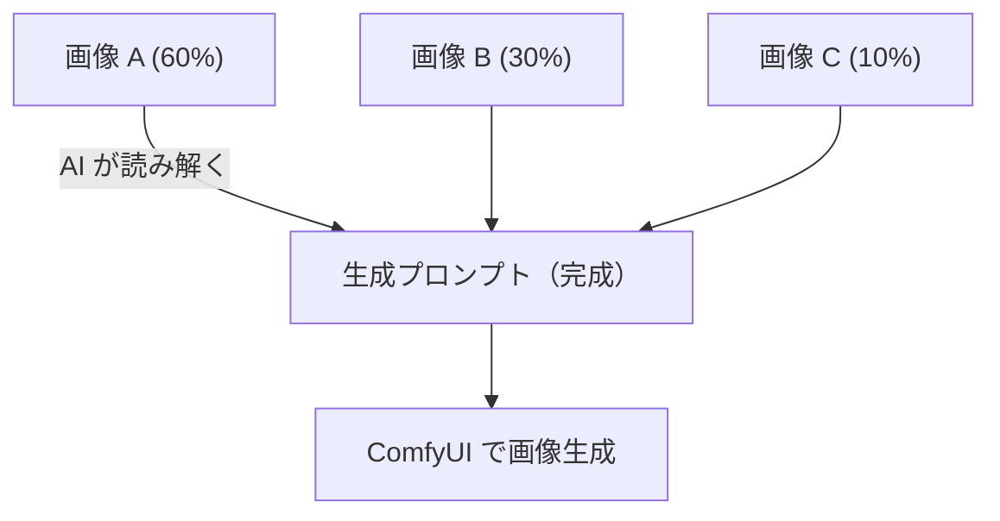
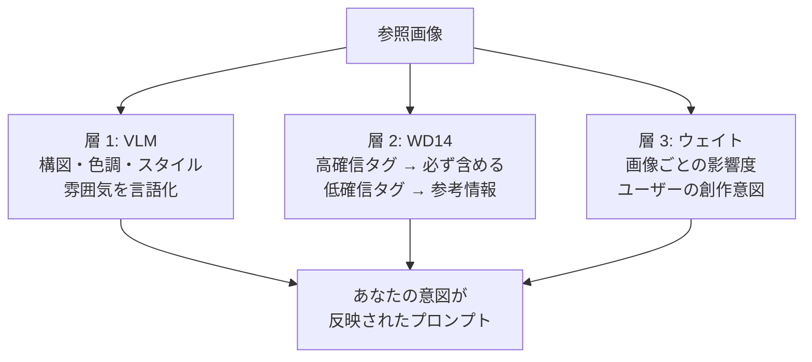
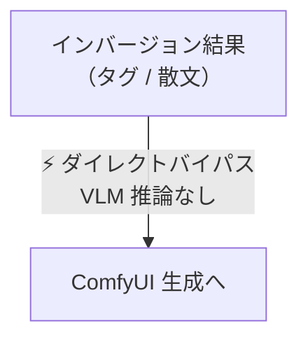
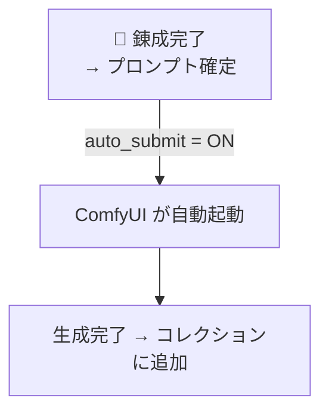
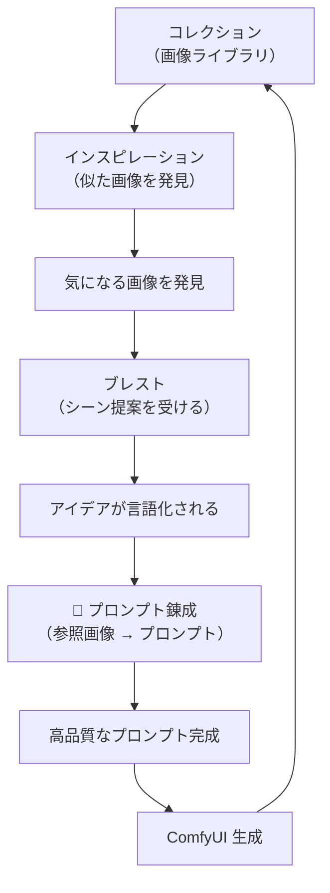

# プロンプト錬成 — クリエイターガイド

**Ranbell Image v0.2.0**

---

## 錬成とは何か

「この雰囲気をもう一度作りたい」——その感覚を、プロンプトに変換してくれる機能です。



参照画像を最大 **6枚** 選んで、それぞれの「影響度」を設定するだけ。あとは AI が自動でプロンプトを書いてくれます。

---

## 参照画像と影響度ウェイト


各画像スロットにスライダーがあり、「この画像をどれくらい重視するか」を 0〜100 で設定できます。

```text
例：2枚の参照画像でウェイトを設定した場合

  画像 A（夕暮れの森）    ██████████  70
  画像 B（赤いドレス）    ████░░░░░░  30

  ↓ AI が読む
  「夕暮れの森の雰囲気を強く、赤いドレスを添えた」プロンプト
```

**ウェイトを省略した場合は均等分配**になります（2枚なら各 50%）。

---

## AI が画像を「3つの層」で読む

参照画像から情報を引き出す方法は 1 つではありません。錬成は **3 つの視点を重ね合わせて** プロンプトを作ります。



単なる「画像の説明」ではなく、**どの画像を重視するか**という創作の意思が込められたプロンプトになります。

---

## プロンプトスタイルを選ぶ

使いたい生成モデルに合わせてスタイルを選びます。


### 比較早見表

| スタイル | 向いているモデル | 出力の形 |
|---------|-------------|--------|
| **natural** | FLUX、Anima など新世代 | タグ + 散文の 2ブロック |
| **danbooru** | Stable Diffusion 系 | カンマ区切りタグのみ |
| **detailed** | 構造化プロンプト向け | 8セクションの詳細記述 |

---

### natural スタイル — 新世代モデル向け

出力は **2ブロック構成**。

```text
BLOCK 1 — タグ行（40〜60 タグ）

1girl, long hair, auburn hair, blue eyes, smile,
school uniform, outdoor, cherry blossoms,
warm lighting, golden hour, bokeh, masterpiece, ...

（空行）

BLOCK 2 — 散文段落（80〜120 語）

A young girl with flowing auburn hair stands in
warm afternoon sunlight, her navy school uniform
catching the golden hour glow...
```

---

### danbooru スタイル — Stable Diffusion 向け

フラットなタグリストだけを出力します。

```text
1girl, solo, long_hair, auburn_hair, blue_eyes,
smile, school_uniform, sailor_collar, outdoor,
cherry_blossoms, golden_hour, bokeh,
masterpiece, best_quality, ultra-detailed, ...
```

---

### detailed スタイル — 細部まで指定したいとき

8つのセクションに分けて詳しく記述します。

```text
Core Subject & Scene Setting:
  桜の園に立つ女学生、懐かしい春の午後

Characters & Composition:
  1girl, auburn hair, blue eyes, school uniform ...

Lighting & Atmosphere:
  Golden hour, soft amber cast, bokeh ...

Style & Artistic Influence:
  Anime illustration, cel-shading ...

（以下 4セクション続く）
```

---

## 追加指示の入れ方（instruction_mode）


日本語で追加指示を書いて、AI に処理させる方法を 3 段階から選べます。

```
  none ─────  指示をそのまま VLM に渡す
               （英語で書く場合はこれが速い）

  basic ────  日本語 → 英語に翻訳してから渡す
               （日本語で気軽に指示できる）  ← おすすめ

  enhanced ─  翻訳 + 指示の種類を AI が分類してから渡す
               （複雑な指示を正確に伝えたいとき）
```

### 画像内テキストの指定

「RANBELL という文字を上部に入れて」のように指定すると、VLM をバイパスして**文字列を直接プロンプトに注入**します。文字が変形・誤解釈されるリスクがありません。

```
指示: 「RANBELL という文字を上部に追加して」
         ↓ basic / enhanced モードが自動処理
最終プロンプト: text "RANBELL", top_text, text_on_image, 1girl, ...
```

---

## ダイレクトバイパス — VLM を使わない高速転送

インバージョン機能や生成履歴から錬成スタジオを開いた場合、すでに高品質なプロンプトが存在します。その場合は **VLM を完全にスキップ**して即座に ComfyUI へ送れます。



| ソース | バイパス内容 |
|-------|-----------|
| インバージョン（タグ） | Danbooru タグ列をそのまま転送 |
| インバージョン（散文） | 自然言語プロンプトをそのまま転送 |
| 生成履歴から再実行 | 前回の生成プロンプトを転送 |

---

## auto_submit — 錬成から生成まで一括

「錬成が終わったらすぐ ComfyUI に投入する」オプションです。ワークフローと ComfyUI ノード ID を設定しておくと、錬成完了後に自動でジョブが走ります。



---

## 錬成中の画面


錬成中はリアルタイムでトークンが流れてきます。途中でキャンセルも可能です。


---

## 創作のサイクル全体像

錬成は、コレクションを使った創作サイクルの**中心**にあります。



生成した画像はコレクションに追加され、**次のインスピレーション探索の素材**になります。使えば使うほど、コレクションが豊かになっていく仕組みです。

---

## 操作クイックリファレンス

| やりたいこと | 設定 |
|------------|------|
| FLUX / Anima でいい感じに生成したい | スタイル: **natural** |
| Stable Diffusion を使っている | スタイル: **danbooru** |
| 参照画像の 1 枚を特に重視したい | その画像のウェイトスライダーを高く |
| 日本語で指示を追加したい | instruction_mode: **basic** |
| 画像に文字を入れたい | basicまたはenhancedで「〇〇という文字を」と指定 |
| インバージョン結果をすぐ生成したい | **ダイレクトバイパス**（自動で適用される） |
| 錬成後すぐ ComfyUI を動かしたい | **auto_submit** をオン |
