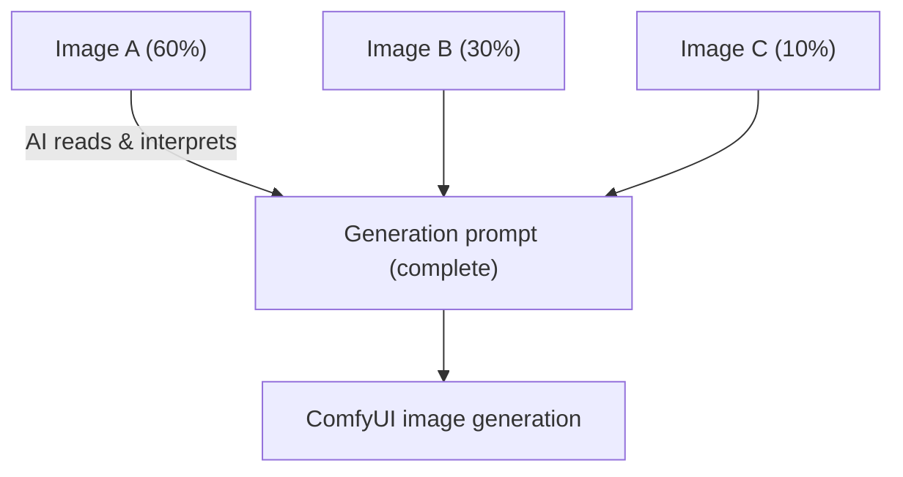
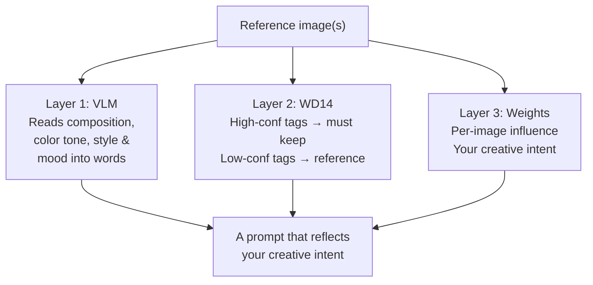
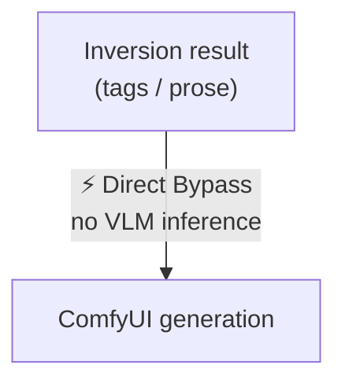
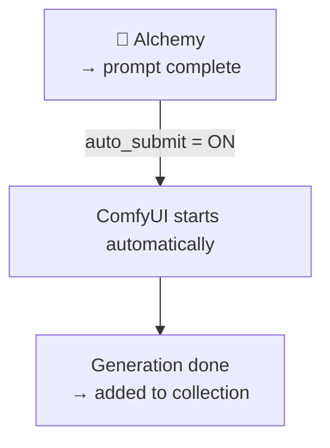
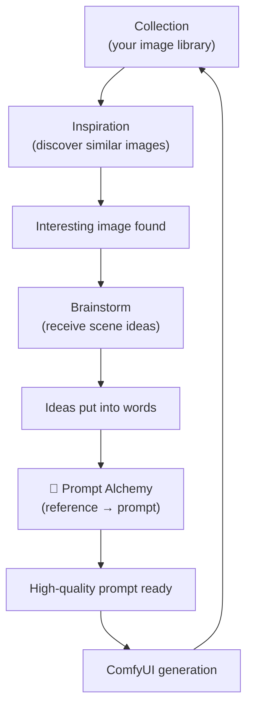

# Prompt Alchemy — Creator's Guide

**Ranbell Image v0.2.0**

---

## What Is Alchemy?

"I want to recreate this feeling." Prompt Alchemy translates that instinct into an image generation prompt for you.



Pick up to **6 reference images**, set how much each one should influence the result, and the AI writes the prompt for you.

---

## Reference Images and Influence Weights


Each image slot has a slider. Set it from 0 to 100 to control how strongly that image shapes the output.

```text
Example: two reference images with weights set

  Image A (forest at dusk)   ██████████  70
  Image B (red dress)        ████░░░░░░  30

  ↓ AI reads
  Prompt strongly weighted toward the dusk forest mood,
  with the red dress as a complement
```

**Leaving weights empty defaults to equal distribution** (50 / 50 for two images).

---

## How the AI Reads an Image in Three Layers

There's more than one way to extract information from a reference image. Alchemy **combines three perspectives** to build the prompt.



The result isn't just a description of the images — it carries **your decision about what matters most**.

---

## Choosing a Prompt Style

Pick the style that matches the generation model you're using.


### Quick-comparison table

| Style | Best for | Output shape |
|-------|----------|-------------|
| **natural** | FLUX, Anima, and other next-gen models | Tags + prose paragraph (2 blocks) |
| **danbooru** | Stable Diffusion family | Comma-separated tags only |
| **detailed** | Structured-prompt models / prompt editors | 8-section detailed description |

---

### natural style — for next-gen models

Output is always **2 blocks**.

```text
BLOCK 1 — tag line (40–60 tags)

1girl, long hair, auburn hair, blue eyes, smile,
school uniform, outdoor, cherry blossoms,
warm lighting, golden hour, bokeh, masterpiece, ...

(blank line)

BLOCK 2 — prose paragraph (80–120 words)

A young girl with flowing auburn hair stands in
warm afternoon sunlight, her navy school uniform
catching the golden hour glow...
```

---

### danbooru style — for Stable Diffusion

Outputs a flat tag list only.

```text
1girl, solo, long_hair, auburn_hair, blue_eyes,
smile, school_uniform, sailor_collar, outdoor,
cherry_blossoms, golden_hour, bokeh,
masterpiece, best_quality, ultra-detailed, ...
```

---

### detailed style — when you want fine control

Describes the scene across 8 named sections.

```text
Core Subject & Scene Setting:
  Female student in a sun-lit cherry blossom garden

Characters & Composition:
  1girl, auburn hair, blue eyes, school uniform ...

Lighting & Atmosphere:
  Golden hour, soft amber cast, bokeh ...

Style & Artistic Influence:
  Anime illustration, cel-shading ...

(4 more sections follow)
```

---

## Adding Instructions (instruction_mode)


You can add extra instructions in any language and choose how the AI processes them.

```
  none ─────  Pass the instruction directly to the VLM
               (fastest if you write in English)

  basic ────  Translate to English first, then pass
               (write freely in any language)  ← recommended

  enhanced ─  Translate + have the AI classify intent type
               (best for complex or multi-part instructions)
```

### Placing text inside the image

Write something like "add the text 'RANBELL' at the top" and the system bypasses the VLM entirely — **the string is injected straight into the prompt**. No risk of the AI misreading or transforming the text.

```
Instruction: "Add the text 'RANBELL' at the top"
         ↓ basic / enhanced handles it automatically
Final prompt: text "RANBELL", top_text, text_on_image, 1girl, ...
```

---

## Direct Bypass — Skip the VLM Entirely

When you open the alchemy studio from Inversion results or generation history, a high-quality prompt already exists. In that case, the VLM is **skipped completely** and the prompt is forwarded to ComfyUI instantly.



| Source | What gets forwarded |
|--------|---------------------|
| Inversion (tags) | Danbooru tag string as-is |
| Inversion (prose) | Natural-language prompt as-is |
| Re-run from history | Prompt from the previous generation |

---

## auto_submit — Alchemy Straight Through to Generation

Enable this option to have ComfyUI start automatically the moment alchemy finishes. Set a workflow and ComfyUI node IDs in advance, and the job fires without any extra click.



---

## While Alchemy Runs


Tokens stream in real time as the prompt is generated. You can cancel at any point.


---

## The Full Creative Cycle

Alchemy sits at the **center** of the collection-driven creative loop.



Every generated image is added back to the collection and becomes **material for the next round of exploration**. The more you use it, the richer the collection grows.

---

## Quick-Reference

| Goal | Setting |
|------|---------|
| Generate with FLUX / Anima | Style: **natural** |
| Using Stable Diffusion | Style: **danbooru** |
| Prioritize one reference image heavily | Raise that image's weight slider |
| Write instructions in your own language | instruction_mode: **basic** |
| Place text inside the image | Use basic or enhanced and write "add the text '…'" |
| Send Inversion results straight to generation | **Direct Bypass** (applied automatically) |
| Run ComfyUI right after alchemy finishes | Turn on **auto_submit** |
