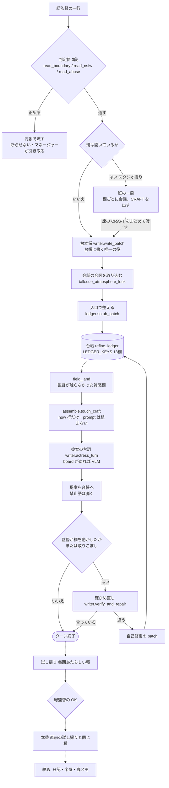
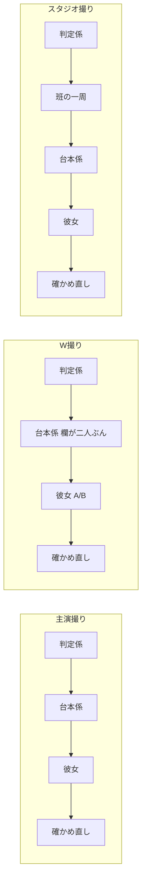
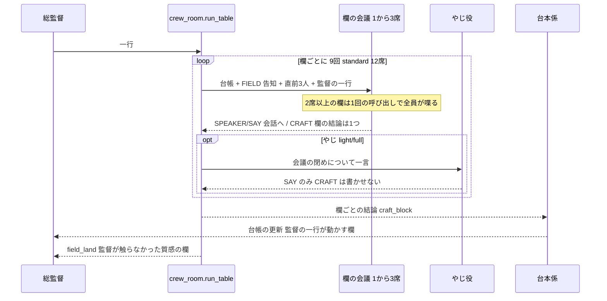
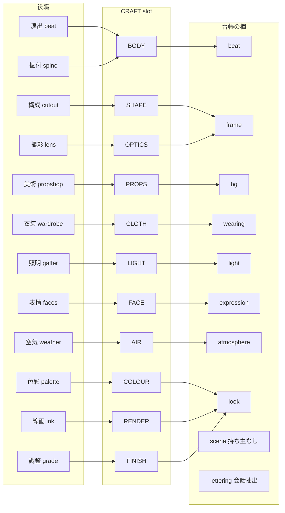
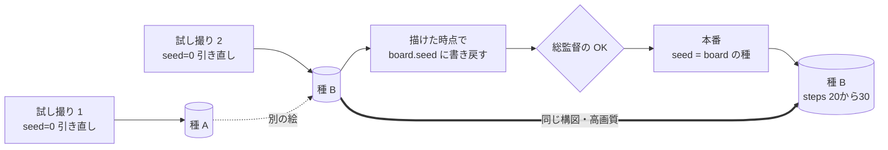
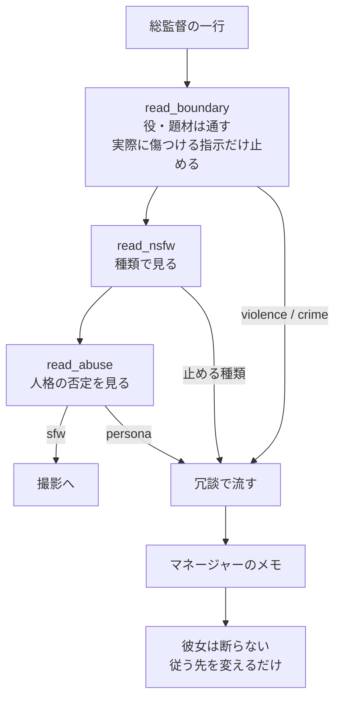

# 技術リファレンス: Muse — 会話が撮影になる仕組み

**Ranbell Image v0.4.0**

English → [muse.md](muse.md)

このドキュメントは Muse の実装全体を解説します。
使い方は [クリエイターガイド](../guide/muse.ja.md) を参照してください。

Muse の設計は一行で言えば **「話す人は多く、書く人は一人」** です。
18 役職が意見を出しても、台帳（ledger）に書き込むのは台本係（writer）ただ一人
 —— これが、同じ欄を全員で奪い合って絵が壊れるのを防いでいます。

---

## 1. 一周の流れ

総監督が一行打ってから、絵が出るまで。



**この図で読むべきこと**

- 判定係は彼女より前にいる。彼女に断らせず、部屋が引き取る
- 班が居ても居なくても、台帳に書くのは `write_patch` 一箇所（着地の `field_land` は監督が触らなかった質感欄に限る）
- `scrub_patch` は入口の一つきり。席の経路でもカードの経路でも同じ掃除が効く
- 会話中は `touch_craft` のみ。Comfy に渡す文字列は試し撮り／本番の直前に `assemble.rebuild_craft`
- 開幕のお題も同じ道を通る。`open_session` が `write_patch` を一度呼び、場所と芝居を台帳に置いてから彼女が喋る（§4）
- 試し撮りと本番は種でつながっている（§7）

同じ一周でも、走る段は撮影版で違います。



実測（26B・実機・2026-09-13）:

| 撮影版 | 1ターン | 内訳 |
|---|---|---|
| 主演撮り | 20〜30秒 | 台本係 + 彼女 + 確かめ直し |
| W撮り | 40〜50秒 | 同上、欄と台詞が二人ぶん |
| スタジオ撮り | 165〜192秒 | うち班の一周が 141秒（翌 14 日に欄ごと会議へ。台では -35%） |

全 Refine セッションの `mode` は `"duet"` です。二人判定は `partner_character` の有無。
W 用 `_b` 欄は `has_partner` で gate します。門（gate 席）も `mode` ではなく席の実体で開きます。

---

## 2. ソースファイル

実装の置き場は `backend/app/muse/`。ルータは `main.py` から載り、prefix は
どちらも `/api/muse`。

| ファイル | 責務 |
|---|---|
| `api.py` | Refine 撮影室 HTTP API |
| `lounge_api.py` | 楽屋・手帖の読み取り専用 API（6 本。URL は Classic 時代のまま） |
| `service.py` | セッション orchestration。`STUDIO = "muse_refine"` |
| `session_db.py` | Qdrant `muse_sessions`。payload のみ。load 時 `notebook.migrate` |
| `writer.py` | `write_patch`、女優ターン、verify / repair |
| `crew_room.py` | スタジオ撮りの欄ごと会議 → writer への craft 材料 |
| `crew.py` | 18 役職・30 人・6 プリセット、プロンプト文、楽屋／日記用テンプレ |
| `ledger.py` | 絶対ショット台帳。patch 正規化・sticky・UI chips |
| `assemble.py` | ledger → `craft.prompt`。任意 quality / densify |
| `identity.py` | キャラ identity タグの硬ロック、positive / negative 合成、framing |
| `runner.py` | spooler GENERATION レーンの board / shoot ジョブ |
| `chain.py` | ストリーミング LLM ターン。判定係・clerk・日記生成 |
| `shared.py` | `finish_session`、board 画像読み、`unload`、日記／楽屋ジョブ |
| `talk.py` | 開始衣装、ban、atmosphere cue、vitality、chat メタ |
| `persona.py` | 女優の SAY / ASIDE / CARD / PROPOSE 契約、メモリ／日記読了 |
| `brief.py` | チェーン用 brief テキスト |
| `anima.py` | Anima 向け整形、lettering 抽出 |
| `family.py` | ワークフローの系統（anima / krea2）。steps・cfg・canvas・negative の表と判定 |
| `runtime.py` | `style_for` / `negative_for` / `render_settings`（runner が service を import しないため分離） |
| `ctx.py` | `refine_num_ctx` — 全 LLM 呼び出しで Ollama 再ロードを避ける |
| `defaults.py` | 検証済み既定（解像度、steps、unload_vlm、crew_preset 空） |
| `catalog.py` | `GET /catalog`：workflow、Ollama、admin_defaults、suggested_run |
| `events.py` | プロセス内 SSE ファンアウト |
| `debug.py` | refine_log / stage_ms / turn_trace（**判定に使わない**） |
| `pipeline_view.py` | デバッグ用 pipeline 集約（`muse_refine.pipeline.v1`） |
| `notebook.py` | 手帖スキーマ・migrate（Refine 主経路は ledger。レガシー形状） |
| `facets.py` | Classic 系 facet 分割。derive 用資産 |
| `diary.py` | 日記 LLM 出力の labelled-block / JSON サルベージ |
| `lounge.py` | 楽屋 share / reaction / outgoing のパース・正規化 |
| `vitality.py` | 会話 counters、taste chips（サンプリングは触らない） |
| `memories_db.py` | Qdrant ベクトル撮影 recaps |
| `lounge_db.py` | Qdrant 楽屋スレッド・trends |
| `handpost_db.py` | Qdrant 手帖ページ |

フロントエンドは `frontend/src/components/MusePanel.vue` が撮影室、
`CharacterGallery.vue` が名簿と楽屋入口、`muse/LoungePanel.vue` が楽屋／手帖。

---

## 3. データモデル

正本は **`refine_ledger`** です。Comfy に渡す文字列は **`craft.prompt`**
（board / shoot 直前に `assemble.rebuild_craft`）。`notebook` は load 時 migrate
と finish パイプ用のレガシー形状で、会話の正本ではない。

### セッション

`service.new_session` が作る Qdrant payload。ベクトルは持たない。

| キー | 意味 |
|---|---|
| `session_id` | UUID。Qdrant point id と同じ |
| `studio` | 必ず `"muse_refine"`。一覧の仕切りと `_require_studio` の鍵。**文字列を動かすと既存行が開かなくなる** |
| `status` | `chat` / `boarding` / `shooting` / `finished` |
| `mode` | 常に `"duet"`。二人判定は `partner_character` |
| `inputs` | theme、character_id、partner_preset、crew_preset、banter_mode、workflow、model、vision_model、locale、steps / cfg / canvas 等 |
| `character` / `partner_character` | プリセットのスナップショット |
| `refine_ledger` | 13 欄の絶対台帳 |
| `craft` | `prompt` / `now` / `tags` / `scene` / `quality_tags` / `support_tags` / `stale` |
| `chat` | 吹き出し。`public_view` は末尾 40 |
| `board` / `shoot` | pending、job_id、images、seed、prompt、ledger_fp（board） |
| `crew_open` | 班の扉。`crew_room.TABLE_OPEN`。立っていないセッションでは班は回らない |
| `standing` / `banned` / `struck` | 常設指示、禁止タグ、判定で消した行 |
| `diary` | finish 後の状態 |
| `refine_log` / `stage_ms` / `turn_trace` | 観測のみ |

`public_view` はパネル向けに小さくする。`craft.stale` は会話ターンで
`touch_craft` したあと真になり、画面は「試し撮りで組み直します」と出す。

### 台帳（`ledger.LEDGER_KEYS`）

欄は上書き式。欠けたキーは前の値を残し、在るキーは置き換える。

| キー | UI | 中身 |
|---|---|---|
| `scene` | 場所 | 場所と時間 |
| `bg` | 背景 | 人以外 |
| `light` | 光 | 当たり方。露出は動かさない |
| `atmosphere` | 雰囲気 | 空気感。sticky |
| `frame` | 構図 | 寄り・角度・ボケ |
| `wearing` | 服 | 主演の着衣 |
| `beat` | 姿勢 | 一秒の姿勢 |
| `expression` | 表情 | 顔 |
| `look` | 画風 | 描き方。sticky |
| `lettering` | 文字 | Anima の画面内文字。sticky |
| `wearing_b` / `beat_b` / `expression_b` | 相方 | W 撮り専用。`has_partner` で gate |

`STICKY_KEYS` は `{atmosphere, look, lettering}`。長い会話で LLM が「親切に」
空にして消すのを拒む。空文字での消去は、監督がリセットの合図を出したときだけ
通る（`talk.cue_allow_clear`）。

`scrub_patch` が入口でやることは次の三つ。

- 空の消去を弾く（`RESIST_EMPTY_CLEAR` は全キー）
- `one_body` — 同じ体の部位に二つ目の答えを畳む
- 姿勢を取り戻す（`keep_the_posture`）

`wearing_drop` は台帳の欄ではなく、assemble が復活させないための soft ban
（`talk.ban_tag`）に落ちる。

### craft

| フィールド | いつ更新するか |
|---|---|
| `now` | 毎会話ターン。`ledger.now_line`（模型なし） |
| `tags` | 同上。禁止語を落とした袋 |
| `prompt` / `scene` / `quality_tags` | `rebuild_craft` のときだけ |
| `stale` | `touch_craft` で真、`rebuild_craft` で偽 |

---

## 4. チャット 1 ターン

入口は `POST /api/muse/sessions/{id}/chat` → `service.chat`。

1. 空メッセージは 400
2. `persona.note_standing` — 常設指示なら台帳を動かさず ack して終わる
3. `anima.extract_lettering` — 画面内文字は writer より前に台帳へ（VLM に字形を発明させない）
4. 判定係 `persona.contract_check_with_db` — 止めた行は struck。彼女は固定の柔らかな一文だけ
5. 監督の一行を SSE `chat` に**行ごと**流す（`role: "user"`・本文・時刻）。画面は POST
   が返るまで再取得しない決まりなので、取りに行かずにその行を足す。**判定係の後**に
   流すので、止められた行が一度出てから消えることはない
6. スタジオなら `crew_room.run_table`（`crew_open` が立つまで回らない）
7. `writer.write_patch` — 監督の一行 + 班の `craft_block`。絵の指示なのに patch が空なら 1 回リトライ
8. `talk.cue_atmosphere_look` を patch にマージ
9. `ledger.scrub_patch`
10. 監督が動かした欄を `apply_patch`。動かさず絵の指示に見えるときは `missed` を chat に出す
11. `crew_room.field_land` — 監督が名指ししなかった `bg` / `light` / `frame` / `atmosphere` / `look` だけ。消せるのは班が自分で置いた語（`crew_words`）
12. `assemble.touch_craft`（フル assemble しない）
13. `writer.actress_turn` — board 画像があれば `vision_model`（空なら `model`）。非 VLM は空応答 → 画像なしで 1 回リトライし chat に告知（`_note_blind`）
14. PROPOSE は `guard_muse_propose`（服・場所は空欄埋めのみ。表情は監督が顔を名指ししていないときだけ）
15. `verify_and_repair` — **監督が動かした欄があるとき、または missed のときだけ**。彼女の propose だけでは走らない

女優の出力契約は `SAY` / `ASIDE` / `CARD` / `PROPOSE` / `MY_FEEL` / `PITCH`。
画面に出すのは SAY（と ASIDE）。欄名の漏洩は `identity.sanitize_muse_say` が切る。

開幕は撮影版で入口が分かれる。

- 主演／W: `POST .../open` → `open_session`。順は **お題 → 衣装 → 彼女の第一声**。
  - **お題は画の指示なので、台本係を通して台帳へ**（`service._theme_into_ledger`）。
    台帳に書く手は `write_patch` 一つという原則は開幕でも同じ。空が返ったら
    **無条件にもう一度訊く**（会話ターンの当て推量の門は、お題には合わない）。
    二度とも空なら `missed` を会話に出す
  - そのあと `talk.dress_from_signature` が**空の欄だけ**埋めるので、衣装を名指しした
    お題（「夏祭り、浴衣で」）は取られない
  - 彼女の第一声は、埋まった台帳を見て書かれる
- スタジオ: `POST .../table` → `open_table`。`crew_preset` が空なら拒否（黙って `standard` にしない）。**開幕の 3 席より前に `talk.dress_from_signature`**（空の `wearing` にだけ入る）—— 衣装の席は入っている値に質感を足す仕事なので、空欄を見せると一から作り始める。席は衣装 → 撮影 → 主演（`OPENING_SEQUENCE`）。お題はここでも台帳へ入る —— 3 席の結論（`craft_block`）と一緒に `write_patch` へ渡る

画面の「開始」はスタジオのとき `/table`、それ以外は `/open`（`MusePanel.vue` の `door`）。

---

## 5. プロンプト組立

`assemble.rebuild_craft` は試し撮り／本番／明示の `POST .../rebuild` で走る。

1. ledger からタグ袋。`talk.filter_banned_tags`
2. `inputs.enhance_quality` なら `quality_enrich`（LLM。WD14 ではない）
3. `scene_prose` — 人ごとに一続き。W では体型やポーズが混ざらない
4. atmosphere / look が在る、または enhance_quality なら `densify_scene_prose`
5. `assemble_prompt` → `identity.assemble_positive` が identity タグを強制
6. `anima.format_for_anima` が空白と quality を分け、lettering を付ける
7. `craft.stale = False`

identity はソフト（brief の「髪を変えるな」）とハードの二段。ハード側は
preset の identity タグを positive にstaplingし、衝突する体タグを落とし、
反対の体タグを negative へ入れる。髪**色**・目・体型はロック。髪型（cut）は
セッションで変えられる。描写タグ（`floating_hair` 等）は cut 扱いしない。

framing は `auto` / `full_body` / `upper_body` / `face_closeup` / `from_behind`。
positive には一つの作物だけを置く（同義語を積まない）。

`runtime.style_for` は監督の style、named look、なければ班の平均味
（`crew.base_style_for`）。`runtime.negative_for` が組むのは 4 つだけ ——
`inputs.negative_prompt`、`identity.framing_negative`、選んだ画風が否定する描き方
（`crew.look_negative`）、監督が禁じた語（`session["banned"]`）。

**体型と年齢は negative で争わない。** `identity.assemble_positive` がその語を
positive に入れないことでロックする（サンプラーに「描くな」と頼むより、はじめから
頼まないほうが強い）。系統が negative を取らないとき、この文字列は空になる
（→ [§7.1](#71-ワークフローの系統anima--krea2)）。

---

## 6. 班（スタジオ撮り）

**席順ではなく、欄ごとに回る。** 同じ台帳の欄を持つ席は一つの会議に
束ねられ、いまの値を告知されてから、欄ぜんぶの値を一つ決める。



**会議に渡すもの**（`crew_room.group_prompt` / `seat_prompt`）

    CAST 行        一人か二人か
    SHOT LEDGER   いまの台帳（絶対値）
    FIELD 告知     その欄の今の値と、そのうち総監督が書いた語。
                  「keep / drop / replace を決めて、欄ぜんぶの値を1行で」
    THE FLOOR     直前3人の発言（言葉を借りるな）
    SHOWRUNNER    監督の一行

**会議が受け取らないもの**: 絵（board を見せるのは彼女の段）、手帖（もう無い）、
他の欄の CRAFT（会話だけが見える）。

**着地**（`crew_room.field_land`）—— 触るのは `CREW_FIELDS`
（`bg` `light` `frame` `atmosphere` `look`）だけ。姿勢・表情・服は `craft_block`
経由で台本係へ渡り、`ledger.one_body` の掃除を通る。

**欄ごとに束ねる理由。** 席ごとに回すと、二人いる欄では取り合いが、一人の欄でも
言い換えの堆積が起きる（`look` が 12 語になり `amber_theme` と `magenta_theme` が
同居する）。欄の会議は今の値を告知してから**その欄の値を一つ**決めるので、
言い換えは足されずに畳まれる。同じ材料・やじ off・n=3 の実測:

    席ごと   12回  一周 111.4s   総監督の語で開く 14%   look 4.3語  SAY 96字
    欄ごと    9回  一周  72.5s   総監督の語で開く  5%   look 2.3語  SAY 77字

### 欄の持ち主



`crew.CRAFT_SLOTS` → `crew_room.SLOT_FIELD` がこの対応の正本。％は実機 93 ターンで
その欄が動いた頻度（2026-09-13）: beat 72 / expression 62 / bg 39 / frame 34 /
scene 33 / light 29 / wearing 16 / atmosphere 4 / look 2。

一つの欄を複数の役職が持つところ（`beat` `frame` `look`）は一つの会議として回る。
プリセットに載るのは各欄 2 席まで。`grade` は 6 本のプリセットのどれにも入っていない
（`resolve_crew` が finisher を足す。ペンは `NOTE_MUTED`）。

### 18 役職の役務

| 役職 | 欄 | 役務 | ペン |
|---|---|---|---|
| 主演 actress | —— | 演じる本人。班でも喋り、台本係のあとに本人の段がある | ○ |
| 間取り plan | —— | 場所・時刻・光・物の見取り（別経路。`writing_seats` に出ない） | × |
| 演出 beat | `beat` | 一秒を切り取る姿勢 | ○ |
| 振付 spine | `beat` | 芝居の背骨。重心と意志 | ○ |
| 構成 cutout | `frame` | 画面の隙間・余白・非対称 | ○ |
| 撮影 lens | `frame` | 寄り・角度・ピント。一つの絶対的なサイズ | ○ |
| 美術 propshop | `bg` | その場にある物 | ○ |
| 衣装 wardrobe | `wearing` | 布の重み・皺。服を替えられるのはここだけ | ○ |
| 照明 gaffer | `light` | キーの位置と硬さ。露出は動かさない | ○ |
| 表情 faces | `expression` | 目・口・微細な仕草 | ○ |
| 空気 weather | `atmosphere` | 湿度・粒子 | ○ |
| 色彩 palette | `look` | キートーンを色の名前で言う | ○ |
| 線画 ink | `look` | 線の質 | ○ |
| 調整 grade | `look` | 仕上げの明度。足すだけ | ○ |
| 客引き hook | —— | やじ専任 | × |
| 辻褄 continuity | —— | 前のカットとの整合 | × |
| 門 gate | —— | 出していいかの見張り | × |
| 締め finisher | —— | 最後のひと押し | × |

「ペン ×」は喋らない、ではない。一周では発言せず、やじ役・横やり役として
選ばれたときに口を開く。`BANTER_ONLY` は hook。`NOTE_MUTED` は hook /
continuity / gate / finisher / grade。

### 撮影班のプリセット

`crew.PRESETS`。`resolve_crew` が女優と finisher を足す。既定は空
（`defaults.LLM_DEFAULTS["crew_preset"]`）。選ばないと `open_table` が拒否する。

| プリセット | 席 / ペン | 顔ぶれの傾向 |
|---|---|---|
| `standard` | 18 / 12 | 全役職 |
| `calm` | 17 / 12 | 長回し・定点・落ち着いた色 |
| `vivid` | 14 / 10 | 色と光が主役 |
| `photoreal` | 13 / 10 | 質感・粒子・厚塗り |
| `bold` | 13 / 9 | 余白と実験的な構図 |
| `flat` | 12 / 9 | 線と平面。いちばん速い |

画風の土台（`crew.base_style_for` → `runtime.style_for`）:

| プリセット | base style |
|---|---|
| `standard` / 一人撮り | `anime illustration` |
| `vivid` | `vivid anime illustration` |
| `photoreal` | `semi-realistic rendering` |
| `flat` | `flat anime cel shading` |
| `bold` | `anime illustration, experimental composition` |
| `calm` | `anime illustration, classic composition` |

この値は negative 側（`crew.look_negative`）で「打ち消す描き方」に変換される。
positive の画風は台帳の `look` が持つ。

> **門は席の実体で開く**（`crew_room.has_crew`）。`mode` は全セッションが `"duet"`
> なので、分岐の材料にならない。
>
> **`flat` は `bg` / `light` / `atmosphere` の、`bold` は `wearing` / `look` の
> 持ち主が居ない**（その欄は台本係が監督の言葉だけで書く）。

やじは `banter_mode`: `off` / `light`（既定）/ `full`。呼び出し回数の半分が
やじになり得るので、速さの手として画面から送れる（`InputsPatch.banter_mode`）。

---

## 7. 試し撮りと本番



**撮影室がグラフに書き込むのは steps と seed だけ**です。cfg と
解像度はワークフローに焼かれた値をそのまま使い、negative は系統が決めます
（→ [§7.1 ワークフローの系統](#71-ワークフローの系統anima--krea2)）。
試し撮りと本番で変わるのは steps だけなので、種を揃えると「OK を出したのと
同じ絵の仕上げ版」になります。0 を渡すと `runner` が `None` に畳んで引き直すので、
`start_shoot` が種を空振りすると黙って別の絵が出る。

台帳が動いていなければ、承認時のプロンプトもそのまま本番へ渡る
（`board.ledger_fp` と現在の ledger を `|` 連結で比較）。動いていれば
`rebuild_craft` し直すが、種はそのまま。

### 7.1 ワークフローの系統（anima / krea2）

同じ台本でも、画像モデルによって欲しい数値が違う。krea2 は 8 steps で仕上がり、
negative prompt を取らない。そこで **Muse はワークフローがどの系統かを見分ける**
（`backend/app/muse/family.py`）。

| | steps（試し撮り / 本番） | cfg | 解像度 | negative |
|---|---|---|---|---|
| **anima** | 20 / 30 | **ワークフロー** | **ワークフロー** | 送る |
| **krea2** | 4 / 8 | **ワークフロー** | **ワークフロー** | **送らない** |
| 参照画像（キャラのボード） | ワークフロー | ワークフロー | **Muse**（`board.SLOT_SIZE`） | 送る |

- **anima の 20/30 は `defaults.py` から引いている**（写していない）。30 本パックで
  validated した数字なので、出典は一つにしてある
- **cfg と解像度はワークフローのもの。** cfg はチェックポイントごとに大きく違い、
  krea2 は二段階を踏まずに高解像度で仕上げる。`render_settings` はその欄を**返さない**
  ので、`patch_workflow` はグラフに触れない。Muse が canvas を書くのは名簿の参照画像
  （`characters/board.SLOT_SIZE`）だけ —— そこは互いに揃っている必要がある
- **明示した数値は常に勝つ。** 出荷時の既定（`ALL_DEFAULTS`）から動いている欄は
  「選んだ」と読み、系統より優先する（`runtime._untouched`）。steps を 6 にしてから
  krea2 のワークフローに替えても 6 のまま

#### 判定

**json の印 → ファイル名 → 既定（anima）** の順。

```
印        どれかのノードのタイトル（_meta.title）に muse:family=krea2
ファイル名  NAME_PATTERNS（krea を含めば krea2 / anima を含めば anima）
既定       anima —— いま存在するワークフローは全部これ
```

印を `_meta.title` に置くのは、ComfyUI の API 書き出しで残る唯一の場所だから。
`Note` ノードは出力を持たないので API 形式から落ちる。トップレベルに独自キーを
足すのも不可（`queue_prompt` がその dict をそのまま ComfyUI に渡す）。

**系統を足すときは `FAMILIES` と `NAME_PATTERNS` に一行ずつ。** 他のどこも
系統名で分岐していない。

#### negative を送らない系統

`runtime.negative_for` が空文字を返し、`patch_workflow` は空なら negative の
ノードに触れない。つまり**ワークフロー自身が焼き込んだ negative はそのまま生きる**
（それは作者の選択）。落としたことは `[muse.family] krea2 sends no negative —
N chars dropped: …` として INFO に残す。

**negative を消す形のグラフがある。** `CLIPTextEncode` が一つしか無く、
`KSampler.negative` が `ConditioningZeroOut` を経由してその同じノードへ戻っている形
（krea2 のサンプルがこれ）。負の線を辿ると positive を書いたノードに着くので、
negative を送ると **positive に焼き込まれる**。`patch_workflow` は宛先が positive と
同じなら negative を書かず、`[comfy] node %s carries the positive and the negative
traces back to it` を残す。

グラフに対する約束（cfg にも latent にも触れないこと）は
`tests/ai/test_zeroed_negative_workflow.py` が実物のグラフで固定している。

`GET /catalog` は `comfyui.workflow_caps[].family` と、そのグラフ自身の解像度
`workflow_caps[].canvas`、系統の表 `image_families` を返す。画面はそれを札として出す。

---

### board（`service.start_board` → `runner.run_board_job`）

1. board / shoot の pending を拒否
2. `rebuild_craft`
3. `board.seed = 0`、`ledger_fp` を記録、status `queued`
4. `shared._maybe_unload`
5. spooler `JobLane.GENERATION`、名前 `muse_board`
6. `jobs.render.run_render`。preview は SSE `type: preview`
7. `session_db.attach_board_image` が sha と **実際に使った seed** を書き戻す
8. `finish_board` → 画面は `awaiting_ok`

board 後の VLM 読み戻し（手帖合わせ）は runner から外してある。unload 直後の
再ロード、本番の織り直し、ledger 汚染の三つを払っていた。

### shoot（`POST .../approve` と `POST .../shoot` は同一）

1. board 完了・画像必須
2. ledger_fp 一致なら `board.prompt`、違っていれば `rebuild_craft`
3. `shoot.seed = _board_seed(board)`
4. unload → `muse_shoot` → `finish_shoot` で continuity memory

描画は必ず [ジョブスプーラー](spooler.ja.md) の GENERATION レーン。スケジューラ外
でレンダすると、カードが埋まっている最中に載って落ちる。効いてくるのは latent
の大きさで、フルサイズのバッチ 2 以上で余裕が薄くなる。既定の `draft_count` は 1。

ComfyUI のプレビューはサーバ起動オプションではなく、`/prompt` の
`extra_data.preview_method`。runner の `preview_publisher` が JPEG を SSE に載せる。

---

## 8. Ollama / VRAM の不変条件

LLM は PROMPT レーン、描画は GENERATION レーン。Ollama 側に `keep_alive` を
設定してはいけない。

### ストリーミングと thinking

`chain._call` は `num_predict: -1` でストリームする。非ストリーミング＋既定の
`num_predict` だと thinking が出力枠を食い切って `response` が空で返る。
`think` は呼び出し側が明示し、`thinking` と `response` を読み分ける。

Muse ターンは thinking オフ（`defaults.LLM_DEFAULTS` のコメント、`chain` の
`think=False`）。各ターンは役割の狭いエージェントなので、reasoning pass は
遅延だけ増える。セッション設定には出さない。

### `num_ctx` の統一

Ollama は文脈長が違うと別インスタンスとして読み直す。実測（26B）:

    同じ長さを続ける    1回目 21.8s（読込 20.4s）→ 2回目 0.2s
    長さを交互に変える   毎回 12.8s（読込 11.3s）

判定係と writer / 女優 / verify / 班は **`ctx.refine_num_ctx` の同じ式**
（`inputs.num_ctx` → runtime `ollama_num_ctx`）。既定のヘッドルームは 32768。

### vision_model

board 生成後、`shared.board_images` が非空のターンは
`inputs.vision_model` または `model` で女優ターン。テキスト専用モデルは
エラーにならず画像を黙って落とす。`_call_seeing` は画像なしで 1 回リトライし、
chat に告知する。catalog.notes も同じ注意を返す。

会話だけのターンは安いテキストモデル、board 以降は VLM、という分け方ができる。

### unload_vlm

既定 true。`rebuild_craft` の直後、board / shoot 投入前に
`shared._maybe_unload` → `ollama.unload(model)`。26B が ~13GB を握ったまま
Comfy が latent を置くと 16GB カードでは落ちる。off にするのは、チェックポイントと
モデルを同時に載せるカードがあるときに限る。

---

## 9. 締めと Qdrant

`POST .../finish` → `service.finish_session` → `shared.finish_session`。
本番画像が無ければ拒否。二重押しは `queued_at` / status とセッションロックで防ぐ。

PROMPT レーンへ積むジョブ:

| ジョブ | 対象 | 内容 |
|---|---|---|
| `generate_actress_diary` | 主演と相方 | 秘密日記。総監督の話以外を一つ |
| `generate_lounge_share` | 同上 | 楽屋への短い投稿。成功すると reaction を連鎖 |
| `generate_outing` | 同上 | 数回に一度の休みの日。ジョブが自分で due を決める |
| `generate_lounge_pitch` | 主演のみ | 次の撮影の提案。確率は `lounge.should_pitch` |
| `generate_handpost_habit` | 主演のみ | 監督の癖メモ。その撮影の `notes` が空なら出ない |
| chemistry | 二人の日記が揃ったとき | 相性カード |

### 日記の日本語（漢字率の見張り）

日記は**漢字かな交じりのふつうの日本語**で書かせる。条文（`crew.actress_diary_prompt`
第5項）は「漢字を減らさない」と明示し、混ぜてはいけないものだけを名指しする
（ハングル・キリル・中国語だけの漢字）。**「常用漢字だけで書くこと」のような書き方は
使わない** —— 「かなで書け」とも読めるうえ、前置きに VLM の英語の散文（写真読み）が
入ると、その読みのほうへ倒れる。実測 93 本:

```
写真読み無し（タグ列）× 2モデル × 2条文                       要約かな一色 0/40
写真読み有り・「常用漢字だけで書くこと」                       7/20（35%）
写真読み有り・「漢字かな交じりの、ふつうの日本語で書くこと」   0/20
```

枠は関係しない（入力 1,455 tok ＋ 出力 851 tok＝ 32,768 の 7%、`done_reason` は
毎回 `stop`）。

出口にも見張りを置く。

| 場所 | 中身 |
|---|---|
| `diary.kanji_ratio(text)` | 文字に占める漢字の割合。健全な日記は 17〜29% |
| `diary.KANJI_FLOOR` | `0.08`。本文がこれを下回ると「かな一色」と読む |
| `diary.SUMMARY_MIN_LEN` | `12`。これ以上の長さで漢字ゼロの要約も同じ |
| `diary.kana_only()` | 倒れた側を `"content"` / `"summary"` / `""` で返す |

引っかかったら**一度だけ書き直しを頼む**。二度目はそのまま残す（日記が無いほうが
損失は大きい）。頼んだ事実は
`session["diary"]["entries"][<character_id>]["asked_again"]` に残るので、あとから
どの回が言い直しだったか読める。

【口調・声】の材料はキャラの `first_person_ja` と `talk_quirks`。`appearance.voice`
は英語で、文の途中で切れているものがあるため使わない。

永続化は [Qdrant](qdrant.ja.md) のみ。画像本体はディスクの sha。セッションは
`image_id` 参照。

| コレクション | 定数 | 内容 |
|---|---|---|
| `muse_sessions` | `MUSE_SESSIONS_COLLECTION` | セッション全文 payload。ベクトルなし |
| `muse_lounge` | `MUSE_LOUNGE_COLLECTION` | スレッド、固定 ID の studio_trends |
| `muse_memories` | `MUSE_MEMORIES_COLLECTION` | shoot recap の embed ベクトル + payload |
| `muse_handpost` | `MUSE_HANDPOST_COLLECTION` | 手帖ページ。ピン留め最大 3 が次の撮影に入る |

`memories_db` だけベクトル検索する。sessions / lounge / handpost は payload
スクロール。楽屋 API は読むだけ。書くのは finish ジョブ。

---

## 10. 安全の三段

入口は `persona.contract_check_with_db` → `chain` の clerk。彼女より前。



判定係は 26B が必須。小型では、止めなくていい撮影を止めるか、守るべき所を
守れないかのどちらかになる（実測）。

止めた行は会話文脈に残さない（`struck`）。画だけ止めて彼女が書いてしまう形と、
口では流して台帳が動く形の両方を避ける。NSFW は製品の仕事であり、過度な検閲の
対象ではない（暗い役・傷の絵・質問は通す）。

フロントの操作とマネージャーの見え方は [クリエイターガイド §安全](../guide/muse.ja.md#7-安全のしくみ)。

---

## 11. REST / SSE

prefix `/api/muse`。撮影は `api.py`、楽屋は `lounge_api.py`。

### 撮影室

| Method | Path | 概要 |
|---|---|---|
| GET | `/catalog` | workflows、llm / vision_models、admin_defaults、suggested_run、crew.presets / roles |
| GET | `/sessions` | 最近の Refine セッション |
| POST | `/sessions` | `SessionCreate`。続けて character / partner を載せる |
| GET | `/sessions/{id}` | `public_view` |
| GET | `/sessions/{id}/pipeline` | pipeline_view のみ |
| GET | `/sessions/{id}/debug` | pipeline + logs + craft 抜粋 |
| DELETE | `/sessions/{id}` | 削除 |
| PATCH | `/sessions/{id}/inputs` | `InputsPatch`（crew_preset、banter_mode、解像度、steps 等） |
| POST | `/sessions/{id}/character` | `{character_id}` |
| POST | `/sessions/{id}/partner` | `{partner_preset}` |
| POST | `/sessions/{id}/open` | 開幕（主演が先に話す） |
| POST | `/sessions/{id}/table` | 班を開く。crew_preset 必須 |
| POST | `/sessions/{id}/banned/restore` | `{tag}` → rebuild_craft |
| POST | `/sessions/{id}/restate` | `{field}` 欄の言い直し |
| PUT | `/sessions/{id}/standing` | `{standing: string[]}` |
| POST | `/sessions/{id}/chat` | `{message}` |
| POST | `/sessions/{id}/rebuild` | craft 再組み立て |
| POST | `/sessions/{id}/board` | 試し撮りキュー |
| POST | `/sessions/{id}/approve` | 本番（`/shoot` と同じ） |
| POST | `/sessions/{id}/shoot` | 本番 |
| POST | `/sessions/{id}/finish` | ラップ |
| GET | `/sessions/{id}/stream` | SSE |

画面が送る設定は `InputsPatch` に**欄がある分だけ**通る。pydantic は知らないキーを
黙って捨てるので、`crew_preset` / `banter_mode` / steps / 解像度のように画面から
動かすものは、ここと `public_view.inputs` の両方に無ければならない（返さないと、
開き直したとき既定に見える）。

### 楽屋（読み取り）

| Method | Path | 概要 |
|---|---|---|
| GET | `/lounge/threads` | `limit` / `kind`。顔 sha を stamp |
| GET | `/lounge/threads/{id}` | 1 件 |
| GET | `/lounge/trends` | `{trends}` |
| POST | `/lounge/threads/{id}/like` | `{liked?}` |
| GET | `/lounge/summary` | 名簿バッジ。新着と未回答 pitch |
| GET | `/handpost` | `{pages}`。`pinned_only` 可 |

### SSE

`events.py` はプロセス内の queue ファンアウト。`GET .../stream` は 25 秒で ping。
`session_db.save` が `session_updated` を出す。

| type | いつ |
|---|---|
| `ping` | タイムアウト |
| `session_updated` | save |
| `chat` | 監督／彼女／班の吹き出し。監督の行は本文と時刻を載せて判定係の直後に出る |
| `chat_message` / `chat_delta` | shared 側のストリーム |
| `muse_speaking` | 誰が打っているか |
| `preview` | Comfy JPEG（base64） |
| `board_attached` / `board_ready` | 試し撮り |
| `shoot_attached` | 本番 |
| `diary_status` | 日記 |
| `lounge_status` | share / reacted / pitch / habit |
| `chemistry_ready` | 相性 |
| `notebook_rewrite` | debug |

---

## 12. 既定値

`defaults.py`。パネルで動かせるが、動かしたときに何が壊れるかはコメントが正本。

| キー | 値 | メモ |
|---|---|---|
| `width` / `height` | 896 × 1152 | **セッションでは使わない**（解像度はワークフロー任せ）。上書きしたときの出発点と、参照画像の既定 |
| `draft_steps` / `draft_cfg` | 20 / 4.0 | steps は anima の系統がここから引く。**cfg はグラフに書き込まない** —— 上書きしたときの出発点 |
| `draft_count` | 1 | バッチ 2 以上で VRAM の余裕が薄くなる。krea2 は latent が 2.3MP あるので特に |
| `final_steps` / `final_cfg` | 30 / 4.5 | 同上。系統ごとの値は [§7.1](#71-ワークフローの系統anima--krea2) |
| `look` | `""` | 名前付きの画風（`crew.LOOKS`）。空なら班の平均 |
| `num_ctx` | 32768 | 全ターン同一 |
| `vision_model` | `""` | 空なら `model` を流用 |
| `unload_vlm` | `true` | 描画前に LLM を落とす |
| `crew_preset` | `""` | 空のままではスタジオを開けない |
| `banter_mode` | `light` | |
| `framing` | `auto` | |
| `style` | `""` | 空なら班の平均 |
| `negative_prompt` | 品質・枠・multiview | 体型や年齢は入れない。`simple_background` も入れない |
| `simple` | `false` | 旧シンプル経路。並べて比べるために残している |

`ALL_DEFAULTS` には `wd14_threshold` / `drop_character_tags` / `drop_rating_tags` も
残っているが、**Muse から WD14 を呼ぶ経路は無い**（`rebuild_craft` は LLM の
`quality_enrich` だけ）。`enhance_quality` は `defaults.py` ではなく
`SessionCreate` / `InputsPatch` の欄で、既定は false。オンで quality_enrich と
densify が走る。

管理画面の既定は catalog の `admin_defaults`（`muse_model` / `muse_workflow`）。
空なら画面は選ばせる。`suggested_run` の先頭当ては外の呼び元用で、パネルは
admin_defaults を見る。

---

## 13. 段ごとの実測（2026-09-13・26B・実機）

スタジオ撮り 1 ターンの内訳。`crew_table` の秒数は **欄ごと改修前**。
翌 14 日の台では一周 -35%。

| 段 | 実測 | 何をしているか |
|---|---|---|
| `crew_table` | 140.8s | 12席 × 8.2〜9.2秒 ＋ やじ |
| `seat_actress` | 24.4s | 班の席としての彼女（欄を持たない） |
| `writer` | 7.8s | 台帳を書く |
| `actress` | 24.7s | 本人の段（台詞と提案） |
| `verify` | 9.6s | 読み違えの確かめ直し |
| `quality_enrich` | 4.7s | 画質の語を足す（enhance 時。会話中は走らない） |
| `prose_densify` | 7.5s | 散文を組み上げる（同上） |
| 試し撮り | 78.5s | ComfyUI（スケジューラ経由） |
| 本番 | 99.2s | 同上・steps 30 |

席に渡す前置きは約 4,900 字。内訳のうち 380 字は `crew_room.SEAT_VOICE`（席の口調を
保つ段）で、これが無いと席の発言の 46% が「総監督、」で始まり、42% が同じ 4 文字で
切り出す（有りで 8% / 21%、所要時間は横ばい）。

会話ターンが `touch_craft` だけなのは、ここに効いている。`rebuild_craft` を毎ターン
走らせると、会話だけの一手が約 54 秒になる
（writer 4.5 + enrich 4.4 + densify 6.9 + actress 22 + assemble 9.6 + verify 6.8）。
enrich / densify / assemble は撮る時まで待たせる。

---

## 14. フロントエンド

| 面 | ファイル | 叩く API |
|---|---|---|
| 撮影室 | `frontend/src/components/MusePanel.vue` | catalog、sessions CRUD、open / table、chat、board、approve、rebuild、finish、stream |
| 名簿 | `CharacterGallery.vue` | キャラ選択、`/lounge/summary` バッジ、Muse 再開 |
| 楽屋 | `muse/LoungePanel.vue` | threads / trends / like / handpost |
| 日記 | `muse/ActressDiaryModal.vue` | セッションの diary |

デバッグ枠は `refine_log` / `stage_ms` / `pipeline` を出す。判定には使わない。

---

## 関連ドキュメント

- [クリエイターガイド](../guide/muse.ja.md) — 画面の使い方
- [ジョブスプーラー](spooler.ja.md) — GENERATION / PROMPT レーン
- [Qdrant](qdrant.ja.md) — 永続化レイヤ
