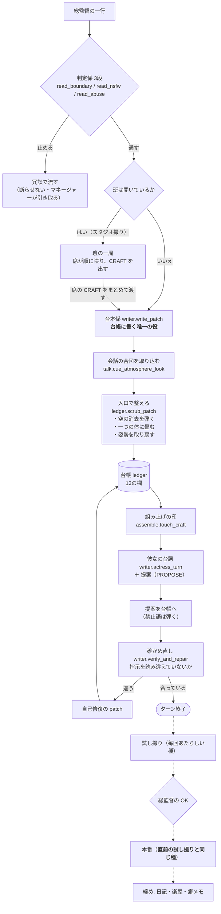
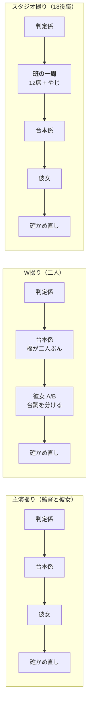
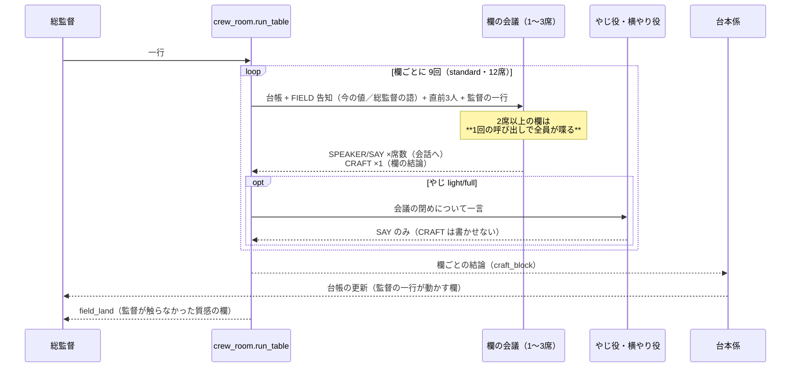
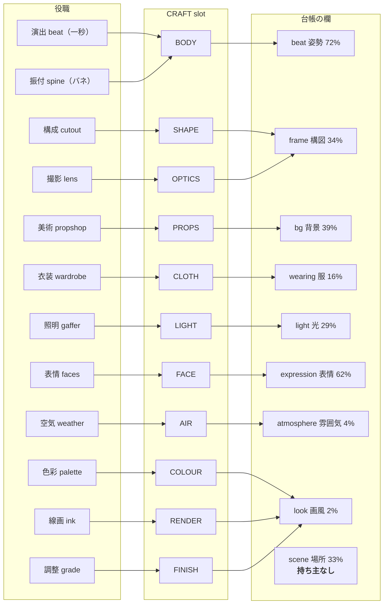
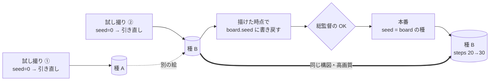
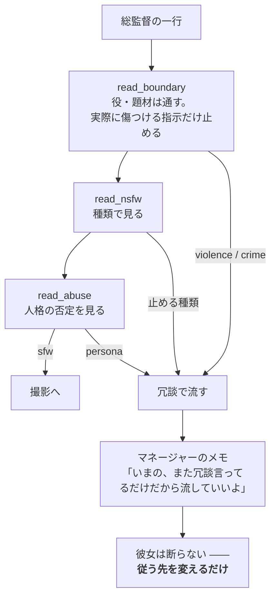

# 技術リファレンス: Muse — 会話が撮影になる仕組み

このドキュメントは Muse の**一周（1ターン）を段ごとに解剖**し、それぞれの役が何を
受け取り、何を書き、何を書かないかを示します。使い方は
[クリエイターガイド](../guide/muse.ja.md) を参照してください。

Muse の設計は一行で言えば **「話す人は多く、書く人は一人」** です。18役職が意見を
出しても、台帳（ledger）に書き込むのは台本係（writer）ただ一人 —— これが、同じ欄を
全員で奪い合って絵が壊れるのを防いでいます。

---

## 1. 一周の流れ

総監督が一行打ってから、絵が出るまで。

**この図で読むべきこと**

- 判定係は**彼女より前**にいる。彼女に断らせず、部屋が引き取る
- 班が居ても居なくても、**台帳に書くのは `write_patch` 一箇所**
- `scrub_patch` は入口の一つきり。席の経路でもカードの経路でも同じ掃除が効く
- 試し撮りと本番は**種でつながっている**（下の §5）

---

## 2. 三つの撮影版

同じ一周でも、走る段が違います。

実測（26B・実機・2026-09-13）:

| 撮影版 | 1ターン | 内訳 |
|---|---|---|
| 主演撮り | 20〜30秒 | 台本係 + 彼女 + 確かめ直し |
| W撮り | 40〜50秒 | 同上、欄と台詞が二人ぶん |
| スタジオ撮り | 165〜192秒 | うち **班の一周が 141秒** |

---

## 3. 班の一周（スタジオ撮り）

**席順ではなく、欄ごとに回る。**（2026-09-14）同じ台帳の欄を持つ席は**一つの会議**に
束ねられ、いまの値を告知されてから、**欄ぜんぶの値を一つ**決める。

**会議に渡すもの**（`crew_room.group_prompt` / `seat_prompt`）

    CAST 行        一人か二人か
    SHOT LEDGER   いまの台帳（絶対値）
    FIELD 告知     **その欄の今の値**と、**そのうち総監督が書いた語**。
                  「keep / drop / replace を決めて、欄ぜんぶの値を1行で」
    THE FLOOR     直前3人の発言（**言葉を借りるな**）
    SHOWRUNNER    監督の一行

**会議が受け取らないもの**: 絵（board を見せるのは彼女の段の仕事）、手帖（もう無い）、
他の欄の CRAFT（会話だけが見える）。

**着地**（`crew_room.field_land`）—— 台帳を書くのは今も台本係が正本で、班が触るのは
**監督がその回に名指ししなかった質感の欄**（`bg` `light` `frame` `atmosphere` `look`）
だけ。そこでも消せるのは**班が自分で置いた語**に限る（`crew_words` に控えがある）。
姿勢・表情・服は `craft_block` 経由で台本係へ渡り、`ledger.one_body` の掃除を通る。

**なぜ束ねたか。** 実機（`6dc11d0e`）で `look` が12語になり `amber_theme` と
`magenta_theme` が同居した。席が二人いる欄では取り合いが、一人の欄でも言い換えの
堆積が起きていた —— 毎ターン「足す」ことしかできず、欄の全体を言い直す機会が
無かったため。台の実測（同じ材料・やじ off・n=3）:

    席ごと   12回  一周 111.4s   総監督で開く 14%   look 4.3語  SAY 96字
    欄ごと    9回  一周  72.5s   総監督で開く  5%   look 2.3語  SAY 77字

---

## 4. 欄の持ち主 —— 誰が何を書くか

％は**実機93ターンで、その欄が動いた頻度**（2026-09-13 実測）。

**一つの欄を複数の役職が持つところ**（`beat` `frame` `look`）は、2026-09-14 から
**一つの会議**として回ります（§3）。取り合いはその場で潰れ、台帳に出るのは
**欄ごとに一つの結論**です。プリセットに載るのは各欄2席まで（`grade` は6本の
プリセットのどれにも入っていません）。

### 18役職の役務

| 役職 | 欄 | 役務 | ペン |
|---|---|---|---|
| 主演 actress | —— | 演じる本人。班でも喋り、台本係のあとに本人の段がある | ○ |
| 間取り plan | —— | 場所・時刻・光・物の見取りを決める（別経路） | × |
| 演出 beat | `beat` | 一秒を切り取る姿勢。信じられる体重の乗り方 | ○ |
| 振付 spine | `beat` | 芝居の背骨。重心と意志 | ○ |
| 構成 cutout | `frame` | 画面の隙間・余白・非対称 | ○ |
| 撮影 lens | `frame` | 寄り・角度・ピント。**一つの絶対的なサイズ**を言う | ○ |
| 美術 propshop | `bg` | その場にある物。生活感 | ○ |
| 衣装 wardrobe | `wearing` | 布の重み・皺・着方。**服を替えられるのはここだけ** | ○ |
| 照明 gaffer | `light` | キーの位置と硬さ。**露出は動かさない** | ○ |
| 表情 faces | `expression` | 目・口・微細な仕草 | ○ |
| 空気 weather | `atmosphere` | 湿度・粒子・空気の密度 | ○ |
| 色彩 palette | `look` | キートーンを**色の名前**で言う（気分ではなく） | ○ |
| 線画 ink | `look` | 線の質。迷いのない輪郭 | ○ |
| 調整 grade | `look` | 仕上げの明度。**足すだけ・並べ替えない** | ○ |
| 客引き hook | —— | やじ専任。場を温める | × |
| 辻褄 continuity | —— | 前のカットとの整合 | × |
| 門 gate | —— | 出していいかの見張り | × |
| 締め finisher | —— | 最後のひと押し（メモの経路には居ない） | × |

**「ペン ×」は喋らない、ではありません** —— 一周では発言せず、やじ役・横やり役として
選ばれたときに口を開きます。

---

## 5. 種（seed）—— 試し撮りと本番のつながり

canvas（幅・高さ）は試し撮りと本番で同じ。変わるのは steps と cfg だけなので、
**種を揃えると「OK を出したのと同じ絵の仕上げ版」**になります。

台帳が動いていなければ、承認時の**プロンプトもそのまま**本番へ渡ります
（`ledger_fp` の一致で判定）。

---

## 6. 安全の三段

判定係は **26B が必須**です。小型では、止めなくていい撮影を止めるか、守るべき所を
守れないかのどちらかになります（実測）。

---

## 7. 段ごとの実測（2026-09-13・26B・実機）

スタジオ撮り1ターンの内訳:

| 段 | 実測 | 何をしているか |
|---|---|---|
| `crew_table` | 140.8s | 12席 × 8.2〜9.2秒 ＋ やじ（**2026-09-14 に欄ごとへ。台では -35%**） |
| `seat_actress` | 24.4s | 班の席としての彼女（**欄を持たない**） |
| `writer` | 7.8s | 台帳を書く |
| `actress` | 24.7s | 本人の段（台詞と提案） |
| `verify` | 9.6s | 読み違えの確かめ直し |
| `quality_enrich` | 4.7s | 画質の語を足す |
| `prose_densify` | 7.5s | 散文を組み上げる |
| 試し撮り | 78.5s | ComfyUI（スケジューラ経由） |
| 本番 | 99.2s | 同上・steps 30 |

**席の前置きは約 4,900字**（2026-09-13 に 8,792字から）。打ち消されていた
`crew.OUTPUT` と、classic の機構に宛てていた `crew.CARRY` を外し、効いていた条文
（拒否したものを名指ししない／相対指定の禁止／言語と声）だけを残しました。

そのうち 380字は **`crew_room.SEAT_VOICE`** —— 席の口調を保つ段です。外していた
あいだ、席の発言の 46% が「総監督、」で始まり、42% が同じ4文字で切り出していました
（戻して 8% / 21%、時間は横ばい）。

---

## 8. 撮影班のプリセット

| プリセット | 席 / ペン | 顔ぶれの傾向 |
|---|---|---|
| `standard` | 18 / 12 | 全役職 |
| `calm` | 17 / 12 | 長回し・定点・落ち着いた色 |
| `vivid` | 14 / 10 | 色と光が主役。各職の「賑やかな側」 |
| `photoreal` | 13 / 10 | 質感・粒子・厚塗り |
| `bold` | 13 / 9 | 余白と実験的な構図 |
| `flat` | 12 / 9 | 線と平面。いちばん速い |

同じ役職でも人が違えば言うことが違います（`beat` は「一秒」と「長回し」、
`gaffer` は「逆光」と「行灯」）。

画風の土台も班で変わります（`crew.base_style_for` →`runtime.style_for`）:

| プリセット | base style |
|---|---|
| `standard` / 一人撮り | `anime illustration` |
| `vivid` | `vivid anime illustration` |
| `photoreal` | `semi-realistic rendering` |
| `flat` | `flat anime cel shading` |
| `bold` | `anime illustration, experimental composition` |
| `calm` | `anime illustration, classic composition` |

この値は negative 側（`crew.look_negative`）で「打ち消す描き方」に変換されます。
positive の画風は台帳の `look` が持ちます。

> **門は班の実体です**（2026-09-13 に直しました）。`mode == "duet"` で分けていた
> 頃は、Refine の全セッションが `duet` なので**永久に閉じていて**、6プリセットとも
> `anime illustration` でした。
>
> **`flat` は `bg` / `light` / `atmosphere` の、`bold` は `wearing` / `look` の
> 持ち主が居ません**（その欄は台本係が監督の言葉だけで書きます）。
