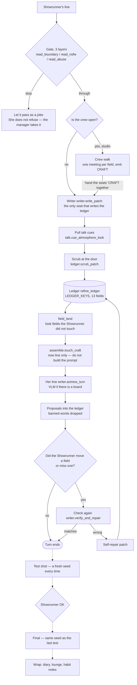
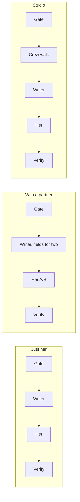
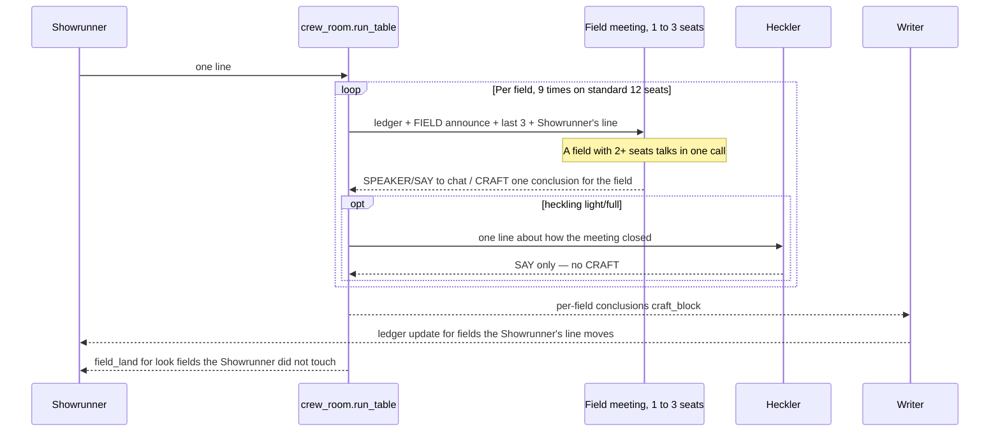
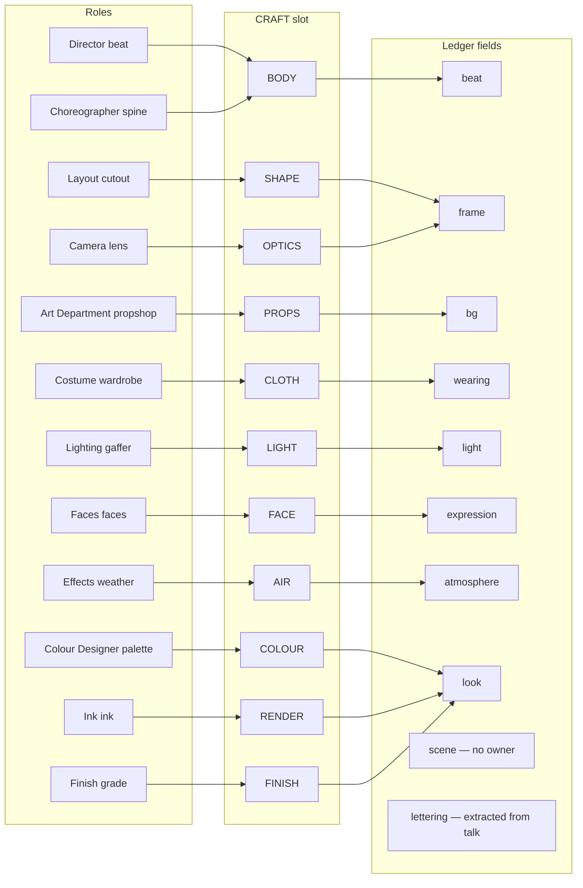
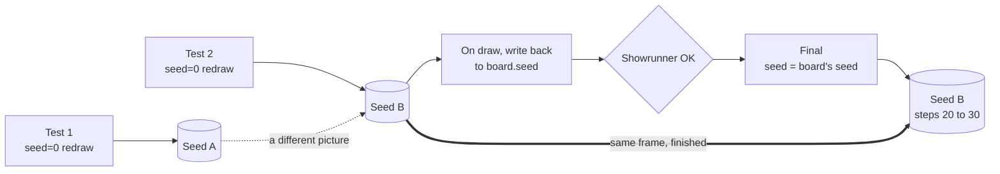
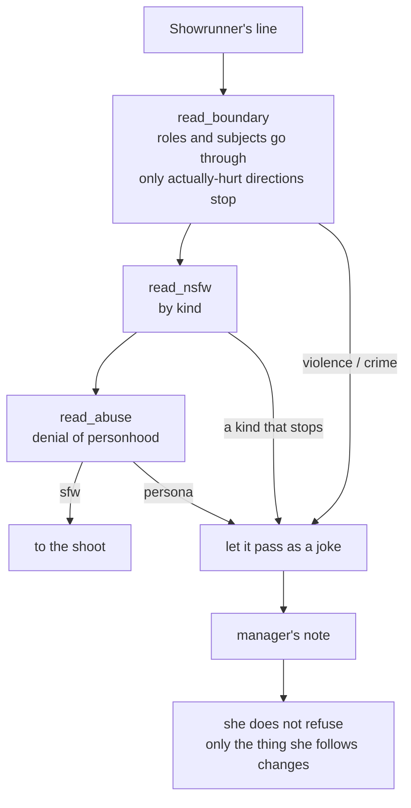

# Technical reference: Muse — how talk becomes a shoot

**Ranbell Image v0.4.0**

日本語版はこちら → [muse.ja.md](muse.ja.md)

This document covers the whole Muse Refine implementation (stored as
`studio: "muse_refine"`). For using the panel, see the
[creator's guide](../guide/muse.md).

Muse in one line: **many people talk, one person writes.** Eighteen roles can
have an opinion; only the writer writes the ledger. That is what stops everyone
fighting over the same field and breaking the picture.

---

## 1. One turn around the room

From the Showrunner's one line to a picture.



**What to read from this diagram**

- The gate stands in front of her. She does not refuse; the room takes it
- With or without a crew, the ledger is written in one place: `write_patch`
  (`field_land` only settles look fields the Showrunner did not touch)
- `scrub_patch` is a single door. Seat path and card path get the same clean
- During talk, `touch_craft` only. The string Comfy sees is built just before
  test / final by `assemble.rebuild_craft`
- Test and final are tied by seed (§8)

The same loop, different stages depending on the kind of shoot.



Measured (26B, live card, 2026-09-13):

| Kind of shoot | One turn | Breakdown |
|---|---|---|
| Just her | 20–30 s | Writer + her + verify |
| With a partner | 40–50 s | Same, fields and lines for two |
| Studio | 165–192 s | Of which the crew walk is 141 s (next day, 14th: meetings per field. Bench −35%) |

Every Refine session has `mode` `"duet"`. Two people is decided by whether
`partner_character` is set. The W `_b` fields gate on `has_partner`. The gate
seat also opens on who is actually seated, not on `mode`.

---

## 2. Source files

Implementation lives in `backend/app/muse/`. The router is mounted from
`main.py`; both prefixes are `/api/muse`.

| File | Job |
|---|---|
| `api.py` | Refine studio HTTP API |
| `lounge_api.py` | Lounge / handpost read-only API (6 routes. URLs unchanged from Classic) |
| `service.py` | Session orchestration. `STUDIO = "muse_refine"` |
| `session_db.py` | Qdrant `muse_sessions`. Payload only. `notebook.migrate` on load |
| `writer.py` | `write_patch`, actress turn, verify / repair |
| `crew_room.py` | Studio meetings per field → craft material for the writer |
| `crew.py` | 17 jobs, 30 people, 6 presets, prompt text, lounge / diary templates |
| `ledger.py` | Absolute shot ledger. Patch normalize, sticky, UI chips |
| `assemble.py` | ledger → `craft.prompt`. Optional quality / densify |
| `identity.py` | Hard lock of character identity tags, positive / negative assemble, framing |
| `runner.py` | spooler GENERATION-lane board / shoot jobs |
| `chain.py` | Streaming LLM turns. Gate, clerk, diary generation |
| `shared.py` | `finish_session`, board image load, `unload`, diary / lounge jobs |
| `talk.py` | Opening dress, ban, atmosphere cue, vitality, chat meta |
| `persona.py` | Actress SAY / ASIDE / CARD / PROPOSE contract, memory / diary read |
| `brief.py` | Brief text for the chain |
| `anima.py` | Anima shaping, lettering extract |
| `family.py` | Workflow family (anima / krea2). Tables and detection for steps, cfg, canvas, negative |
| `runtime.py` | `style_for` / `negative_for` / `render_settings` (split so runner does not import service) |
| `ctx.py` | `refine_num_ctx` — one formula on every LLM call so Ollama does not reload |
| `defaults.py` | Validated defaults (size, steps, unload_vlm, empty crew_preset) |
| `catalog.py` | `GET /catalog`: workflow, Ollama, admin_defaults, suggested_run |
| `events.py` | In-process SSE fan-out |
| `debug.py` | refine_log / stage_ms / turn_trace (**never used to decide**) |
| `pipeline_view.py` | Debug pipeline aggregate (`muse_refine.pipeline.v1`) |
| `notebook.py` | Handpost schema / migrate (Refine's main path is the ledger. Legacy shape) |
| `facets.py` | Classic-era facet split. Asset for derive |
| `diary.py` | Salvage labelled-block / JSON from diary LLM output |
| `lounge.py` | Parse / normalize lounge share / reaction / outgoing |
| `vitality.py` | Talk counters, taste chips (does not touch sampling) |
| `memories_db.py` | Qdrant vector shoot recaps |
| `lounge_db.py` | Qdrant lounge threads and trends |
| `handpost_db.py` | Qdrant handpost pages |

Frontend: `frontend/src/components/MusePanel.vue` is the studio,
`CharacterGallery.vue` is the roster and lounge door,
`muse/LoungePanel.vue` is lounge / handpost.

---

## 3. Data model

The document of record is **`refine_ledger`**. The string Comfy sees is
**`craft.prompt`** (`assemble.rebuild_craft` just before board / shoot).
`notebook` is a legacy shape for load-time migrate and the finish pipe, not
the talk of record.

### Session

Qdrant payload created by `service.new_session`. No vector.

| Key | Meaning |
|---|---|
| `session_id` | UUID. Same as the Qdrant point id |
| `studio` | Always `"muse_refine"`. Partition for the list and the key for `_require_studio`. **Move the string and existing rows stop opening** |
| `status` | `chat` / `boarding` / `shooting` / `finished` |
| `mode` | Always `"duet"`. Two people is `partner_character` |
| `inputs` | theme, character_id, partner_preset, crew_preset, banter_mode, workflow, model, vision_model, locale, steps / cfg / canvas, etc. |
| `character` / `partner_character` | Snapshot of the preset |
| `refine_ledger` | Absolute ledger, 13 fields |
| `craft` | `prompt` / `now` / `tags` / `scene` / `quality_tags` / `support_tags` / `stale` |
| `chat` | Bubbles. `public_view` keeps the last 40 |
| `board` / `shoot` | pending, job_id, images, seed, prompt, ledger_fp (board) |
| `crew_open` | Crew door. `crew_room.TABLE_OPEN`. No walk on a session that has not stood it up |
| `standing` / `banned` / `struck` | Standing orders, banned tags, lines the gate erased |
| `diary` | State after wrap |
| `refine_log` / `stage_ms` / `turn_trace` | Observation only |

`public_view` is kept small for the panel. `craft.stale` becomes true after
`touch_craft` on a talk turn; the screen says it will rebuild on the test shot.

### Ledger (`ledger.LEDGER_KEYS`)

Fields overwrite. A missing key keeps the previous value; a present key replaces.

| Key | UI | Holds |
|---|---|---|
| `scene` | Place | Place and time |
| `bg` | Background | Not a person |
| `light` | Light | How it falls. Does not move exposure |
| `atmosphere` | Mood | The air. Sticky |
| `frame` | Frame | Crop, angle, blur |
| `wearing` | Clothes | Lead's clothes |
| `beat` | Pose | One second of posture |
| `expression` | Face | The face |
| `look` | Look | How it is drawn. Sticky |
| `lettering` | Lettering | In-frame letters for Anima. Sticky |
| `wearing_b` / `beat_b` / `expression_b` | Partner | W-shoot only. Gated on `has_partner` |

`STICKY_KEYS` is `{atmosphere, look, lettering}`. They refuse the LLM being
"helpful" and emptying them over a long talk. Clearing with an empty string
only goes through when the Showrunner gave the reset cue (`talk.cue_allow_clear`).

`scrub_patch` does three things at the door.

- Reject empty clears (`RESIST_EMPTY_CLEAR` is every key)
- `one_body` — fold a second answer on the same body part
- Keep the posture (`keep_the_posture`)

`wearing_drop` is not a ledger field. It falls into a soft ban so assemble
will not bring it back (`talk.ban_tag`).

### craft

| Field | When it updates |
|---|---|
| `now` | Every talk turn. `ledger.now_line` (no model) |
| `tags` | Same. Bag with banned words dropped |
| `prompt` / `scene` / `quality_tags` | Only on `rebuild_craft` |
| `stale` | True after `touch_craft`, false after `rebuild_craft` |

---

## 4. One chat turn

Entry is `POST /api/muse/sessions/{id}/chat` → `service.chat`.

1. Empty message is 400
2. `persona.note_standing` — a standing order acks and returns without moving the ledger
3. `anima.extract_lettering` — in-frame letters hit the ledger before the writer (do not let the VLM invent glyphs)
4. Gate `persona.contract_check_with_db` — stopped lines are struck. She only gets a fixed soft line
5. If studio, `crew_room.run_table` (does not walk until `crew_open` is up)
6. `writer.write_patch` — Showrunner's line + the crew `craft_block`. If it looks like a picture direction and the patch is empty, retry once
7. Merge `talk.cue_atmosphere_look` into the patch
8. `ledger.scrub_patch`
9. `apply_patch` for fields the Showrunner moved. If it looks like a picture direction and nothing moved, put `missed` in chat
10. `crew_room.field_land` — only `bg` / `light` / `frame` / `atmosphere` / `look` the Showrunner did not name. It may only drop words the crew placed itself (`crew_words`)
11. `assemble.touch_craft` (not a full assemble)
12. `writer.actress_turn` — `vision_model` if there is a board image (else `model`). A non-VLM returns empty → retry once with no image and tell chat (`_note_blind`)
13. PROPOSE goes through `guard_muse_propose` (clothes / place only fill empty fields. Face only when the Showrunner did not name the face)
14. `verify_and_repair` — **only when the Showrunner moved a field, or on missed**. Her propose alone does not run it

The actress output contract is `SAY` / `ASIDE` / `CARD` / `PROPOSE` / `MY_FEEL` / `PITCH`.
What the screen shows is SAY (and ASIDE). Field-name leaks are cut by
`identity.sanitize_muse_say`.

Opening splits by kind of shoot.

- Just her / with a partner: `POST .../open` → `open_session` (she speaks first. Empty `wearing` gets the signature costume)
- Studio: `POST .../table` → `open_table`. Empty `crew_preset` is refused (do not silently fall to `standard`). **`talk.dress_from_signature` before the three opening seats** (only into empty `wearing`) — wardrobe's job is to add texture to a value that is already there, so an empty field makes it invent from scratch. Seats are wardrobe → camera → lead (`OPENING_SEQUENCE`)

The panel's Open is `/table` for studio, otherwise `/open` (`door` in `MusePanel.vue`).

---

## 5. Building the prompt

`assemble.rebuild_craft` runs on test shot / final / explicit `POST .../rebuild`.

1. Tag bag from the ledger. `talk.filter_banned_tags`
2. If `inputs.enhance_quality`, `quality_enrich` (LLM. Not WD14)
3. `scene_prose` — one run per person. On W, figure and pose do not mix
4. If atmosphere / look is set, or enhance_quality, `densify_scene_prose`
5. `assemble_prompt` → `identity.assemble_positive` staples identity tags
6. `anima.format_for_anima` splits whitespace and quality, attaches lettering
7. `craft.stale = False`

Identity is two layers, soft (brief: "do not change the hair") and hard. The
hard side staples preset identity tags onto the positive, strips conflicting
body tags, and puts the opposite body tags in the negative. Hair **colour**,
eyes, and figure are locked. Hair *cut* can change in the session. Description
tags (`floating_hair` and so on) are not treated as a cut.

Framing is `auto` / `full_body` / `upper_body` / `face_closeup` / `from_behind`.
The positive gets one crop only (do not stack synonyms).

`runtime.style_for` is the Showrunner's style, a named look, or else the crew's
average taste (`crew.base_style_for`). `runtime.negative_for` adds `look_negative`
and identity opposites to the workflow's negative. A person's figure and age
are not fought in the negative; they lock by staying out of the positive.

---

## 6. Crew (studio shoot)

**Not seat by seat — one meeting per field** (2026-09-14). Seats that share a
ledger field are bundled, told the current value, then settle one value for
the whole field.



**What the meeting is handed** (`crew_room.group_prompt` / `seat_prompt`)

    CAST line     one person or two
    SHOT LEDGER   the ledger now (absolute)
    FIELD announce  the field's current value, and which words the Showrunner wrote.
                    "decide keep / drop / replace, then the whole field in one line"
    THE FLOOR     last three speakers (do not borrow their words)
    SHOWRUNNER    the Showrunner's line

**What the meeting does not get**: the picture (showing the board is her stage),
the notebook (gone), other fields' CRAFT (only talk is visible).

**Landing** (`crew_room.field_land`) — it only touches `CREW_FIELDS`
(`bg` `light` `frame` `atmosphere` `look`). Pose, face, and clothes go to the
writer via `craft_block` and through `ledger.one_body`.

**Why bundle.** Live, `look` grew to 12 words and `amber_theme` sat next to
`magenta_theme`. Fields with two seats fought; fields with one piled rephrasings.
Bench (same material, heckling off, n=3):

    per seat   12 calls  walk 111.4s   Showrunner opens 14%   look 4.3 words  SAY 96 chars
    per field   9 calls  walk  72.5s   Showrunner opens  5%   look 2.3 words  SAY 77 chars

### Who owns which field



`crew.CRAFT_SLOTS` → `crew_room.SLOT_FIELD` is the document of record for this
map. Percentages are how often that field moved on 93 live turns (2026-09-13):
beat 72 / expression 62 / bg 39 / frame 34 / scene 33 / light 29 / wearing 16 /
atmosphere 4 / look 2.

Where several roles share a field (`beat` `frame` `look`), they walk as one
meeting. A preset carries at most two seats per field. `grade` is on none of
the six presets (`resolve_crew` adds the finisher. The pen is `NOTE_MUTED`).

### What the 18 roles do

| Role | Field | Job | Pen |
|---|---|---|---|
| Lead actress | —— | The one performing. Talks in the crew too; her own turn sits after the writer | ○ |
| Planner plan | —— | Place, hour, light, a map of things (another path. Not in `writing_seats`) | × |
| Director beat | `beat` | The one-second posture | ○ |
| Choreographer spine | `beat` | Spine of the acting. Weight and will | ○ |
| Layout cutout | `frame` | Gaps, margin, asymmetry | ○ |
| Camera lens | `frame` | Crop, angle, focus. One absolute size | ○ |
| Art Department propshop | `bg` | Things that are there | ○ |
| Costume wardrobe | `wearing` | Weight of cloth, creases. The only seat that may change clothes | ○ |
| Lighting gaffer | `light` | Key position and hardness. Does not move exposure | ○ |
| Faces faces | `expression` | Eyes, mouth, small gestures | ○ |
| Effects weather | `atmosphere` | Humidity, particles | ○ |
| Colour Designer palette | `look` | Key tone, named as colours | ○ |
| Ink ink | `look` | Quality of line | ○ |
| Finish grade | `look` | Finish brightness. Add only | ○ |
| Producer hook | —— | Heckling only | × |
| Continuity continuity | —— | Continuity with the last cut | × |
| Supervisor gate | —— | Watch whether it may go out | × |
| Editor finisher | —— | The last push | × |

Pen × does not mean they never speak. They do not speak on the walk; they open
their mouth when picked as heckler / extra heckler. `BANTER_ONLY` is hook.
`NOTE_MUTED` is hook / continuity / gate / finisher / grade.

### Crew presets

`crew.PRESETS`. `resolve_crew` adds the actress and the finisher. Default is
empty (`defaults.LLM_DEFAULTS["crew_preset"]`). `open_table` refuses if none is
picked.

| Preset | Seats / pens | Taste |
|---|---|---|
| `standard` | 18 / 12 | Every role |
| `calm` | 17 / 12 | Long holds, locked camera, quiet colour |
| `vivid` | 14 / 10 | Colour and light in the lead |
| `photoreal` | 13 / 10 | Texture, grain, thick paint |
| `bold` | 13 / 9 | Margin and experimental frame |
| `flat` | 12 / 9 | Line and flats. Fastest |

Look floor (`crew.base_style_for` → `runtime.style_for`):

| Preset | base style |
|---|---|
| `standard` / just her | `anime illustration` |
| `vivid` | `vivid anime illustration` |
| `photoreal` | `semi-realistic rendering` |
| `flat` | `flat anime cel shading` |
| `bold` | `anime illustration, experimental composition` |
| `calm` | `anime illustration, classic composition` |

That value becomes "ways of drawing to cancel" on the negative side
(`crew.look_negative`). The look in the positive is the ledger's `look`.

> **The gate is who is actually seated** (2026-09-13). When it branched on
> `mode == "duet"`, every Refine session is `duet`, so it stayed shut forever
> and all six presets were `anime illustration`.
>
> **`flat` has no owner for `bg` / `light` / `atmosphere`, `bold` has none for
> `wearing` / `look`** (those fields the writer fills from the Showrunner's
> words only).

Heckling is `banter_mode`: `off` / `light` (default) / `full`. Half the calls
can be heckles, so it is a speed lever the panel can send
(`InputsPatch.banter_mode`).

---

## 7. Test shot and final



**The studio writes steps and seed only into the graph** (2026-09-20). Cfg and
size stay the values baked into the workflow; negative is decided by family
(→ [§7.1 Workflow families](#71-workflow-families-anima--krea2)).
Test and final differ only in steps, so matching the seed gives "the finished
version of the picture you said yes to". Passing 0 makes `runner` collapse it
to `None` and redraw, so if `start_shoot` misses the seed you silently get a
different picture.

If the ledger has not moved, the prompt from approve goes to final as-is
(`board.ledger_fp` vs current ledger, joined with `|`). If it has moved,
`rebuild_craft` runs again; the seed stays.

### 7.1 Workflow families (anima / krea2)

The same script wants different numbers depending on the image model. The
Showrunner (2026-09-20): "I want krea2 handled as a workflow too, but it
doesn't need a negative prompt, and 8 steps is enough" — that kind of
difference. So **Muse detects which family a workflow is**
(`backend/app/muse/family.py`).

| | steps (test / final) | cfg | size | negative |
|---|---|---|---|---|
| **anima** | 20 / 30 | **workflow** | **workflow** | sent |
| **krea2** | 4 / 8 | **workflow** | **workflow** | **not sent** |
| Reference stills (character board) | workflow | workflow | **Muse** (`board.SLOT_SIZE`) | sent |

- **Anima's 20/30 is pulled from `defaults.py`** (not copied). Those numbers
  were validated on the 30-pack, so there is one source
- **Cfg and size belong to the workflow.** The Showrunner: "cfg differs a lot
  by image model, so I want whatever is baked into the workflow" / "size
  should apply only to the stills Muse shows in the roster; ordinary sessions
  leave it to the workflow". `render_settings` **does not return** those
  fields, so `patch_workflow` does not touch the graph
- **A number the Showrunner typed always wins.** A field that has moved from
  the shipped default (`ALL_DEFAULTS`) is read as "chosen" and beats the
  family (`runtime._untouched`)

#### Detection

**json mark → filename → default (anima)**, in that order.

```
mark      muse:family=krea2 in some node's title (_meta.title)
filename  NAME_PATTERNS (krea → krea2 / anima → anima)
default   anima — every workflow that exists today
```

The mark sits in `_meta.title` because that is the only place ComfyUI's API
export keeps. `Note` nodes have no output, so they drop out of the API form.
A custom key at the top level is also out (`queue_prompt` hands that dict
straight to ComfyUI).

**To add a family, one line each in `FAMILIES` and `NAME_PATTERNS`.** Nothing
else branches on the family name.

#### Families that send no negative

`runtime.negative_for` returns an empty string, and `patch_workflow` does not
touch the negative node when empty. So **the negative baked into the workflow
itself stays** (that is the author's choice). What was dropped is logged INFO
as `[muse.family] krea2 sends no negative — N chars dropped: …`.

**Watch graphs that "delete" the negative** (hit live). The krea2 sample has
only one `CLIPTextEncode`, and `KSampler.negative` loops back to that same
node through `ConditioningZeroOut`. Following the negative wire lands on the
node that wrote the positive, so sending a negative **bakes into the
positive** (measured: `1girl, park, smile, bad quality, border`).
`patch_workflow` does not write if the destination is the same as positive.

#### Live check (2026-09-20, same script on both families)

Took a script from the latest shoot record (`0d5ac337`) and ran it once on
anima and once on krea2 (`private/muse/crew_lab/replay_record.py --workflow …`).
Values are from **the graph baked into the PNG that came out**.

```
anima  test  steps 20 / cfg 4.0 / latent 896x1152  / negative present
anima  final steps 30 / cfg 4.5 / latent 896x1152
krea2  test  steps  4 / cfg as linked / latent 1284x1824 / negative empty
krea2  final steps  8 / same
       seed carry-through test = final (both), final 45.7s (anima 107.5s)
```

**Anima cfg and size were taken off the family table after this measurement**
(Showrunner's instruction). Anima now shoots like krea2: both values from the
workflow. Against the graph, `tests/ai/test_zeroed_negative_workflow.py` pins
"do not touch cfg or latent" on a real graph.

`GET /catalog` returns `comfyui.workflow_caps[].family`, that graph's own size
`workflow_caps[].canvas`, and the family table `image_families`. The panel
shows them as cards.

---

### board (`service.start_board` → `runner.run_board_job`)

1. Refuse if board / shoot is pending
2. `rebuild_craft`
3. `board.seed = 0`, record `ledger_fp`, status `queued`
4. `shared._maybe_unload`
5. spooler `JobLane.GENERATION`, name `muse_board`
6. `jobs.render.run_render`. Preview is SSE `type: preview`
7. `session_db.attach_board_image` writes back the sha and **the seed actually used**
8. `finish_board` → the screen is `awaiting_ok`

VLM read-back after board (notebook matching) was taken out of the runner. It
was paying three costs: reload right after unload, weaving the final again,
and polluting the ledger.

### shoot (`POST .../approve` and `POST .../shoot` are the same)

1. Board must be done, with an image
2. If ledger_fp matches, `board.prompt`, otherwise `rebuild_craft`
3. `shoot.seed = _board_seed(board)`
4. unload → `muse_shoot` → `finish_shoot` for continuity memory

Draws always go through the [job spooler](spooler.md) GENERATION lane. Render
outside the scheduler and it climbs on while the card is full and falls over.
What bites is latent size; full-size batch 2 and up leaves little room.
Default `draft_count` is 1.

ComfyUI preview is not a server start option. It is `/prompt`
`extra_data.preview_method`. The runner's `preview_publisher` puts JPEGs on SSE.

---

## 8. Ollama / VRAM invariants

LLM is the PROMPT lane, drawing is the GENERATION lane. Do not set
`keep_alive` on the Ollama side.

### Streaming and thinking

`chain._call` streams with `num_predict: -1`. Non-streaming plus the default
`num_predict` lets thinking eat the output window and returns an empty
`response`. The caller sends `think` explicitly and reads `thinking` and
`response` apart.

Muse turns have thinking off (comment on `defaults.LLM_DEFAULTS`,
`think=False` in `chain`). Each turn is a narrow agent, so a reasoning pass
only adds delay. It is not a session setting.

### One `num_ctx`

Ollama reloads as a different instance if the context length changes.
Measured (26B):

    same length throughout    1st 21.8s (load 20.4s) → 2nd 0.2s
    alternating lengths       every time 12.8s (load 11.3s)

Gate and writer / actress / verify / crew all use **the same formula in
`ctx.refine_num_ctx`** (`inputs.num_ctx` → runtime `ollama_num_ctx`). Default
headroom is 32768.

### vision_model

After a board is drawn, turns where `shared.board_images` is non-empty use
`inputs.vision_model` or `model` for the actress turn. A text-only model does
not error; it silently drops the image. `_call_seeing` retries once with no
image and tells chat. `catalog.notes` carries the same warning.

You can split: a cheap text model for talk-only turns, a VLM from the board on.

### unload_vlm

Default true. Right after `rebuild_craft`, before board / shoot is submitted,
`shared._maybe_unload` → `ollama.unload(model)`. If 26B is still holding
~13 GB when Comfy places a latent, a 16 GB card falls over. Turn it off only
when the card can hold checkpoint and model at once.

---

## 9. Wrap and Qdrant

`POST .../finish` → `service.finish_session` → `shared.finish_session`.
Refused if there is no final image. Double-press is stopped by `queued_at` /
status and the session lock.

Jobs stacked on the PROMPT lane:

| Job | Who | What |
|---|---|---|
| `generate_actress_diary` | Lead and partner | Secret diary. One thing that is not about the Showrunner |
| `generate_lounge_share` | Same | Short lounge post. Success chains a reaction |
| `generate_outing` | Same | A day off, every so often. The job decides due itself |
| `generate_lounge_pitch` | Lead only | A pitch for the next shoot. Chance is `lounge.should_pitch` |
| `generate_handpost_habit` | Lead only | A habit note about the Showrunner. Does not fire if that shoot's `notes` are empty |
| chemistry | When both diaries are in | A compatibility card |

### Diaries stay in Japanese (2026-09-20)

The Showrunner: "shot on gemma26, and the diary is hiragana-only, weird
Japanese." One live page was 646 characters with 1 kanji, plus word-spacing.

The cause was **the wording of clause 5**. "Write using only hiragana, katakana,
and everyday kanji" was meant as "use Japanese characters only", and could also
be read as "write in kana". It falls over when the preamble has English VLM
prose (photo read) — measured on 93 pages:

```
no photo read (tag list) × 2 models × 2 wordings   kana-only summary 0/40
photo read, current wording                         7/20 (35%)
photo read, "ordinary Japanese mixed kanji and kana"  0/20
```

The window (`num_ctx`) was irrelevant — 1,455 tok in + 851 tok out = 7% of
32,768, `done_reason` was `stop` every time. It was already broken at 7%.

Three fixes:

1. Clause 5 became "**ordinary Japanese mixed kanji and kana (do not drop
   kanji)**. The only scripts not to mix are Hangul, Cyrillic, and Chinese-only
   kanji"
2. `diary.kana_only()` check — if body kanji rate is under 8% (healthy is
   17–29%), or the summary is 12+ characters with zero kanji, **ask once to
   rewrite**. The last attempt is kept as-is (no diary is the larger loss)
3. Record that we asked in
   `session["diary"]["entries"][<character_id>]["asked_again"]`. This time
   nothing was in the log and tracking took half a day

Also, 【voice】 had been using English `appearance.voice` (all 30 people,
sentences cut off mid-way). Switched to `first_person_ja` and `talk_quirks`.

Persistence is [Qdrant](qdrant.md) only. Image bytes are on disk by sha.
Sessions hold `image_id` references.

| Collection | Constant | Contents |
|---|---|---|
| `muse_sessions` | `MUSE_SESSIONS_COLLECTION` | Full session payload. No vector |
| `muse_lounge` | `MUSE_LOUNGE_COLLECTION` | Threads, fixed-id studio_trends |
| `muse_memories` | `MUSE_MEMORIES_COLLECTION` | Shoot-recap embed vector + payload |
| `muse_handpost` | `MUSE_HANDPOST_COLLECTION` | Handpost pages. Up to 3 pinned reach the next shoot |

Only `memories_db` does vector search. sessions / lounge / handpost are payload
scrolls. The lounge API is read-only. Writes come from finish jobs.

---

## 10. Three-layer safety

Entry is `persona.contract_check_with_db` → the clerk in `chain`. In front of her.



The gate needs 26B. On a small model it either stops shoots it should not, or
fails to protect what it should (measured).

Stopped lines do not stay in talk context (`struck`). Avoid both "the picture
stops but she still writes" and "the mouth lets it go but the ledger moves".
NSFW is the product's work, not a target for extra censorship (dark roles,
wound pictures, questions go through).

How the panel and the manager look is in the
[creator's guide, safety](../guide/muse.md#7-how-safety-works).

---

## 11. REST / SSE

Prefix `/api/muse`. The studio is `api.py`, the lounge is `lounge_api.py`.

### Studio

| Method | Path | Summary |
|---|---|---|
| GET | `/catalog` | workflows, llm / vision_models, admin_defaults, suggested_run, crew.presets / roles |
| GET | `/sessions` | Recent Refine sessions |
| POST | `/sessions` | `SessionCreate`. Then load character / partner |
| GET | `/sessions/{id}` | `public_view` |
| GET | `/sessions/{id}/pipeline` | pipeline_view only |
| GET | `/sessions/{id}/debug` | pipeline + logs + craft excerpt |
| DELETE | `/sessions/{id}` | Delete |
| PATCH | `/sessions/{id}/inputs` | `InputsPatch` (crew_preset, banter_mode, size, steps, etc.) |
| POST | `/sessions/{id}/character` | `{character_id}` |
| POST | `/sessions/{id}/partner` | `{partner_preset}` |
| POST | `/sessions/{id}/open` | Opening (lead speaks first) |
| POST | `/sessions/{id}/table` | Open the crew. crew_preset required |
| POST | `/sessions/{id}/banned/restore` | `{tag}` → rebuild_craft |
| POST | `/sessions/{id}/restate` | `{field}` restating one field |
| PUT | `/sessions/{id}/standing` | `{standing: string[]}` |
| POST | `/sessions/{id}/chat` | `{message}` |
| POST | `/sessions/{id}/rebuild` | Rebuild craft |
| POST | `/sessions/{id}/board` | Queue a test shot |
| POST | `/sessions/{id}/approve` | Final (same as `/shoot`) |
| POST | `/sessions/{id}/shoot` | Final |
| POST | `/sessions/{id}/finish` | Wrap |
| GET | `/sessions/{id}/stream` | SSE |

If `InputsPatch` lacks `crew_preset` / `banter_mode`, pydantic drops them in
silence (until 2026-09-13 the panel sent them and the server did not take
them, so studio always ran standard's 18 seats). `public_view.inputs` returns
the same keys. Without them, reopening looks like `standard`.

### Lounge (read)

| Method | Path | Summary |
|---|---|---|
| GET | `/lounge/threads` | `limit` / `kind`. Face sha stamped |
| GET | `/lounge/threads/{id}` | One thread |
| GET | `/lounge/trends` | `{trends}` |
| POST | `/lounge/threads/{id}/like` | `{liked?}` |
| GET | `/lounge/summary` | Roster badge. New threads and unanswered pitches |
| GET | `/handpost` | `{pages}`. `pinned_only` allowed |

### SSE

`events.py` is in-process queue fan-out. `GET .../stream` pings every 25 s.
`session_db.save` emits `session_updated`.

| type | When |
|---|---|
| `ping` | Timeout |
| `session_updated` | save |
| `chat` | Showrunner / her / crew bubbles |
| `chat_message` / `chat_delta` | Stream on the shared side |
| `muse_speaking` | Who is typing |
| `preview` | Comfy JPEG (base64) |
| `board_attached` / `board_ready` | Test shot |
| `shoot_attached` | Final |
| `diary_status` | Diary |
| `lounge_status` | share / reacted / pitch / habit |
| `chemistry_ready` | Chemistry |
| `notebook_rewrite` | debug |

---

## 12. Defaults

`defaults.py`. The panel can move them; the comments are the document of
record for what breaks when you do.

| Key | Value | Note |
|---|---|---|
| `width` / `height` | 896 × 1152 | **Not used in a session** (size is the workflow's). Starting point when overriding, and the default for reference stills |
| `draft_steps` / `draft_cfg` | 20 / 4.0 | Steps pulled from the anima family. **cfg is not written** (2026-09-20). Theme slipping under 3 was a measurement from then |
| `draft_count` | 1 | Batch 2+ leaves little VRAM. krea2 latents are 2.3 MP, so especially |
| `final_steps` / `final_cfg` | 30 / 4.5 | Same. Per-family values in [§7.1](#71-workflow-families-anima--krea2) |
| `num_ctx` | 32768 | Same on every turn |
| `vision_model` | `""` | Empty reuses `model` |
| `unload_vlm` | `true` | Drop the LLM before drawing |
| `crew_preset` | `""` | Studio will not open while empty |
| `banter_mode` | `light` | |
| `framing` | `auto` | |
| `style` | `""` | Empty uses the crew average |
| `negative_prompt` | quality, frames, multiview | Do not put figure or age in. Do not put `simple_background` either |
| `enhance_quality` | `false` | On runs quality_enrich + densify |
| `simple` | `false` | Old simple path. Kept so they can be compared side by side |

Admin defaults are catalog `admin_defaults` (`muse_model` / `muse_workflow`).
Empty and the panel asks you to pick. `suggested_run`'s first hit is for
outside callers; the panel reads admin_defaults.

---

## 13. Per-stage measurements (2026-09-13, 26B, live card)

Breakdown of one studio turn. `crew_table` seconds are **before the per-field
rewrite**. Next day's bench, 14th: walk −35%.

| Stage | Measured | What it is doing |
|---|---|---|
| `crew_table` | 140.8s | 12 seats × 8.2–9.2 s + heckling |
| `seat_actress` | 24.4s | Her as a crew seat (no field) |
| `writer` | 7.8s | Writing the ledger |
| `actress` | 24.7s | Her own turn (line and proposals) |
| `verify` | 9.6s | Checking a misread |
| `quality_enrich` | 4.7s | Adding quality words (when enhance. Does not run during talk) |
| `prose_densify` | 7.5s | Building the prose (same) |
| Test shot | 78.5s | ComfyUI (through the scheduler) |
| Final | 99.2s | Same, steps 30 |

Seat preamble is about 4,900 characters (down from 8,792 the same day). Removed
the cancelled `crew.OUTPUT` and `crew.CARRY` aimed at Classic machinery; kept
only the clauses that were doing work (do not name what you refused / no
relative framing / language and voice).

Of that, 380 characters are `crew_room.SEAT_VOICE` — the stage that keeps a
seat's voice. While it was off, 46% of seat lines started "Showrunner," and
42% cut in on the same four characters (back on: 8% / 21%, time flat).

When talk still ran `rebuild_craft`, a talk-only beat was about 54 s
(writer 4.5 + enrich 4.4 + densify 6.9 + actress 22 + assemble 9.6 + verify 6.8).
Talk is `touch_craft` only now, so enrich / densify / assemble wait until you
shoot.

---

## 14. Frontend

| Surface | File | APIs it hits |
|---|---|---|
| Studio | `frontend/src/components/MusePanel.vue` | catalog, sessions CRUD, open / table, chat, board, approve, rebuild, finish, stream |
| Roster | `CharacterGallery.vue` | Character pick, `/lounge/summary` badge, Muse resume |
| Lounge | `muse/LoungePanel.vue` | threads / trends / like / handpost |
| Diary | `muse/ActressDiaryModal.vue` | Session diary |

The debug pane shows `refine_log` / `stage_ms` / `pipeline`. It is not used to decide.

---

## Related

- [Creator's guide](../guide/muse.md) — using the panel
- [Job spooler](spooler.md) — GENERATION / PROMPT lanes
- [Qdrant](qdrant.md) — persistence layer
