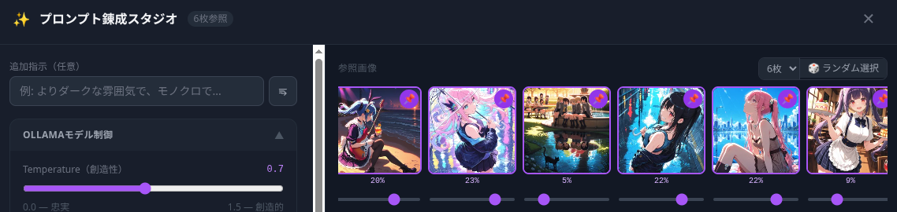
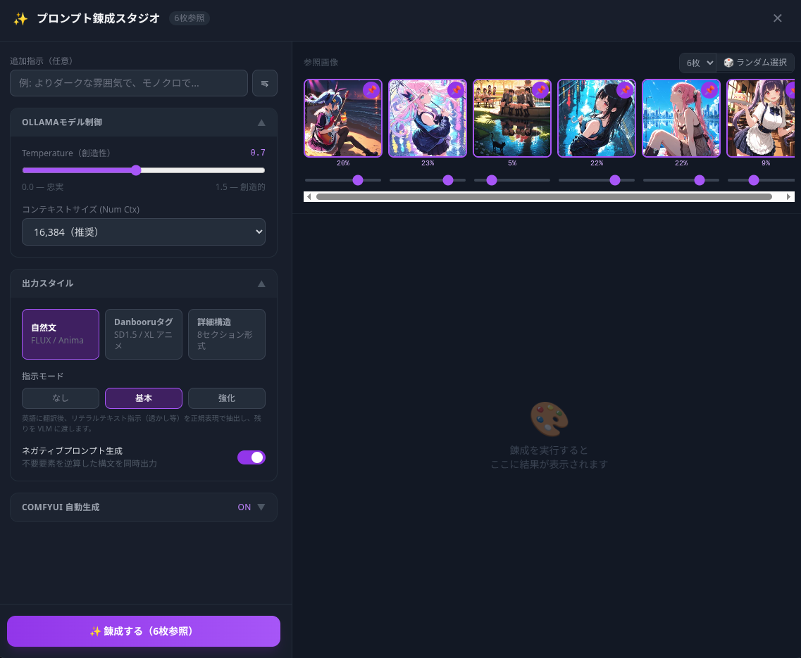
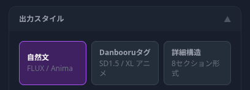
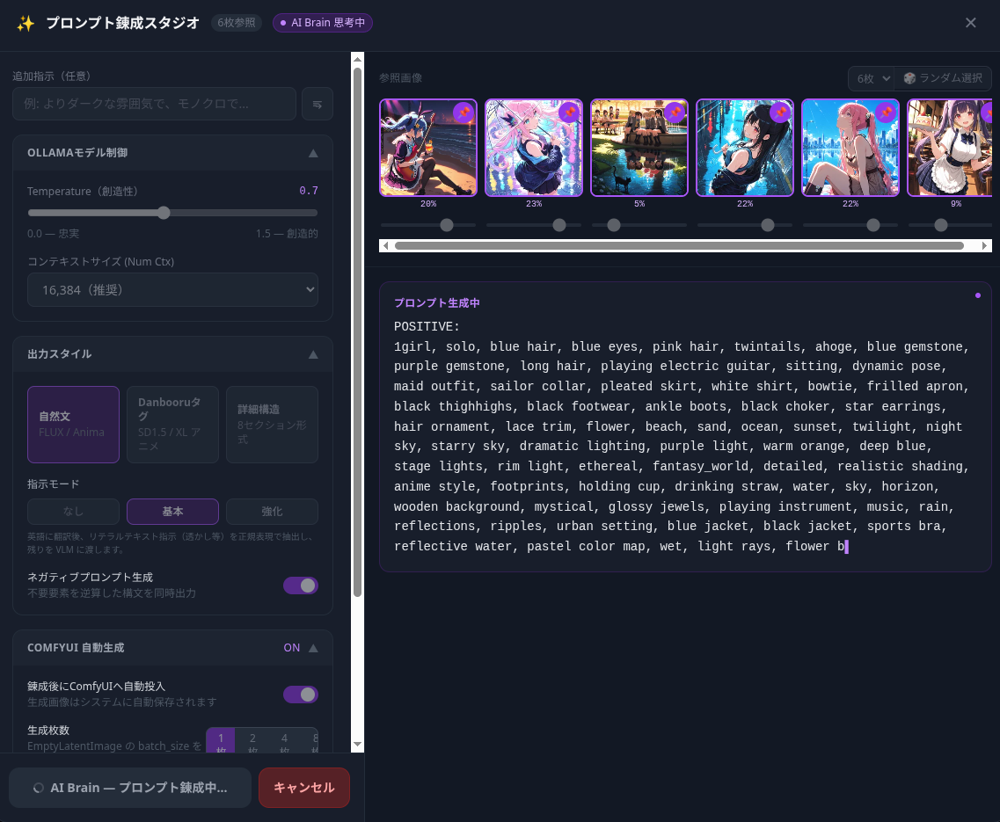
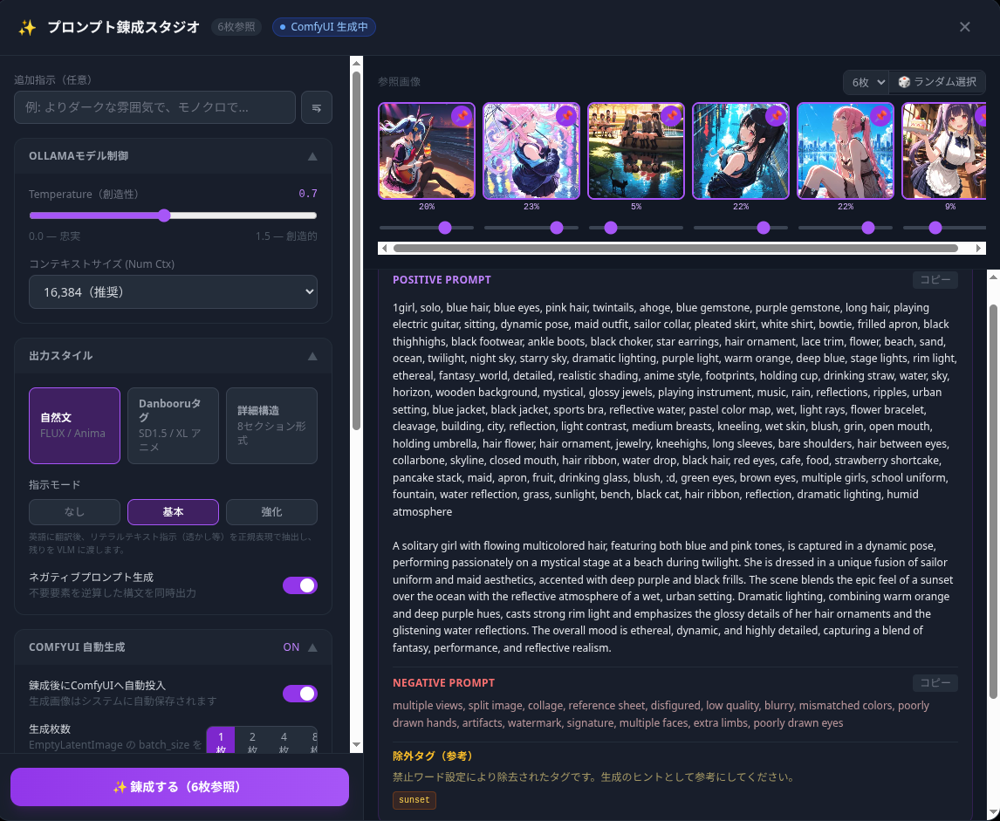

# プロンプト錬成 — 技術リファレンス

**Ranbell Image v0.2.0**

プロンプト錬成機能の技術設計をまとめたドキュメントです。参照画像から画像生成プロンプトがどのように生成されるか、danbooru タグと自然言語プロンプトが内部でどのように処理されるかを中心に解説しています。

---

## 目次

1. [システムアーキテクチャ](#1-システムアーキテクチャ)
2. [錬成の原理 — 参照画像を「3つの層」で読む](#2-錬成の原理--参照画像を3つの層で読む)
3. [技術要素の早見表](#3-技術要素の早見表)
4. [VLM 錬成フロー — 全ステップ詳解](#4-vlm-錬成フロー--全ステップ詳解)
   - [ステップ 1: 参照画像ロード](#ステップ-1-参照画像ロード)
   - [ステップ 2: WD14 タグスコア分類](#ステップ-2-wd14-タグスコア分類)
   - [ステップ 3: 影響度ウェイト正規化](#ステップ-3-影響度ウェイト正規化)
   - [ステップ 4: タイル画像合成](#ステップ-4-タイル画像合成)
   - [ステップ 5: 指示前処理（instruction_mode）](#ステップ-5-指示前処理instruction_mode)
   - [ステップ 6: VLM プロンプト構築](#ステップ-6-vlm-プロンプト構築)
   - [ステップ 7: Ollama ストリーミング生成](#ステップ-7-ollama-ストリーミング生成)
   - [ステップ 8: テキスト後処理パイプライン](#ステップ-8-テキスト後処理パイプライン)
5. [プロンプトスタイル詳解](#5-プロンプトスタイル詳解)
   - [natural スタイル](#natural-スタイル)
   - [danbooru スタイル](#danbooru-スタイル)
   - [detailed スタイル](#detailed-スタイル)
6. [ダイレクトバイパス](#6-ダイレクトバイパス)
7. [スプーラー統合とジョブ管理](#7-スプーラー統合とジョブ管理)
8. [フロントエンド実装](#8-フロントエンド実装)
9. [インスピレーション連携](#9-インスピレーション連携)
10. [データモデルリファレンス](#10-データモデルリファレンス)
11. [創作サイクルの完成](#11-創作サイクルの完成)

---

## 1. システムアーキテクチャ

全体の流れを把握してから細かい処理を追うと理解しやすいので、まずアーキテクチャから見ていきましょう。

### 1.1 全体フロー

```
App.vue (Frontend)
    │
    │  POST /api/ai/refine               ① ジョブ投入
    │  GET  /api/ai/refine/{id}/stream   ② SSE ストリーム接続
    ▼
api/ai.py (FastAPI)
    │
    ├── spooler.submit(JobLane.PROMPT, run_refine_prompt)
    │   └── refine_token_queues[job_id] = asyncio.Queue()
    │
    ▼
jobs/runners.py :: run_refine_prompt()   ← 実処理（Spooler ワーカー）
    ├── db.get() × 最大6枚               画像メタデータ取得
    ├── WD14 スコア分類
    ├── _resolve_weights()               ウェイト正規化
    ├── create_tile_image()              タイル画像合成
    ├── 指示前処理（instruction_mode）
    ├── _build_vlm_prompt()              VLM プロンプト構築
    ├── ollama.generate_vlm_stream()     ストリーミング生成
    ├── テキスト後処理パイプライン
    └── token_queue.put(event)           SSE キューへ送出

    ↑↓ asyncio.Queue（token_queue）

api/ai.py :: refine_stream()             ← SSE ハンドラ
    └── token_queue.get() → SSE → ブラウザ
```

### 1.2 2段階 API 設計

錬成は**投入**と**ストリーム**の 2 エンドポイントに分かれています。

| エンドポイント | メソッド | 役割 |
|-------------|---------|------|
| `/api/ai/refine` | POST | ジョブを PROMPT lane に投入して `job_id` を返す |
| `/api/ai/refine/{job_id}/stream` | GET | **SSE** でトークンを逐次配信する |

この分離のおかげで、ジョブ投入とストリーム接続を独立して管理でき、再接続やキャンセルをシンプルに扱えます。

### 1.3 token_queue ブリッジ

```
Spooler ワーカー（run_refine_prompt）    FastAPI ハンドラ（refine_stream）
              │                                       │
              │ token_queue.put_nowait(event)         │
              ├───────────────────────────────────────▶ queue.get() → SSE
              │ token_queue.put_nowait(None)           │
              └───────────────────────────────────────▶ None 受信 → ストリーム終了
```

`refine_token_queues[job_id]` によって、複数の並行錬成ジョブがそれぞれ独立したキューで管理されます。

---

## 2. 錬成の原理 — 参照画像を「3つの層」で読む

### 2.1 「見る」と「作る」の間にあるギャップ

参照画像を使って新しい画像を生成したいとき、「この雰囲気を再現したい」という意図は頭の中にあります。でも、それを画像生成モデルが理解できる言語（プロンプト）に翻訳するのは、意外と難しくて時間もかかります。

プロンプト錬成は、そういった翻訳作業を AI が代わりにやってくれる機能です。

### 2.2 参照画像の「3層読み」

錬成では、参照画像を単一の方法ではなく、**3つの異なる層**として読み解いています。

```
層 1: ピクセルレベルの視覚理解（VLM が担う）
  ─────────────────────────────────────────
  VLM（視覚言語モデル）が画像を直接見て、
  構図・色調・被写体・スタイル・雰囲気を言語化します。
  人間が「見て感じること」に最も近い読み方です。

層 2: 意味要素のタグ分解（WD14 が担う）
  ─────────────────────────────────────────
  WD14 タガーが各タグに確信度スコアを付与します。
  高スコアタグ = 画像の本質的要素（必ず保持すべき特徴）
  低スコアタグ = 文脈要素（雰囲気を補完する参考情報）

層 3: 相対的重要度の表現（ウェイトが担う）
  ─────────────────────────────────────────
  複数画像のそれぞれを「どの程度反映するか」をユーザーが指定します。
  見た目が似ていても、創作意図によって優先したいものは違いますよね。
```

この 3 層を統合して VLM に渡すことで、単なる「画像の説明」ではなく、**ユーザーの創作意図が反映されたプロンプト**が生成されます。

### 2.3 タイル画像合成による「視覚的統合」

複数の参照画像は、VLM に個別に渡すのではなく、1枚のタイル画像として合成してから渡しています。

```
個別渡し（採用しない方法）:
  VLM → 「画像1はこう、画像2はこう」と個別に解析
  → 統合されない、関係性が見えない

タイル合成（採用した方法）:
  複数画像を1枚のムードボードとして配置
  → VLM が「全体の雰囲気・主従関係・共通要素」を統合的に読む
  → 画像間の意味的関係が自然に反映されたプロンプトになる
```

### 2.4 インスピレーション機能との役割分担

| 機能 | 役割 | 入力 | 出力 |
|------|------|------|------|
| **インスピレーション** | 探索フェーズ | コレクション（既存画像群） | 参照すべき画像の発見 |
| **プロンプト錬成** | 生成フェーズ | 参照画像 1〜6 枚 | 画像生成プロンプト |

---

## 3. 技術要素の早見表

### 動作パス × 技術要素マトリクス

| 動作パス | タイル画像合成 | WD14スコア重み付け | 影響度ウェイト | 指示前処理 | VLM生成 | SSEストリーム | Markdown除去 | Prose検証 | 強制除去タグ | ComfyUI自動投入 | スプーラー |
|---------|:---:|:---:|:---:|:---:|:---:|:---:|:---:|:---:|:---:|:---:|:---:|
| 🔮 VLM 錬成（通常） | ● | ● | ● | ● | ● | ● | ● | ◐ | ● | ◐ | ● |
| ⚡ ダイレクトバイパス | — | — | — | — | — | — | — | — | — | ◐ | ● |

● = 中核技術　◐ = 条件付き使用　— = 使用しない

### 複雑度・AI 依存度の分類

```
ダイレクトバイパス（超高速・決定論的）
  └── ⚡ バイパス  ← VLM なし、プロンプトをそのまま転送

VLM 統合（低速・非決定論的・高表現力）
  └── 🔮 VLM 錬成  ← タイル合成 → VLM 生成 → テキスト解析

自動パイプライン（最長フロー）
  └── 🔮 + auto_submit  ← 錬成完了後に ComfyUI 生成まで一括
```

---

## 4. VLM 錬成フロー — 全ステップ詳解

実装の核心は `backend/app/jobs/runners.py` の `run_refine_prompt()` 関数（行 781〜1012）です。各ステップを順に見ていきましょう。

### ステップ 1: 参照画像ロード

```python
# runners.py:858-884 より
for idx, sha256 in enumerate(body.sha256s[:6]):      # 最大6枚
    doc = await db.get(sha256)
    if not doc:
        continue
    lines: list[str] = []
    prompt_txt = doc.get("positive_prompt", "")
    if prompt_txt:
        lines.append(f"Prompt: {prompt_txt}")         # 既存プロンプトもコンテキストに含める
    wd14 = doc.get("wd14_tags", [])
    wd14_scores = doc.get("wd14_tags_scores", [])
    ...
    fp = Path(doc.get("path", ""))
    if fp.exists():
        image_bytes_list.append(fp.read_bytes())       # 画像バイト列を収集
```

各画像のドキュメントから取得するもの：
- `positive_prompt` — 既存の生成プロンプト（あれば）
- `wd14_tags` — WD14 タグ文字列リスト
- `wd14_tags_scores` — 各タグの確信度スコア（0.0〜1.0）
- `path` — 画像ファイルパス

---

### ステップ 2: WD14 タグスコア分類

WD14 タガーが付与した確信度スコアを使い、タグを 2 段階に分類します。

| スコア範囲 | 扱い | VLM プロンプトへの記述 |
|-----------|------|---------------------|
| ≥ 0.70 | **必須タグ** (`must_tags`) | `Must include these tags verbatim: tag1, tag2, ...` |
| < 0.70 | **参考タグ** (`reference_tags`) | `Reference tags: tag1, tag2, ...`（上位30件） |

```python
# runners.py:869-879 より（閾値定数 = 0.70）
scored_pairs = list(zip(wd14, wd14_scores))
must_tags = [t for t, s in scored_pairs if s >= _WD14_MUST_INCLUDE_THRESHOLD]
if must_tags:
    lines.append(f"Must include these tags verbatim: {', '.join(must_tags)}")
remaining = [t for t, s in scored_pairs if s < _WD14_MUST_INCLUDE_THRESHOLD]
if remaining:
    lines.append(f"Reference tags: {', '.join(remaining[:30])}")
```

**なぜ 2 段階に分けるのでしょう？**

高スコアタグは「この画像を構成する本質的な要素」なので、`verbatim`（そのまま含めよ）という強い指示を付けます。低スコアタグは「この画像の文脈・雰囲気」なので、VLM が柔軟に解釈して活用できる参考情報として渡します。この区別が、参照画像の「核」を守りながら「雰囲気」も活かすプロンプトを生み出す鍵です。

> **WD14 タグの形式について**
> WD14 モデルは Danbooru 風のタグ（`blue_hair`, `1girl` 等）を出力しますが、Ranbell Image のパイプライン（`wd14.py`）はアンダースコアをスペースに変換して格納します（`blue_hair` → `blue hair`）。そのため VLM に渡るタグはスペース区切りの自然語に近い形になっています。

---

### ステップ 3: 影響度ウェイト正規化

```python
# api/ai.py:539-548
def _resolve_weights(sha256s: list[str], raw_weights: list[float]) -> list[float]:
    n = len(sha256s)
    if not raw_weights or len(raw_weights) != n:
        return [1.0 / n] * n        # デフォルト: 均等分配
    total = sum(raw_weights)
    if total <= 0:
        return [1.0 / n] * n
    return [w / total for w in raw_weights]   # 合計が 1.0 になるよう正規化
```

正規化されたウェイトはパーセンテージに変換されて、コンテキスト文字列に明示的に注記されます。

```python
# runners.py:899-903
for part_idx, (ctx, img_idx) in enumerate(zip(context_parts, loaded_indices)):
    pct = round(weights[img_idx] * 100)
    annotated_parts.append(f"[Image {part_idx + 1} — influence weight: {pct}%]\n{ctx}")
context = "\n\n---\n\n".join(annotated_parts)
```

VLM が受け取るコンテキストの例：

```
[Image 1 — influence weight: 60%]
Prompt: 1girl, long hair, school uniform
Must include these tags verbatim: 1girl, long hair, smile
Reference tags: school uniform, outdoor, cherry blossoms

---

[Image 2 — influence weight: 40%]
Must include these tags verbatim: sunset, warm lighting
Reference tags: cloud, horizon, golden hour
```

---

### ステップ 4: タイル画像合成

`backend/app/ai/tile_image.py` の `create_tile_image()` が複数画像を1枚のムードボードに統合します。

**グリッドレイアウト計算：**

| 枚数 | グリッド | セルサイズ（max 1024px） |
|------|---------|----------------------|
| 1 枚 | 1×1 | 1024×1024 |
| 2 枚 | 2×1 | 512×1024 |
| 3〜4 枚 | 2×2 | 512×512 |
| 5〜6 枚 | 3×2 | 341×512 |

**実装：**

```python
# tile_image.py より
def create_tile_image(image_bytes_list: list[bytes], max_size: int = 1024) -> bytes:
    cols, rows = _compute_grid(len(image_bytes_list))
    cell_w = max_size // cols
    cell_h = max_size // rows
    canvas = Image.new("RGB", (cols * cell_w, rows * cell_h), (0, 0, 0))

    for i, img_bytes in enumerate(image_bytes_list[: cols * rows]):
        img = Image.open(io.BytesIO(img_bytes)).convert("RGB")
        img.thumbnail((cell_w, cell_h), Image.LANCZOS)     # アスペクト比保持でリサイズ
        col = i % cols
        row = i // cols
        x = col * cell_w + (cell_w - img.width) // 2       # セル内でセンタリング
        y = row * cell_h + (cell_h - img.height) // 2
        canvas.paste(img, (x, y))

    buf = io.BytesIO()
    canvas.save(buf, format="JPEG", quality=85)             # JPEG quality=85
    return buf.getvalue()
```

VLM が1枚の画像として受け取ることで、「画像 A の構図と画像 B の色彩の共鳴」「画像 C のスタイルが支配的」といった**画像間の関係性**を自然に推論できるようになります。個別に解析して結果を合算する方式では得られない視覚的統合ですね。



---

### ステップ 5: 指示前処理（instruction_mode）

ユーザーが日本語などで入力した追加指示は、VLM に渡す前に `instruction_mode` に応じた前処理が入ります。

#### 3つのモード

```
none:
  instruction ──────────────────────────────────────▶ VLM（変換なし）

basic:
  instruction → _translate_instruction()             英語翻訳
               → _extract_literal_directives()       リテラルテキスト抽出（regex）
               → nl_instruction ──────────────────▶ VLM
               → literals ───────────────────────── 後で注入

enhanced:
  instruction → _translate_and_classify()            JSON 構造化分類
               → nl_instruction ──────────────────▶ VLM
               → literals ───────────────────────── 後で注入
```

#### basic モード — `_translate_instruction()`

温度 0.1（低温 = 正確な翻訳）でテキスト LLM を呼び出して英語に翻訳します。

```python
_TRANSLATE_PROMPT = (
    "Translate the following image generation instruction to English.\n"
    "If already in English, return it unchanged.\n"
    "Return ONLY the translated text, no explanation, no quotes.\n\n"
    "Instruction: {instruction}"
)
```

翻訳後、`_extract_literal_directives()` で**リテラルテキスト指示**（画像内に文字を描き込む指示）を正規表現で抽出します。

```python
_LITERAL_TEXT_RE = re.compile(
    r"""(?:add|insert|put|place|show|write|display|include|render)\s+
        (?:the\s+)?(?:text|word|words|label|watermark|title|string|letters?|caption)\s+
        ['"""「]
        (?P<text>[^'""」]+)
        ['"""」]
        (?:[\s,]*(?:at|on|in|to)\s+
           (?P<position>top|bottom|left|right|center|upper|lower|above|below)
        )?""",
    re.IGNORECASE | re.VERBOSE,
)
```

**リテラルテキストの抽出と注入の例：**

```
入力指示（日本語）: 「RANBELL という文字を上部に追加して」
     ↓ _translate_instruction()
英語訳: "Add the text 'RANBELL' at the top"
     ↓ _extract_literal_directives()
literals = [{"type": "literal_text", "text": "RANBELL", "position": "top"}]
nl_instruction = ""  ← リテラル部分が除去された残り

（後処理ステップで注入）
     ↓ _inject_literal_directives()
最終ポジティブ: 'text "RANBELL", top_text, text_on_image, 1girl, long_hair, ...'
```

位置キーワードのマッピング：

| 入力キーワード | 出力タグ |
|-------------|--------|
| top / upper / above | `top_text` |
| bottom / lower / below | `bottom_text` |
| left / right / center | `overlay_text` |

**なぜ VLM を迂回するのでしょう？**

VLM に対して「画像内に文字を正確に描いてほしい」と伝えることは実は難しくて、VLM がそのテキストを別の意図で解釈したり変形したりするリスクがあります。リテラルテキストを先に抽出して VLM を完全にバイパスし、後から直接プロンプトに注入することで、文字列の正確性を確保しています。

#### enhanced モード — `_translate_and_classify()`

指示を翻訳するだけでなく、JSON 形式で意図のタイプを分類します。

```python
_TRANSLATE_AND_CLASSIFY_PROMPT = """\
...
Directive types:
- "literal_text": text string to appear verbatim in the image
- "style_change": artistic or rendering style modification
- "concept_add": adding a visual element or atmosphere
- "concept_remove": removing an element
- "composition": framing, angle, or layout change

Return JSON:
{
  "instruction_en": "full translated instruction",
  "literals": [{"type": "literal_text", "text": "...", "position": "top|bottom|center|left|right"}],
  "nl_instruction": "translated instruction with literals removed, for VLM"
}"""
```

LLM の出力から JSON ブロックを取り出して解析します。パースに失敗した場合は元の指示にフォールバックするので安心です。

---

### ステップ 6: VLM プロンプト構築

`_build_vlm_prompt()` が、スタイル指示・メタデータコンテキスト・ユーザー指示を1つの VLM プロンプトに組み立てます。

```python
# api/ai.py:190-234
def _build_vlm_prompt(
    context: str,
    instruction: str,
    prompt_style: str,
    with_negative: bool,
    instruction_framing: bool = False,
) -> str:
    style_instr = _STYLE_INSTRUCTIONS.get(prompt_style, _STYLE_INSTRUCTIONS["natural"])
    neg_instr = _NEGATIVE_INSTRUCTION if with_negative else "Output the positive prompt only..."

    if instruction:
        if instruction_framing:           # instruction_mode != "none" の場合
            instr_block = (
                "[PROMPT ENGINEERING DIRECTIVE — NOT NARRATIVE CONTENT]\n"
                "Apply the following as a structural modification to the output prompt.\n"
                "DO NOT incorporate it as scene description...\n\n"
                f"Directive: {instruction}"
            )
        else:
            instr_block = instruction     # none モード: そのまま渡す
    else:
        instr_block = "Create a refined, high-quality image generation prompt."

    return (
        "You are an expert image generation prompt engineer.\n"
        "...\n\n"
        f"[Style directive]\n{style_instr}\n\n"
        f"[Reference metadata]\n{context}\n\n"
        f"[User instruction]\n{instr_block}"
        f"{neg_instr}"
    )
```

**`[PROMPT ENGINEERING DIRECTIVE]` ラッピングの理由**

`instruction_mode` が `basic` か `enhanced` の場合、指示を `[PROMPT ENGINEERING DIRECTIVE — NOT NARRATIVE CONTENT]` で囲みます。これは、VLM がユーザー指示を「シーンの説明文」として誤解釈するのを防ぐためです。たとえば「テキストを追加して」という指示を VLM が「テキストの書かれた小道具を持つキャラクター」として解釈してしまうケースへの対処ですね。

**VLM プロンプトの全体構造：**

```
You are an expert image generation prompt engineer.
[プロンプトエンジニアとしての役割宣言]
[UNIFIED COMPOSITION MANDATE: 複数画像は1つのシーンに統合せよ]

[Style directive]
{スタイル別の詳細指示（natural / danbooru / detailed）}

[Reference metadata]
[Image 1 — influence weight: 60%]
Prompt: ...
Must include these tags verbatim: ...
Reference tags: ...

---

[Image 2 — influence weight: 40%]
...

[User instruction]
[PROMPT ENGINEERING DIRECTIVE]
Directive: {前処理済み指示}

{ポジティブ/ネガティブ分離指示}
```

---

### ステップ 7: Ollama ストリーミング生成

構築したプロンプトとタイル画像をローカル VLM（Ollama）に送り、トークンをストリーミングで受信します。

```python
# runners.py:930-947
async for event in ollama.generate_vlm_stream(
    vlm_prompt, images_for_vlm, model=cfg["vlm_model"], options=options
):
    if _abort.is_set():
        raise JobCancelled()
    _put(event)                              # SSE キューに逐次送出
    if event["type"] == "token":
        accumulated_tokens.append(event["text"])
```

`options` は `RefineRequest` から渡されます：
- `temperature`: 0.7（デフォルト）— 創造性と再現性のバランス
- `num_ctx`: 16384（デフォルト）— コンテキストウィンドウ（長いプロンプト対応）

キャンセル検知は `_abort` asyncio.Event で行われています。`cancel.on_cancel(_abort.set)` で Spooler のキャンセルシグナルと連動し、次のループで `JobCancelled` を raise します。

---

### ステップ 8: テキスト後処理パイプライン

VLM の生出力（`raw_text`）を、プロンプトスタイルに応じた後処理パイプラインで整形します。

#### スタイル別の後処理分岐

```python
# runners.py:952-984
if body.prompt_style == "detailed":
    if body.negative_prompt:
        parsed = _parse_detailed_output(raw_text)
        positive = _clean_markdown(parsed or _parse_positive_negative(raw_text)[0])
        neg_m = re.search(r"NEGATIVE:\s*(.*?)$", raw_text, re.S | re.I)
        negative = _clean_markdown(neg_m.group(1).strip()) if neg_m else ""
    else:
        raw_stripped = _strip_stray_negative(raw_text)
        parsed = _parse_detailed_output(raw_stripped)
        positive = _clean_markdown(parsed if parsed else raw_stripped)
        negative = ""

elif body.negative_prompt:
    positive_raw, negative_raw = _parse_positive_negative(raw_text)
    positive = _clean_markdown(positive_raw)
    negative = _clean_markdown(negative_raw)
else:
    positive = _clean_markdown(_strip_stray_negative(raw_text))
    negative = ""
```

#### 後処理関数の役割一覧

| 関数 | 役割 | 処理例 |
|------|------|--------|
| `_parse_detailed_output()` | 8セクション構造を解析してフラット化 | `**Core Subject:** ...` → セクション内容のみ抽出 |
| `_parse_positive_negative()` | `POSITIVE:` / `NEGATIVE:` セクションを分離 | ネガティブプロンプト要求時に使用 |
| `_clean_markdown()` | Markdown 記号・ラベル行を除去 | `**bold**` → `bold`、`## Header` → 削除 |
| `_strip_stray_negative()` | 意図しないネガティブセクションを除去 | `NEGATIVE: blurry, ...` が勝手に生成された場合に削除 |
| `_remove_forced_tags()` | 管理設定の禁止タグを除去 | `explicit, 1girl, ...` → `1girl, ...` |
| `_inject_literal_directives()` | リテラルテキストタグを先頭に注入 | `text "RANBELL", top_text, text_on_image, 1girl, ...` |
| `_check_natural_prose()` | natural スタイルで散文ブロックの存在を検証 | 散文がない場合 `prose_missing=true` を返す |

#### `_clean_markdown()` が処理するパターン

```
**bold text**      →  bold text       （太字除去）
*italic*           →  italic          （斜体除去）
## Header text     →  （行削除）       （ATX ヘッダー除去）
Tags:              →  （行削除）       （ラベル行除去）
Positive Prompt:   →  （行削除）
--- boundary ---   →  （行削除）       （区切り線除去）
3行以上の空行       →  2行に圧縮
```

生成モデルは Markdown 記号やラベル行を誤解釈してしまいます。「創造的に良い出力」と「生成モデルへの入力として適切な出力」を両立させるために、この後処理が必要になっています。

#### `_check_natural_prose()` の判定ロジック

natural スタイルでは、タグブロックの後に散文段落があることが期待されています。以下の条件をすべて満たす末尾ブロックがあれば「散文あり」と判定されます。

```python
blocks = re.split(r"\n{2,}", text.strip())     # 空行でブロック分割
prose_candidate = blocks[-1]                    # 末尾ブロックを候補に
words = prose_candidate.split()
comma_density = prose_candidate.count(",") / max(len(words), 1)
avg_word_len = sum(len(w.strip(".,;:")) for w in words) / max(len(words), 1)

return (
    len(blocks) >= 2          # 2ブロック以上ある
    and len(words) >= 15      # 15語以上
    and comma_density < 0.25  # カンマ密度 < 0.25（タグ列は高密度なので弾かれる）
    and avg_word_len > 4.0    # 平均語長 > 4.0 文字（タグより単語が長い）
)
```

#### `_remove_forced_tags()` の動作

管理画面で設定した `prompt_removal_tags` のリストに基づいて、ポジティブプロンプトからタグを削除します。スペースとアンダースコアを等価として扱う（`blue hair` と `blue_hair` は同じタグと認識）のがポイントです。

- `all_lines=False`（natural / danbooru スタイル）: 最初の非空行のみ処理（散文ブロックは変更しない）
- `all_lines=True`（detailed スタイル）: 全行を処理（各セクション内容をすべて対象にする）

---

## 5. プロンプトスタイル詳解

### natural スタイル

**対象モデル**: FLUX, Anima 等の新世代モデル

**出力形式**:

```
[BLOCK 1 — タグ行（40〜60 タグ、1行）]
1girl, long hair, auburn hair, blue eyes, smile, school uniform, sailor collar,
outdoor, cherry blossoms, warm lighting, golden hour, bokeh, masterpiece, ...

[空行]

[BLOCK 2 — 散文段落（80〜120 語）]
A young girl with flowing auburn hair stands in warm afternoon sunlight,
her navy school uniform catching the golden hour glow. The soft bokeh of a
blossoming cherry garden frames her gentle smile, while dappled light filters
through pink petals falling around her. The scene carries a tender, nostalgic
quality, with rich amber tones and soft shadows that evoke a quiet spring afternoon.
```

**VLM への主要指示（要点）**:
- 必ず空行で区切られた **2ブロック** を出力すること
- BLOCK 1: Danbooru 風タグ 40〜60 個
- BLOCK 2: 自然英語の散文 80〜120 語
- `masterpiece`, `best_quality` のような品質タグを含める
- Markdown 記号・ラベル行は一切使わない
- `1girl, ...` から直接始める（前置き禁止）

---

### danbooru スタイル

**対象モデル**: Stable Diffusion 系

**出力形式**:

```
1girl, solo, long_hair, auburn_hair, blue_eyes, tareme, smile, blush,
school_uniform, sailor_collar, white_shirt, pleated_skirt, knee_socks,
outdoor, cherry_blossoms, tree, petals, warm_lighting, golden_hour,
bokeh, depth_of_field, masterpiece, best_quality, ultra-detailed, ...
```

**VLM への主要指示（要点）**:
- フラットなカンマ区切りタグリスト 80〜120 個
- カテゴリを網羅する：SUBJECT, HAIR, EYES, FACE, BODY, CLOTHING, ACCESSORIES, FOOTWEAR, POSE, COMPOSITION, BACKGROUND, LIGHTING, ATMOSPHERE, ART STYLE, QUALITY
- 汎用タグより具体的タグを優先（`socks` より `thighhighs`）
- **禁止タグ**（複数パネルを示唆するもの）：`multiple_views`, `reference_sheet`, `character_sheet`, `split_image`, `collage`, `comparison`, `before_and_after`, `diptych`, `triptych`
- カテゴリラベルや改行は出力しない

---

### detailed スタイル

**対象モデル**: 構造化プロンプトを受け付けるモデル、またはプロンプト編集ツール用

**出力形式**（8セクション Markdown 構造）:

```markdown
**Core Subject & Scene Setting:** A young female student in a sun-drenched cherry blossom
garden, evoking a nostalgic spring afternoon.

**Characters & Composition:** 1girl, long flowing auburn hair, blue tareme eyes, gentle
smile, blush; school uniform with sailor collar; full body, cowboy shot, from slightly
below, bloom framing

**Lighting & Atmosphere:** Golden hour warm side lighting, soft amber cast, gentle bokeh
background, dappled sunlight through branches, light rim highlight on hair

**Style & Artistic Influence:** Anime illustration, digital art, cel-shading with soft
painterly finish, inspired by key visual art style

**Details & Textures:** Smooth skin with subtle shading, fabric wrinkle on collar and
skirt hem, individual petal rendering, hair strands with soft sheen

**Color Palette:** Dominant warm amber and navy blue; accent soft pink petals; pastel
highlights; warm overall tone

**Camera & Lens Effects:** 85mm portrait lens effect, medium depth of field, soft bokeh
background, slight lens flare at frame edge

**Refinements & Modifiers:** masterpiece, best_quality, ultra-detailed, highres, sharp
focus, volumetric lighting, hyperdetailed, professional illustration
```

**パース処理 — `_parse_detailed_output()` の3段階フォールバック**

VLM が Markdown 形式を完全に守るとは限らないので、3段階のフォールバックを用意しています。

```
段階 1: bold 形式 **Header:** content
  → re.findall(r"\*\*[^*]+\*\*[:\s]*(.*?)(?=\*\*|\Z)", text, re.S)
  → 最も信頼性が高い形式です。VLM が指示通りに出力した場合に使われます。

段階 2: 行スキャン（インラインヘッダ対応）
  → is_header_re: "Core Subject", "Characters", "Lighting" 等のキーワードで始まる行を検出
  → extract_inline_re: "Core Subject: content" 形式でインラインにコンテンツがある場合に抽出
  → 次のヘッダ行までの内容をセクションとして収集
  → POSITIVE: / NEGATIVE: ラベル行が来たら即座に停止

段階 3: フォールバックなし → runners.py 側で raw_stripped をそのまま使用
```

**8セクションのヘッダーキーワード**（`_DETAILED_SECTION_HEADERS`）:

| キーワード | 対応セクション |
|----------|------------|
| Core Subject | Core Subject & Scene Setting |
| Characters | Characters & Composition |
| Lighting | Lighting & Atmosphere |
| Style | Style & Artistic Influence |
| Details | Details & Textures |
| Color Palette | Color Palette |
| Camera | Camera & Lens Effects |
| Refinements | Refinements & Modifiers |

---

## 6. ダイレクトバイパス

### 概念

`RefineRequest.direct_prompt` が `None` でない場合、VLM 処理全体をスキップして直接完了イベントを送出します。

```python
# runners.py:832-849
if body.direct_prompt is not None:
    positive = body.direct_prompt.strip()
    negative = (body.direct_negative_prompt or "").strip()
    _put({"type": "done", "positive": positive, "negative": negative,
           "auto_submit": body.auto_submit, "prose_missing": False})
    if body.auto_submit and body.workflow_name:
        gen_job_id = _submit_gen_direct(...)
        _put({"type": "comfy_job_id", "job_id": gen_job_id})
    _put(None)
    return
```

### 主なユースケース

| ソース | `direct_prompt` の内容 | `source` 値 |
|-------|----------------------|------------|
| インバージョン（タグ） | `inversion_tags`（Danbooru タグ列） | `'inversion-tags'` |
| インバージョン（散文） | `inversion_prose`（自然言語文） | `'inversion-prose'` |
| 履歴から再実行 | 前回生成時のプロンプト | `'history'` |

### なぜバイパスが必要なのでしょう？

インバージョンモードが生成する「概念の反転プロンプト」は、VLM が3ステージかけて設計した高品質なプロンプトです。これを再度 VLM に通しても品質は向上しません。ダイレクトバイパスを使えば、VLM の推論コストなしに既存プロンプトを即座に ComfyUI 生成パイプラインへ接続できます。

---

## 7. スプーラー統合とジョブ管理

### 7.1 JobLane.PROMPT

錬成処理は専用の `PROMPT` レーンで実行されます。

| レーン | 用途 | 錬成との関係 |
|-------|------|------------|
| `embed` | AI パイプライン（WD14 / 埋め込み） | — |
| `prompt` | **プロンプト錬成** | ← ここで実行 |
| `gen` | ComfyUI 画像生成 | `auto_submit` 時に連鎖 |
| `eval` | アライメント評価 | — |
| `sync` | 同期処理 | — |

各レーンは独立したキューを持っているので、インスピレーション探索をしながら別タブで錬成が動作するといった使い方もできます。

### 7.2 ジョブ連鎖（auto_submit）

```
[1] PROMPT lane ジョブ（run_refine_prompt）
    └── VLM でプロンプト生成（SSE ストリーミング）
    └── 完了 → auto_submit=true かつ workflow_name が設定されていたら...

[2] GENERATION lane ジョブ（run_generation）
    └── _submit_gen_direct() で即時投入
    └── ComfyUI でワークフロー実行 → 画像を保存・コレクションに登録
```

### 7.3 キャンセル検知

ブラウザが切断した場合の流れ：

```python
# SSE ハンドラ側
if await request.is_disconnected():
    await request.app.state.spooler.cancel(job_id)
    break

# ランナー側（Ollama ストリームループ内）
cancel.on_cancel(_abort.set)
...
if _abort.is_set():
    raise JobCancelled()
```

---

## 8. フロントエンド実装

### 8.1 UI レイアウト



```
錬成オーバーレイ（z-index: 65、全画面モーダル）
├── ヘッダー
│   ├── タイトル + 参照画像数バッジ
│   └── フェーズバッジ（LLM中 / ComfyUI中 / 完了）
│
├── 左ペイン（420px 固定幅）
│   ├── ダイレクトバナー（インバージョン連携時のみ表示）
│   ├── 追加指示テキスト入力（instruction）
│   ├── 設定パネル
│   │   ├── スタイル選択（natural / danbooru / detailed）
│   │   ├── 指示モード選択（none / basic / enhanced）
│   │   ├── ネガティブプロンプト ON/OFF
│   │   ├── 温度スライダー（0.0〜2.0）
│   │   └── コンテキスト設定（num_ctx）
│   ├── 実行ボタン / 停止ボタン
│   └── 生成結果テキストエリア（ポジティブ / ネガティブ）
│
└── 右ペイン（残り幅）
    ├── 参照画像スロット（最大6枚、ウェイトスライダー付き）
    ├── ランダム補完ボタン
    ├── ストリーミングプレビュー（錬成中）
    └── ComfyUI 生成済み画像プレビュー
```



### 8.2 フェーズ遷移

```
[openRefine()]
    └── refinePhase = ''

[runRefine() 開始]
    └── POST /api/ai/refine → job_id 取得
    └── refinePhase = 'llm'

[SSE ストリーム受信中]
    ├── type: token      → streamingText に追記（リアルタイムプレビュー）
    ├── type: done       → positivePrompt / negativePromptText に格納
    │                      auto_submit なら refinePhase = 'comfy'
    │                      そうでなければ refinePhase = 'done'
    └── type: comfy_job_id → refineGenJobId に記録

[ComfyUI ジョブ完了]
    └── refinePhase = 'done'
    └── comfyGeneratedImages に sha256 を追加
```





### 8.3 影響度ウェイト管理

各画像スロットにスライダーを表示（0〜100）。全画像の合計を 100% として正規化してバックエンドに送ります。

```javascript
function normalizedPct(sha) {
    return Math.round(
        ((imageWeights.value.get(sha) ?? 0) / weightTotal.value) * 100
    )
}

// リクエスト送信時
weights: orderedShas.map(s => normalizedPct(s) / 100)   // 0.0〜1.0 に変換
```

バックエンドの `_resolve_weights()` が合計が 0 以下の場合に均等分配へフォールバックします。

### 8.4 SSE ストリーム処理

```javascript
// Step 1: ジョブ投入
const { job_id } = await fetch('/api/ai/refine', {
    method: 'POST',
    headers: { 'Content-Type': 'application/json' },
    body: JSON.stringify(requestBody)
}).then(r => r.json())

// Step 2: SSE ストリーム接続
const streamRes = await fetch(`/api/ai/refine/${job_id}/stream`)
const reader = streamRes.body.getReader()
let buffer = ''
while (true) {
    const { done, value } = await reader.read()
    if (done) break
    buffer += decoder.decode(value, { stream: true })
    const lines = buffer.split('\n')
    buffer = lines.pop() ?? ''
    for (const line of lines) {
        if (!line.startsWith('data: ')) continue
        handleRefineEvent(JSON.parse(line.slice(6)))    // "data: " の6文字を除去
    }
}
```

---

## 9. インスピレーション連携

### 9.1 連携フロー

```
インスパイアパネル（InspirePanel.vue）
    │
    ├── @send-to-refine        通常連携（VLM 経由で錬成）
    └── @send-to-refine-direct ダイレクト連携（VLM をスキップ）
    ▼
App.vue（handleSendToRefine / handleSendToRefineDirect）
    ├── selectedIds / pinnedShas を探索結果で更新
    ├── refineInspireContext に inspire_context を格納
    ├── refineStyle を 'danbooru' に自動設定
    └── openRefine()
```

### 9.2 通常連携（`@send-to-refine`）

ブレスト機能やインスパイア結果から画像を錬成スタジオに送る標準フローです。

```javascript
function handleSendToRefine({ shas, text, inspireContext = null }) {
    selectedIds.value = new Set(shas)
    pinnedShas.value = new Set(shas)
    refineInstruction.value = text         // ブレストのシーン提案テキスト等
    refineDirectPrompt.value = null        // VLM 経由で生成
    refineInspireContext.value = inspireContext
    refineStyle.value = 'danbooru'
    openRefine()
}
```

### 9.3 ダイレクト連携（`@send-to-refine-direct`）

インバージョンモードのタグや散文を直接バイパス転送します。

```javascript
function handleSendToRefineDirect({ shas, directPrompt, directNegativePrompt, source, inspireContext }) {
    refineDirectPrompt.value = directPrompt                 // VLM をスキップ
    refineDirectNegativePrompt.value = directNegativePrompt
    refineDirectPromptSource.value = source                 // 'inversion-tags' | 'inversion-prose'
    refineInspireContext.value = inspireContext
    refineStyle.value = 'danbooru'
    openRefine()
}
```

### 9.4 inspire_context の永続化

錬成→生成が完了した画像には `creation_record` としてメタデータが保存されます。「どのインスパイアモードで発見された画像か」を後から追跡できる仕組みです。

```json
{
  "creation_record": {
    "method": "refine",
    "inspire_context": {
      "mode": "inversion",
      "inversion_tags": ["ruins", "fog", "abandoned"],
      "inversion_negative_tags": ["bright", "cheerful"]
    },
    "prompt": "...",
    "model_name": "...",
    "workflow_name": "..."
  }
}
```

---

## 10. データモデルリファレンス

### 10.1 RefineRequest（最新版）

```python
class RefineRequest(BaseModel):
    sha256s: list[str]                    # 参照画像のハッシュ（最大6枚）
    weights: list[float] = []             # 影響度ウェイト（正規化前、未指定時は均等）
    instruction: str = ""                 # 追加指示（多言語対応）
    instruction_mode: Literal[
        "none",       # 前処理なし、指示をそのまま渡す
        "basic",      # 英語翻訳 + リテラルテキスト抽出（regex）
        "enhanced",   # 英語翻訳 + JSON 構造化分類
    ] = "basic"
    temperature: float = 0.7             # VLM 温度（0.0〜2.0、高いほど創造的）
    num_ctx: int = 16384                 # コンテキストウィンドウサイズ
    prompt_style: Literal[
        "natural",   # タグ + 散文（FLUX / Anima 向け）
        "danbooru",  # フラットタグリスト（SD 向け）
        "detailed",  # 8セクション構造（詳細記述）
    ] = "natural"
    negative_prompt: bool = False        # ネガティブプロンプトも生成する
    auto_submit: bool = False            # 完了後に ComfyUI へ自動投入
    workflow_name: str = ""              # auto_submit 時のワークフロー名
    positive_node_id: str = ""           # ComfyUI ノード ID（ポジティブ）
    negative_node_id: str = ""           # ComfyUI ノード ID（ネガティブ）
    batch_count: int = 1                 # 生成枚数
    direct_prompt: str | None = None     # ダイレクトバイパス用プロンプト
    direct_negative_prompt: str | None = None
    inspire_context: dict | None = None  # インスパイア連携メタデータ
    use_ref_seed: bool = False           # 参照画像のシードを引き継ぐ
```

### 10.2 SSE イベント型一覧

| type | タイミング | 主なフィールド |
|------|---------|-------------|
| `think` | VLM 拡張思考トークン（対応モデル使用時） | `text: str` |
| `token` | 通常生成トークン（逐次） | `text: str` |
| `done` | 生成完了 | `positive`, `negative`, `auto_submit`, `prose_missing`, `removed_tags`, `injected_literals` |
| `comfy_job_id` | ComfyUI ジョブ投入完了 | `job_id: str` |
| `error` | エラー発生 | `message: str` |
| `cancelled` | キャンセル完了 | — |

**`done` イベントの全フィールド：**

```json
{
  "type": "done",
  "positive": "1girl, long hair, smile, ...\n\nA young girl stands in...",
  "negative": "blurry, low_quality, ...",
  "auto_submit": false,
  "prose_missing": false,
  "removed_tags": ["explicit"],
  "injected_literals": [
    {"type": "literal_text", "text": "RANBELL", "position": "top"}
  ]
}
```

- `prose_missing`: natural スタイルで散文ブロックが生成されなかった場合に `true`
- `removed_tags`: `prompt_removal_tags` 設定によって削除されたタグのリスト
- `injected_literals`: `instruction_mode` で抽出・注入されたリテラルテキストのリスト

### 10.3 主要実装ファイル

| ファイル | 行数目安 | 役割 |
|---------|---------|------|
| `backend/app/api/ai.py` | 〜754行 | RefineRequest, スタイル指示文字列, 全ヘルパー関数, エンドポイント |
| `backend/app/jobs/runners.py:781-1012` | 231行 | `run_refine_prompt()` 実処理 |
| `backend/app/ai/tile_image.py` | 42行 | タイル画像合成（Pillow） |
| `backend/app/ai/wd14.py` | — | WD14 ONNX 推論、タグ + スコア出力 |
| `frontend/src/App.vue:〜239-, 〜1685-, 〜2761-` | — | 錬成 UI 全体（状態管理 / SSE 処理 / レイアウト） |
| `backend/app/runtime_config.py` | — | `prompt_removal_tags`, `vlm_model` 等のランタイム設定 |

---

## 11. 創作サイクルの完成

### プロンプト錬成が担う役割

インスピレーション機能が「コレクションの中に何を見つけるか」を担うなら、錬成は「見つけたものをどう形にするか」を担います。この 2 つのフェーズが組み合わさることで、Ranbell Image は単なる整理ツールを超えた創作のパートナーとして機能します。

```
コレクション（既存の画像群）
    │
    ▼  インスピレーション（探索）
  発見 — セレンディピティ / 錬金術 / インバージョン 等
    │
    ▼  ブレスト（発想）
  アイデア — LLM が WD14 タグを読んでシーン提案を言語化
    │
    ▼  プロンプト錬成（変換）
  プロンプト — 視覚的価値 → 生成言語（3層読み + VLM 統合）
    │
    ▼  ComfyUI 生成
  新しい画像
    │
    ▼
  コレクションに追加 → 次の探索の素材に
```

### 生成されたものがコレクションを豊かにしていく

生成された新しい画像は即座にコレクションに追加されます。その画像もまた埋め込みベクトルとして意味空間に配置され、次のインスピレーション探索の素材になっていきます。

コレクションを使って画像を生成し、その生成物がコレクションを拡張し、拡張されたコレクションでより豊かな探索ができる——この循環が、**クリエイターの創作語彙が時間とともに深化・拡張していく**仕組みを作り出しています。
