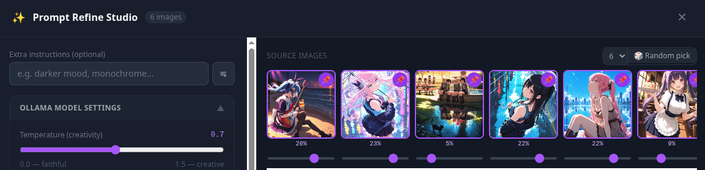
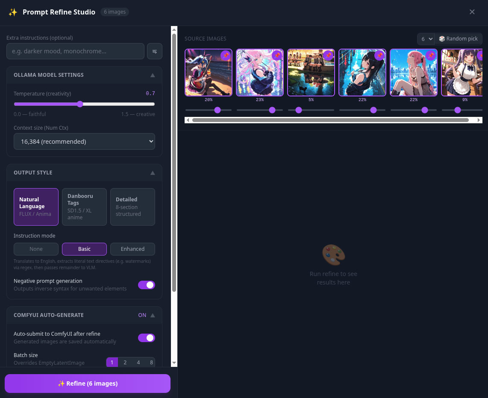
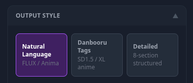
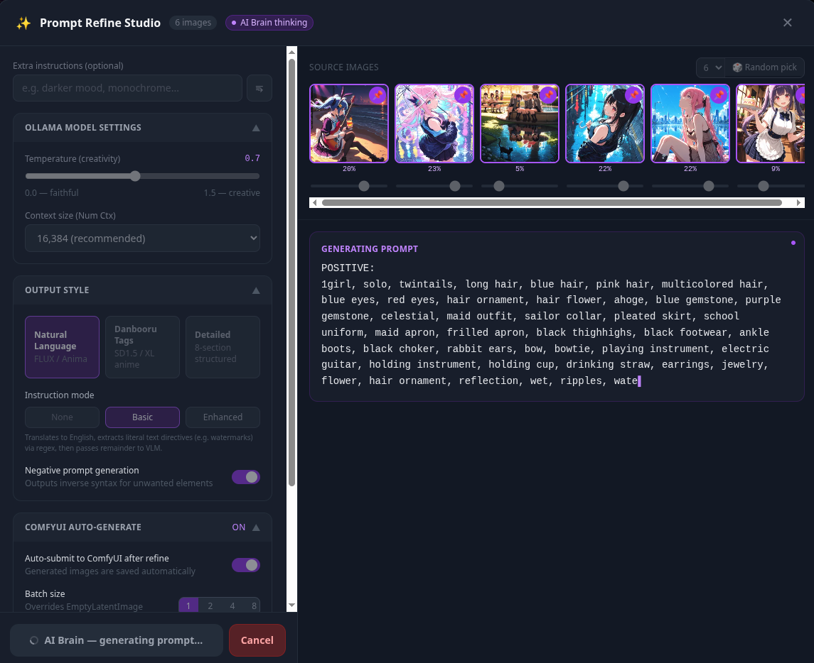
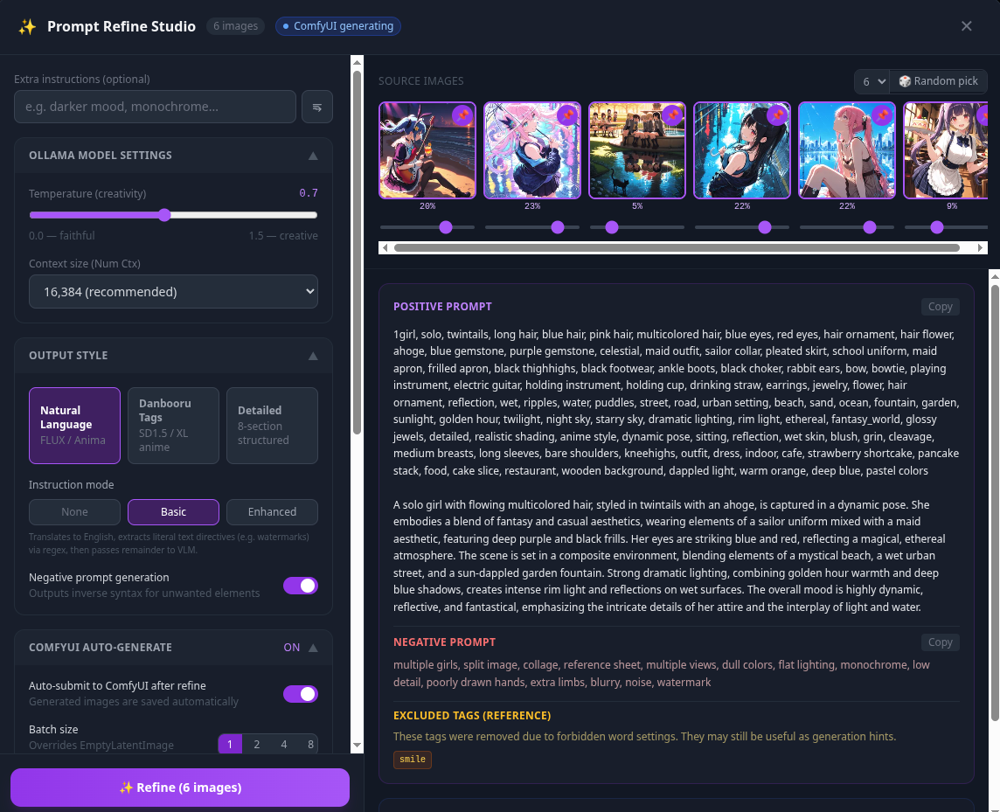

# Prompt Alchemy — Technical Reference

**Ranbell Image v0.2.0**

This document covers the technical design of the Prompt Alchemy feature: how image generation prompts are produced from reference images, and how Danbooru tags and natural-language prompts are processed internally.

---

## Table of Contents

1. [System Architecture](#1-system-architecture)
2. [How Alchemy Works — Reading a Reference Image in Three Layers](#2-how-alchemy-works--reading-a-reference-image-in-three-layers)
3. [Technology Quick-Reference](#3-technology-quick-reference)
4. [VLM Alchemy Flow — Step-by-Step](#4-vlm-alchemy-flow--step-by-step)
   - [Step 1: Load Reference Images](#step-1-load-reference-images)
   - [Step 2: WD14 Tag Score Classification](#step-2-wd14-tag-score-classification)
   - [Step 3: Influence Weight Normalization](#step-3-influence-weight-normalization)
   - [Step 4: Tile Image Composition](#step-4-tile-image-composition)
   - [Step 5: Instruction Pre-processing (instruction_mode)](#step-5-instruction-pre-processing-instruction_mode)
   - [Step 6: VLM Prompt Construction](#step-6-vlm-prompt-construction)
   - [Step 7: Ollama Streaming Generation](#step-7-ollama-streaming-generation)
   - [Step 8: Text Post-processing Pipeline](#step-8-text-post-processing-pipeline)
5. [Prompt Styles in Detail](#5-prompt-styles-in-detail)
   - [natural style](#natural-style)
   - [danbooru style](#danbooru-style)
   - [detailed style](#detailed-style)
6. [Direct Bypass](#6-direct-bypass)
7. [Spooler Integration and Job Management](#7-spooler-integration-and-job-management)
8. [Frontend Implementation](#8-frontend-implementation)
9. [Inspiration Integration](#9-inspiration-integration)
10. [Data Model Reference](#10-data-model-reference)
11. [Completing the Creative Cycle](#11-completing-the-creative-cycle)

---

## 1. System Architecture

A high-level view of the architecture makes the detailed processing easier to follow.

### 1.1 Overall Flow

```
App.vue (Frontend)
    │
    │  POST /api/ai/refine               ① Submit job
    │  GET  /api/ai/refine/{id}/stream   ② Connect SSE stream
    ▼
api/ai.py (FastAPI)
    │
    ├── spooler.submit(JobLane.PROMPT, run_refine_prompt)
    │   └── refine_token_queues[job_id] = asyncio.Queue()
    │
    ▼
jobs/runners.py :: run_refine_prompt()   ← actual processing (Spooler worker)
    ├── db.get() × up to 6 images        fetch image metadata
    ├── WD14 score classification
    ├── _resolve_weights()               weight normalization
    ├── create_tile_image()              tile image composition
    ├── instruction pre-processing (instruction_mode)
    ├── _build_vlm_prompt()              VLM prompt construction
    ├── ollama.generate_vlm_stream()     streaming generation
    ├── text post-processing pipeline
    └── token_queue.put(event)           emit to SSE queue

    ↑↓ asyncio.Queue (token_queue)

api/ai.py :: refine_stream()             ← SSE handler
    └── token_queue.get() → SSE → browser
```

### 1.2 Two-Stage API Design

Alchemy is split across two endpoints: **submit** and **stream**.

| Endpoint | Method | Purpose |
|----------|--------|---------|
| `/api/ai/refine` | POST | Submit job to the PROMPT lane and return `job_id` |
| `/api/ai/refine/{job_id}/stream` | GET | Stream tokens via **SSE** |

This separation keeps job submission and stream connection independent, making reconnection and cancellation straightforward.

### 1.3 token_queue Bridge

```
Spooler worker (run_refine_prompt)       FastAPI handler (refine_stream)
              │                                       │
              │ token_queue.put_nowait(event)         │
              ├───────────────────────────────────────▶ queue.get() → SSE
              │ token_queue.put_nowait(None)           │
              └───────────────────────────────────────▶ None received → stream end
```

`refine_token_queues[job_id]` ensures that multiple concurrent alchemy jobs each maintain their own independent queue.

---

## 2. How Alchemy Works — Reading a Reference Image in Three Layers

### 2.1 The Gap Between "Seeing" and "Creating"

When you want to generate a new image from a reference, the intent — "I want to recreate this mood" — exists clearly in your mind. Translating that into the language an image generation model understands (a prompt) is surprisingly difficult and time-consuming.

Prompt Alchemy is the feature that delegates this translation to AI on your behalf.

### 2.2 Three-Layer Reading of Reference Images

Rather than reading a reference image in a single pass, alchemy interprets it as **three distinct layers**.

```
Layer 1: Pixel-level visual understanding (handled by VLM)
  ─────────────────────────────────────────────────────────
  The VLM (Vision Language Model) looks directly at the image
  and puts composition, color tone, subject, style, and
  atmosphere into words — the closest approximation to
  "what a human sees and feels."

Layer 2: Semantic element tag decomposition (handled by WD14)
  ─────────────────────────────────────────────────────────
  The WD14 tagger assigns a confidence score to each tag.
  High-score tags = essential elements of the image (features to preserve)
  Low-score tags  = contextual elements (supplementary atmosphere)

Layer 3: Relative importance expression (handled by weights)
  ─────────────────────────────────────────────────────────
  The user specifies how strongly each image should be reflected.
  Even visually similar images may have different creative priorities.
```

By combining all three layers before passing them to the VLM, the system produces a prompt that reflects the user's **creative intent**, not just a description of the images.

### 2.3 Visual Integration via Tile Image Composition

Multiple reference images are not passed to the VLM individually. They are first composited into a single tile image — a mood board — and passed as one.

```
Individual pass (not used):
  VLM → analyzes "image 1 is like this, image 2 is like this" separately
  → no integration, relationships invisible

Tile composition (used):
  Multiple images arranged as a single mood board
  → VLM reads "overall atmosphere, dominant/subordinate relationships,
    shared elements" holistically
  → prompt naturally reflects the semantic relationships between images
```

### 2.4 Division of Roles with the Inspiration Feature

| Feature | Phase | Input | Output |
|---------|-------|-------|--------|
| **Inspiration** | Discovery | Collection (existing images) | Finding reference images worth using |
| **Prompt Alchemy** | Generation | 1–6 reference images | Image generation prompt |

---

## 3. Technology Quick-Reference

### Operation Path × Technology Matrix

| Operation Path | Tile Composition | WD14 Score Weighting | Influence Weights | Instruction Pre-proc | VLM Generation | SSE Stream | Markdown Removal | Prose Check | Forced Tag Removal | ComfyUI Auto-submit | Spooler |
|----------------|:---:|:---:|:---:|:---:|:---:|:---:|:---:|:---:|:---:|:---:|:---:|
| 🔮 VLM Alchemy (normal) | ● | ● | ● | ● | ● | ● | ● | ◐ | ● | ◐ | ● |
| ⚡ Direct Bypass | — | — | — | — | — | — | — | — | — | ◐ | ● |

● = core technology　◐ = conditionally used　— = not used

### Complexity / AI Dependency Classification

```
Direct Bypass (ultra-fast, deterministic)
  └── ⚡ Bypass  ← no VLM, prompt forwarded as-is

VLM Integration (slow, non-deterministic, high expressiveness)
  └── 🔮 VLM Alchemy  ← tile composition → VLM generation → text analysis

Automated Pipeline (longest flow)
  └── 🔮 + auto_submit  ← alchemy through ComfyUI generation in one pass
```

---

## 4. VLM Alchemy Flow — Step-by-Step

The implementation core is `run_refine_prompt()` in `backend/app/jobs/runners.py` (lines 781–1012). The following walks through each step in order.

### Step 1: Load Reference Images

```python
# runners.py:858-884
for idx, sha256 in enumerate(body.sha256s[:6]):      # up to 6 images
    doc = await db.get(sha256)
    if not doc:
        continue
    lines: list[str] = []
    prompt_txt = doc.get("positive_prompt", "")
    if prompt_txt:
        lines.append(f"Prompt: {prompt_txt}")         # include existing prompt as context
    wd14 = doc.get("wd14_tags", [])
    wd14_scores = doc.get("wd14_tags_scores", [])
    ...
    fp = Path(doc.get("path", ""))
    if fp.exists():
        image_bytes_list.append(fp.read_bytes())       # collect image bytes
```

Fields retrieved from each image document:
- `positive_prompt` — existing generation prompt (if any)
- `wd14_tags` — list of WD14 tag strings
- `wd14_tags_scores` — confidence score per tag (0.0–1.0)
- `path` — path to the image file

---

### Step 2: WD14 Tag Score Classification

Confidence scores from the WD14 tagger are used to classify tags into two tiers.

| Score range | Treatment | VLM prompt text |
|-------------|-----------|-----------------|
| ≥ 0.70 | **Must-include tags** (`must_tags`) | `Must include these tags verbatim: tag1, tag2, ...` |
| < 0.70 | **Reference tags** (`reference_tags`) | `Reference tags: tag1, tag2, ...` (top 30) |

```python
# runners.py:869-879 (threshold constant = 0.70)
scored_pairs = list(zip(wd14, wd14_scores))
must_tags = [t for t, s in scored_pairs if s >= _WD14_MUST_INCLUDE_THRESHOLD]
if must_tags:
    lines.append(f"Must include these tags verbatim: {', '.join(must_tags)}")
remaining = [t for t, s in scored_pairs if s < _WD14_MUST_INCLUDE_THRESHOLD]
if remaining:
    lines.append(f"Reference tags: {', '.join(remaining[:30])}")
```

**Why split into two tiers?**

High-score tags are the essential elements that define the image, so they get a strong `verbatim` directive. Low-score tags represent context and atmosphere, so they are passed as reference information the VLM can interpret flexibly. This distinction is the key to producing prompts that preserve the "core" of the reference image while also capturing its "atmosphere."

> **Note on WD14 tag format**
> WD14 outputs Danbooru-style tags (`blue_hair`, `1girl`, etc.), but Ranbell Image's pipeline (`wd14.py`) converts underscores to spaces before storing them (`blue_hair` → `blue hair`). Tags passed to the VLM therefore approximate space-separated natural language.

---

### Step 3: Influence Weight Normalization

```python
# api/ai.py:539-548
def _resolve_weights(sha256s: list[str], raw_weights: list[float]) -> list[float]:
    n = len(sha256s)
    if not raw_weights or len(raw_weights) != n:
        return [1.0 / n] * n        # default: equal distribution
    total = sum(raw_weights)
    if total <= 0:
        return [1.0 / n] * n
    return [w / total for w in raw_weights]   # normalize so sum equals 1.0
```

Normalized weights are converted to percentages and annotated explicitly in the context string.

```python
# runners.py:899-903
for part_idx, (ctx, img_idx) in enumerate(zip(context_parts, loaded_indices)):
    pct = round(weights[img_idx] * 100)
    annotated_parts.append(f"[Image {part_idx + 1} — influence weight: {pct}%]\n{ctx}")
context = "\n\n---\n\n".join(annotated_parts)
```

Example context received by the VLM:

```
[Image 1 — influence weight: 60%]
Prompt: 1girl, long hair, school uniform
Must include these tags verbatim: 1girl, long hair, smile
Reference tags: school uniform, outdoor, cherry blossoms

---

[Image 2 — influence weight: 40%]
Must include these tags verbatim: sunset, warm lighting
Reference tags: cloud, horizon, golden hour
```

---

### Step 4: Tile Image Composition

`create_tile_image()` in `backend/app/ai/tile_image.py` merges multiple images into a single mood board.

**Grid layout calculation:**

| Count | Grid | Cell size (max 1024px) |
|-------|------|----------------------|
| 1 image | 1×1 | 1024×1024 |
| 2 images | 2×1 | 512×1024 |
| 3–4 images | 2×2 | 512×512 |
| 5–6 images | 3×2 | 341×512 |

**Implementation:**

```python
# tile_image.py
def create_tile_image(image_bytes_list: list[bytes], max_size: int = 1024) -> bytes:
    cols, rows = _compute_grid(len(image_bytes_list))
    cell_w = max_size // cols
    cell_h = max_size // rows
    canvas = Image.new("RGB", (cols * cell_w, rows * cell_h), (0, 0, 0))

    for i, img_bytes in enumerate(image_bytes_list[: cols * rows]):
        img = Image.open(io.BytesIO(img_bytes)).convert("RGB")
        img.thumbnail((cell_w, cell_h), Image.LANCZOS)     # resize preserving aspect ratio
        col = i % cols
        row = i // cols
        x = col * cell_w + (cell_w - img.width) // 2       # center within cell
        y = row * cell_h + (cell_h - img.height) // 2
        canvas.paste(img, (x, y))

    buf = io.BytesIO()
    canvas.save(buf, format="JPEG", quality=85)             # JPEG quality=85
    return buf.getvalue()
```

Because the VLM receives all images as a single frame, it can naturally infer **relationships between images** — "the composition of image A resonates with the color palette of image B," "image C's style is dominant" — in a way that separately analyzing and summing results cannot achieve.



---

### Step 5: Instruction Pre-processing (instruction_mode)

Additional instructions the user enters (e.g., in Japanese) go through pre-processing determined by `instruction_mode` before being passed to the VLM.

#### Three modes

```
none:
  instruction ──────────────────────────────────────▶ VLM (no transformation)

basic:
  instruction → _translate_instruction()             translate to English
               → _extract_literal_directives()       extract literal text (regex)
               → nl_instruction ──────────────────▶ VLM
               → literals ───────────────────────── injected later

enhanced:
  instruction → _translate_and_classify()            JSON-structured classification
               → nl_instruction ──────────────────▶ VLM
               → literals ───────────────────────── injected later
```

#### basic mode — `_translate_instruction()`

Calls the text LLM at temperature 0.1 (low temperature = precise translation) to translate the instruction into English.

```python
_TRANSLATE_PROMPT = (
    "Translate the following image generation instruction to English.\n"
    "If already in English, return it unchanged.\n"
    "Return ONLY the translated text, no explanation, no quotes.\n\n"
    "Instruction: {instruction}"
)
```

After translation, `_extract_literal_directives()` uses a regular expression to extract **literal text directives** — instructions to render specific text within the image.

```python
_LITERAL_TEXT_RE = re.compile(
    r"""(?:add|insert|put|place|show|write|display|include|render)\s+
        (?:the\s+)?(?:text|word|words|label|watermark|title|string|letters?|caption)\s+
        ['"""「]
        (?P<text>[^'""」]+)
        ['"""」]
        (?:[\s,]*(?:at|on|in|to)\s+
           (?P<position>top|bottom|left|right|center|upper|lower|above|below)
        )?""",
    re.IGNORECASE | re.VERBOSE,
)
```

**Example — extraction and injection of literal text:**

```
Input instruction (Japanese): 「RANBELL という文字を上部に追加して」
     ↓ _translate_instruction()
English: "Add the text 'RANBELL' at the top"
     ↓ _extract_literal_directives()
literals = [{"type": "literal_text", "text": "RANBELL", "position": "top"}]
nl_instruction = ""  ← literal portion removed

(injected in post-processing step)
     ↓ _inject_literal_directives()
final positive: 'text "RANBELL", top_text, text_on_image, 1girl, long_hair, ...'
```

Position keyword mapping:

| Input keyword | Output tag |
|---------------|------------|
| top / upper / above | `top_text` |
| bottom / lower / below | `bottom_text` |
| left / right / center | `overlay_text` |

**Why bypass the VLM for this?**

Asking a VLM to render a specific string precisely in an image is notoriously unreliable — the VLM may reinterpret or transform the text. By extracting the literal text before the VLM sees it and injecting it directly into the prompt afterward, the system guarantees string accuracy.

#### enhanced mode — `_translate_and_classify()`

Rather than just translating, this mode also classifies the intent type in JSON format.

```python
_TRANSLATE_AND_CLASSIFY_PROMPT = """\
...
Directive types:
- "literal_text": text string to appear verbatim in the image
- "style_change": artistic or rendering style modification
- "concept_add": adding a visual element or atmosphere
- "concept_remove": removing an element
- "composition": framing, angle, or layout change

Return JSON:
{
  "instruction_en": "full translated instruction",
  "literals": [{"type": "literal_text", "text": "...", "position": "top|bottom|center|left|right"}],
  "nl_instruction": "translated instruction with literals removed, for VLM"
}"""
```

The JSON block is extracted from the LLM output and parsed. If parsing fails, the system falls back to the original instruction.

---

### Step 6: VLM Prompt Construction

`_build_vlm_prompt()` assembles style directives, metadata context, and user instruction into a single VLM prompt.

```python
# api/ai.py:190-234
def _build_vlm_prompt(
    context: str,
    instruction: str,
    prompt_style: str,
    with_negative: bool,
    instruction_framing: bool = False,
) -> str:
    style_instr = _STYLE_INSTRUCTIONS.get(prompt_style, _STYLE_INSTRUCTIONS["natural"])
    neg_instr = _NEGATIVE_INSTRUCTION if with_negative else "Output the positive prompt only..."

    if instruction:
        if instruction_framing:           # when instruction_mode != "none"
            instr_block = (
                "[PROMPT ENGINEERING DIRECTIVE — NOT NARRATIVE CONTENT]\n"
                "Apply the following as a structural modification to the output prompt.\n"
                "DO NOT incorporate it as scene description...\n\n"
                f"Directive: {instruction}"
            )
        else:
            instr_block = instruction     # none mode: pass through as-is
    else:
        instr_block = "Create a refined, high-quality image generation prompt."

    return (
        "You are an expert image generation prompt engineer.\n"
        "...\n\n"
        f"[Style directive]\n{style_instr}\n\n"
        f"[Reference metadata]\n{context}\n\n"
        f"[User instruction]\n{instr_block}"
        f"{neg_instr}"
    )
```

**Why wrap with `[PROMPT ENGINEERING DIRECTIVE]`?**

When `instruction_mode` is `basic` or `enhanced`, the directive is wrapped in `[PROMPT ENGINEERING DIRECTIVE — NOT NARRATIVE CONTENT]`. This prevents the VLM from misinterpreting the user's instruction as scene description. For example, without this framing, "add some text" could lead the VLM to generate a character holding a prop with text written on it rather than rendering text in the image.

**Full VLM prompt structure:**

```
You are an expert image generation prompt engineer.
[role declaration as prompt engineer]
[UNIFIED COMPOSITION MANDATE: merge multiple images into one scene]

[Style directive]
{detailed style-specific instructions (natural / danbooru / detailed)}

[Reference metadata]
[Image 1 — influence weight: 60%]
Prompt: ...
Must include these tags verbatim: ...
Reference tags: ...

---

[Image 2 — influence weight: 40%]
...

[User instruction]
[PROMPT ENGINEERING DIRECTIVE]
Directive: {pre-processed instruction}

{positive/negative separation directive}
```

---

### Step 7: Ollama Streaming Generation

The constructed prompt and tile image are sent to the local VLM (Ollama), and tokens are received as a stream.

```python
# runners.py:930-947
async for event in ollama.generate_vlm_stream(
    vlm_prompt, images_for_vlm, model=cfg["vlm_model"], options=options
):
    if _abort.is_set():
        raise JobCancelled()
    _put(event)                              # emit to SSE queue incrementally
    if event["type"] == "token":
        accumulated_tokens.append(event["text"])
```

`options` are passed from `RefineRequest`:
- `temperature`: 0.7 (default) — balance between creativity and reproducibility
- `num_ctx`: 16384 (default) — context window size (handles long prompts)

Cancellation is detected via the `_abort` asyncio.Event. `cancel.on_cancel(_abort.set)` links it to the Spooler's cancel signal; `JobCancelled` is raised on the next loop iteration.

---

### Step 8: Text Post-processing Pipeline

The raw VLM output (`raw_text`) is cleaned by a post-processing pipeline that varies by prompt style.

#### Style-specific post-processing branches

```python
# runners.py:952-984
if body.prompt_style == "detailed":
    if body.negative_prompt:
        parsed = _parse_detailed_output(raw_text)
        positive = _clean_markdown(parsed or _parse_positive_negative(raw_text)[0])
        neg_m = re.search(r"NEGATIVE:\s*(.*?)$", raw_text, re.S | re.I)
        negative = _clean_markdown(neg_m.group(1).strip()) if neg_m else ""
    else:
        raw_stripped = _strip_stray_negative(raw_text)
        parsed = _parse_detailed_output(raw_stripped)
        positive = _clean_markdown(parsed if parsed else raw_stripped)
        negative = ""

elif body.negative_prompt:
    positive_raw, negative_raw = _parse_positive_negative(raw_text)
    positive = _clean_markdown(positive_raw)
    negative = _clean_markdown(negative_raw)
else:
    positive = _clean_markdown(_strip_stray_negative(raw_text))
    negative = ""
```

#### Post-processing function overview

| Function | Purpose | Example |
|----------|---------|---------|
| `_parse_detailed_output()` | Parse 8-section structure and flatten | `**Core Subject:** ...` → extract section content only |
| `_parse_positive_negative()` | Split `POSITIVE:` / `NEGATIVE:` sections | Used when negative prompt is requested |
| `_clean_markdown()` | Remove Markdown symbols and label lines | `**bold**` → `bold`, `## Header` → deleted |
| `_strip_stray_negative()` | Remove unintended negative sections | Delete `NEGATIVE: blurry, ...` when generated spontaneously |
| `_remove_forced_tags()` | Remove admin-configured banned tags | `explicit, 1girl, ...` → `1girl, ...` |
| `_inject_literal_directives()` | Prepend literal text tags | `text "RANBELL", top_text, text_on_image, 1girl, ...` |
| `_check_natural_prose()` | Verify prose block presence for natural style | Returns `prose_missing=true` if no prose found |

#### Patterns processed by `_clean_markdown()`

```
**bold text**      →  bold text       (remove bold)
*italic*           →  italic          (remove italic)
## Header text     →  (line deleted)  (remove ATX headers)
Tags:              →  (line deleted)  (remove label lines)
Positive Prompt:   →  (line deleted)
--- boundary ---   →  (line deleted)  (remove dividers)
3+ blank lines     →  collapsed to 2 lines
```

Generation models tend to add Markdown symbols and label lines. This post-processing step is necessary to produce output that is simultaneously "creatively strong" and "appropriate as input to a generation model."

#### Detection logic in `_check_natural_prose()`

For the natural style, a prose paragraph is expected after the tag block. A trailing block is considered "prose" if all of the following conditions are met:

```python
blocks = re.split(r"\n{2,}", text.strip())     # split on blank lines
prose_candidate = blocks[-1]                    # candidate: last block
words = prose_candidate.split()
comma_density = prose_candidate.count(",") / max(len(words), 1)
avg_word_len = sum(len(w.strip(".,;:")) for w in words) / max(len(words), 1)

return (
    len(blocks) >= 2          # at least 2 blocks
    and len(words) >= 15      # at least 15 words
    and comma_density < 0.25  # comma density < 0.25 (tag lists have high density, so they're excluded)
    and avg_word_len > 4.0    # average word length > 4.0 chars (words are longer than tags)
)
```

#### How `_remove_forced_tags()` works

Tags are removed from the positive prompt based on the `prompt_removal_tags` list configured in the admin panel. Spaces and underscores are treated as equivalent (`blue hair` and `blue_hair` are recognized as the same tag).

- `all_lines=False` (natural / danbooru style): only the first non-empty line is processed (prose blocks are left unchanged)
- `all_lines=True` (detailed style): all lines are processed (all section content is targeted)

---

## 5. Prompt Styles in Detail

### natural style

**Target models**: FLUX, Anima, and other next-generation models

**Output format**:

```
[BLOCK 1 — tag line (40–60 tags, single line)]
1girl, long hair, auburn hair, blue eyes, smile, school uniform, sailor collar,
outdoor, cherry blossoms, warm lighting, golden hour, bokeh, masterpiece, ...

[blank line]

[BLOCK 2 — prose paragraph (80–120 words)]
A young girl with flowing auburn hair stands in warm afternoon sunlight,
her navy school uniform catching the golden hour glow. The soft bokeh of a
blossoming cherry garden frames her gentle smile, while dappled light filters
through pink petals falling around her. The scene carries a tender, nostalgic
quality, with rich amber tones and soft shadows that evoke a quiet spring afternoon.
```

**Key VLM directives (summary)**:
- Output exactly **2 blocks** separated by a blank line
- BLOCK 1: 40–60 Danbooru-style tags
- BLOCK 2: natural English prose, 80–120 words
- Include quality tags such as `masterpiece`, `best_quality`
- No Markdown symbols or label lines whatsoever
- Start directly with `1girl, ...` (no preamble)

---

### danbooru style

**Target models**: Stable Diffusion family

**Output format**:

```
1girl, solo, long_hair, auburn_hair, blue_eyes, tareme, smile, blush,
school_uniform, sailor_collar, white_shirt, pleated_skirt, knee_socks,
outdoor, cherry_blossoms, tree, petals, warm_lighting, golden_hour,
bokeh, depth_of_field, masterpiece, best_quality, ultra-detailed, ...
```

**Key VLM directives (summary)**:
- Flat comma-separated tag list of 80–120 tags
- Cover all categories: SUBJECT, HAIR, EYES, FACE, BODY, CLOTHING, ACCESSORIES, FOOTWEAR, POSE, COMPOSITION, BACKGROUND, LIGHTING, ATMOSPHERE, ART STYLE, QUALITY
- Prefer specific tags over generic ones (`thighhighs` over `socks`)
- **Banned tags** (those implying multi-panel layouts): `multiple_views`, `reference_sheet`, `character_sheet`, `split_image`, `collage`, `comparison`, `before_and_after`, `diptych`, `triptych`
- No category labels or line breaks in output

---

### detailed style

**Target models**: Models accepting structured prompts, or prompt-editing tools

**Output format** (8-section Markdown structure):

```markdown
**Core Subject & Scene Setting:** A young female student in a sun-drenched cherry blossom
garden, evoking a nostalgic spring afternoon.

**Characters & Composition:** 1girl, long flowing auburn hair, blue tareme eyes, gentle
smile, blush; school uniform with sailor collar; full body, cowboy shot, from slightly
below, bloom framing

**Lighting & Atmosphere:** Golden hour warm side lighting, soft amber cast, gentle bokeh
background, dappled sunlight through branches, light rim highlight on hair

**Style & Artistic Influence:** Anime illustration, digital art, cel-shading with soft
painterly finish, inspired by key visual art style

**Details & Textures:** Smooth skin with subtle shading, fabric wrinkle on collar and
skirt hem, individual petal rendering, hair strands with soft sheen

**Color Palette:** Dominant warm amber and navy blue; accent soft pink petals; pastel
highlights; warm overall tone

**Camera & Lens Effects:** 85mm portrait lens effect, medium depth of field, soft bokeh
background, slight lens flare at frame edge

**Refinements & Modifiers:** masterpiece, best_quality, ultra-detailed, highres, sharp
focus, volumetric lighting, hyperdetailed, professional illustration
```

**Parsing — three-stage fallback in `_parse_detailed_output()`**

Because the VLM may not always follow the Markdown format perfectly, three fallback stages are provided.

```
Stage 1: bold format  **Header:** content
  → re.findall(r"\*\*[^*]+\*\*[:\s]*(.*?)(?=\*\*|\Z)", text, re.S)
  → Most reliable. Used when the VLM follows the instructions correctly.

Stage 2: line scan (inline header handling)
  → is_header_re: detect lines starting with keywords "Core Subject", "Characters", "Lighting", etc.
  → extract_inline_re: extract content when present inline as "Core Subject: content"
  → collect content up to the next header line as a section
  → stop immediately on a POSITIVE: / NEGATIVE: label line

Stage 3: no fallback → runners.py uses raw_stripped as-is
```

**8-section header keywords** (`_DETAILED_SECTION_HEADERS`):

| Keyword | Corresponding section |
|---------|----------------------|
| Core Subject | Core Subject & Scene Setting |
| Characters | Characters & Composition |
| Lighting | Lighting & Atmosphere |
| Style | Style & Artistic Influence |
| Details | Details & Textures |
| Color Palette | Color Palette |
| Camera | Camera & Lens Effects |
| Refinements | Refinements & Modifiers |

---

## 6. Direct Bypass

### Concept

When `RefineRequest.direct_prompt` is not `None`, the entire VLM processing is skipped and a completion event is emitted directly.

```python
# runners.py:832-849
if body.direct_prompt is not None:
    positive = body.direct_prompt.strip()
    negative = (body.direct_negative_prompt or "").strip()
    _put({"type": "done", "positive": positive, "negative": negative,
           "auto_submit": body.auto_submit, "prose_missing": False})
    if body.auto_submit and body.workflow_name:
        gen_job_id = _submit_gen_direct(...)
        _put({"type": "comfy_job_id", "job_id": gen_job_id})
    _put(None)
    return
```

### Primary use cases

| Source | `direct_prompt` content | `source` value |
|--------|------------------------|----------------|
| Inversion (tags) | `inversion_tags` (Danbooru tag string) | `'inversion-tags'` |
| Inversion (prose) | `inversion_prose` (natural language text) | `'inversion-prose'` |
| Re-run from history | Prompt from previous generation | `'history'` |

### Why is a bypass needed?

The "concept-inverted prompt" produced by inversion mode is already a high-quality prompt designed across three stages by the VLM. Passing it through the VLM again would not improve quality. Direct Bypass lets an existing prompt connect instantly to the ComfyUI generation pipeline without paying VLM inference costs.

---

## 7. Spooler Integration and Job Management

### 7.1 JobLane.PROMPT

Alchemy processing runs in a dedicated `PROMPT` lane.

| Lane | Purpose | Relation to alchemy |
|------|---------|---------------------|
| `embed` | AI pipeline (WD14 / embeddings) | — |
| `prompt` | **Prompt alchemy** | ← runs here |
| `gen` | ComfyUI image generation | chained when `auto_submit` |
| `eval` | Alignment evaluation | — |
| `sync` | Sync processing | — |

Each lane has an independent queue, so inspiration search in one tab can run concurrently with alchemy in another.

### 7.2 Job Chaining (auto_submit)

```
[1] PROMPT lane job (run_refine_prompt)
    └── Generate prompt with VLM (SSE streaming)
    └── On completion → if auto_submit=true and workflow_name is set...

[2] GENERATION lane job (run_generation)
    └── Submitted immediately via _submit_gen_direct()
    └── ComfyUI executes workflow → saves image → registers to collection
```

### 7.3 Cancellation Detection

When the browser disconnects:

```python
# SSE handler side
if await request.is_disconnected():
    await request.app.state.spooler.cancel(job_id)
    break

# Runner side (inside Ollama stream loop)
cancel.on_cancel(_abort.set)
...
if _abort.is_set():
    raise JobCancelled()
```

---

## 8. Frontend Implementation

### 8.1 UI Layout



```
Alchemy overlay (z-index: 65, full-screen modal)
├── Header
│   ├── Title + reference image count badge
│   └── Phase badge (LLM running / ComfyUI running / done)
│
├── Left pane (420px fixed width)
│   ├── Direct banner (shown only when inversion integration is active)
│   ├── Additional instruction text input (instruction)
│   ├── Settings panel
│   │   ├── Style selector (natural / danbooru / detailed)
│   │   ├── Instruction mode selector (none / basic / enhanced)
│   │   ├── Negative prompt toggle
│   │   ├── Temperature slider (0.0–2.0)
│   │   └── Context size setting (num_ctx)
│   ├── Run button / Stop button
│   └── Generation result text areas (positive / negative)
│
└── Right pane (remaining width)
    ├── Reference image slots (up to 6, with weight sliders)
    ├── Random fill button
    ├── Streaming preview (during alchemy)
    └── ComfyUI generated image preview
```



### 8.2 Phase Transitions

```
[openRefine()]
    └── refinePhase = ''

[runRefine() starts]
    └── POST /api/ai/refine → receive job_id
    └── refinePhase = 'llm'

[SSE stream receiving]
    ├── type: token      → append to streamingText (real-time preview)
    ├── type: done       → store in positivePrompt / negativePromptText
    │                      if auto_submit → refinePhase = 'comfy'
    │                      otherwise     → refinePhase = 'done'
    └── type: comfy_job_id → record in refineGenJobId

[ComfyUI job complete]
    └── refinePhase = 'done'
    └── add sha256 to comfyGeneratedImages
```





### 8.3 Influence Weight Management

A slider (0–100) is shown for each image slot. Values are normalized to 100% total before being sent to the backend.

```javascript
function normalizedPct(sha) {
    return Math.round(
        ((imageWeights.value.get(sha) ?? 0) / weightTotal.value) * 100
    )
}

// When sending the request
weights: orderedShas.map(s => normalizedPct(s) / 100)   // convert to 0.0–1.0
```

The backend's `_resolve_weights()` falls back to equal distribution when the total is zero or below.

### 8.4 SSE Stream Processing

```javascript
// Step 1: Submit job
const { job_id } = await fetch('/api/ai/refine', {
    method: 'POST',
    headers: { 'Content-Type': 'application/json' },
    body: JSON.stringify(requestBody)
}).then(r => r.json())

// Step 2: Connect SSE stream
const streamRes = await fetch(`/api/ai/refine/${job_id}/stream`)
const reader = streamRes.body.getReader()
let buffer = ''
while (true) {
    const { done, value } = await reader.read()
    if (done) break
    buffer += decoder.decode(value, { stream: true })
    const lines = buffer.split('\n')
    buffer = lines.pop() ?? ''
    for (const line of lines) {
        if (!line.startsWith('data: ')) continue
        handleRefineEvent(JSON.parse(line.slice(6)))    // strip the 6-char "data: " prefix
    }
}
```

---

## 9. Inspiration Integration

### 9.1 Integration Flow

```
InspirePanel.vue
    │
    ├── @send-to-refine        normal integration (alchemy via VLM)
    └── @send-to-refine-direct direct integration (bypass VLM)
    ▼
App.vue (handleSendToRefine / handleSendToRefineDirect)
    ├── update selectedIds / pinnedShas with exploration results
    ├── store inspire_context in refineInspireContext
    ├── auto-set refineStyle to 'danbooru'
    └── openRefine()
```

### 9.2 Normal Integration (`@send-to-refine`)

The standard flow for sending images from the brainstorm feature or inspire results to the alchemy studio.

```javascript
function handleSendToRefine({ shas, text, inspireContext = null }) {
    selectedIds.value = new Set(shas)
    pinnedShas.value = new Set(shas)
    refineInstruction.value = text         // brainstorm scene suggestion text, etc.
    refineDirectPrompt.value = null        // generate via VLM
    refineInspireContext.value = inspireContext
    refineStyle.value = 'danbooru'
    openRefine()
}
```

### 9.3 Direct Integration (`@send-to-refine-direct`)

Directly forwards inversion-mode tags or prose via bypass.

```javascript
function handleSendToRefineDirect({ shas, directPrompt, directNegativePrompt, source, inspireContext }) {
    refineDirectPrompt.value = directPrompt                 // skip VLM
    refineDirectNegativePrompt.value = directNegativePrompt
    refineDirectPromptSource.value = source                 // 'inversion-tags' | 'inversion-prose'
    refineInspireContext.value = inspireContext
    refineStyle.value = 'danbooru'
    openRefine()
}
```

### 9.4 inspire_context Persistence

Images that complete the alchemy → generation pipeline have metadata saved as a `creation_record`. This allows tracing back which inspire mode was used to discover the original images.

```json
{
  "creation_record": {
    "method": "refine",
    "inspire_context": {
      "mode": "inversion",
      "inversion_tags": ["ruins", "fog", "abandoned"],
      "inversion_negative_tags": ["bright", "cheerful"]
    },
    "prompt": "...",
    "model_name": "...",
    "workflow_name": "..."
  }
}
```

---

## 10. Data Model Reference

### 10.1 RefineRequest (current version)

```python
class RefineRequest(BaseModel):
    sha256s: list[str]                    # reference image hashes (up to 6)
    weights: list[float] = []             # influence weights (pre-normalization; equal if omitted)
    instruction: str = ""                 # additional instruction (multi-language)
    instruction_mode: Literal[
        "none",       # no pre-processing; pass instruction through as-is
        "basic",      # translate to English + extract literal text (regex)
        "enhanced",   # translate to English + JSON-structured classification
    ] = "basic"
    temperature: float = 0.7             # VLM temperature (0.0–2.0; higher = more creative)
    num_ctx: int = 16384                 # context window size
    prompt_style: Literal[
        "natural",   # tags + prose (for FLUX / Anima)
        "danbooru",  # flat tag list (for SD)
        "detailed",  # 8-section structure (verbose description)
    ] = "natural"
    negative_prompt: bool = False        # also generate a negative prompt
    auto_submit: bool = False            # auto-submit to ComfyUI on completion
    workflow_name: str = ""              # workflow name for auto_submit
    positive_node_id: str = ""           # ComfyUI node ID (positive)
    negative_node_id: str = ""           # ComfyUI node ID (negative)
    batch_count: int = 1                 # number of images to generate
    direct_prompt: str | None = None     # prompt for direct bypass
    direct_negative_prompt: str | None = None
    inspire_context: dict | None = None  # inspire integration metadata
    use_ref_seed: bool = False           # inherit seed from reference image
```

### 10.2 SSE Event Types

| type | Timing | Key fields |
|------|--------|------------|
| `think` | VLM extended thinking token (when using a compatible model) | `text: str` |
| `token` | Normal generation token (incremental) | `text: str` |
| `done` | Generation complete | `positive`, `negative`, `auto_submit`, `prose_missing`, `removed_tags`, `injected_literals` |
| `comfy_job_id` | ComfyUI job submitted | `job_id: str` |
| `error` | Error occurred | `message: str` |
| `cancelled` | Cancellation complete | — |

**All fields of the `done` event:**

```json
{
  "type": "done",
  "positive": "1girl, long hair, smile, ...\n\nA young girl stands in...",
  "negative": "blurry, low_quality, ...",
  "auto_submit": false,
  "prose_missing": false,
  "removed_tags": ["explicit"],
  "injected_literals": [
    {"type": "literal_text", "text": "RANBELL", "position": "top"}
  ]
}
```

- `prose_missing`: `true` when the natural style produced no prose block
- `removed_tags`: list of tags removed by the `prompt_removal_tags` configuration
- `injected_literals`: list of literal text items extracted and injected via `instruction_mode`

### 10.3 Key Implementation Files

| File | Approx. lines | Purpose |
|------|---------------|---------|
| `backend/app/api/ai.py` | ~754 | RefineRequest, style instruction strings, all helper functions, endpoints |
| `backend/app/jobs/runners.py:781-1012` | 231 | `run_refine_prompt()` core processing |
| `backend/app/ai/tile_image.py` | 42 | Tile image composition (Pillow) |
| `backend/app/ai/wd14.py` | — | WD14 ONNX inference, tag + score output |
| `frontend/src/App.vue:~239-, ~1685-, ~2761-` | — | Full alchemy UI (state management / SSE handling / layout) |
| `backend/app/runtime_config.py` | — | Runtime settings: `prompt_removal_tags`, `vlm_model`, etc. |

---

## 11. Completing the Creative Cycle

### The Role of Prompt Alchemy

If Inspiration handles "what to find within the collection," Alchemy handles "how to shape what was found." Together, these two phases allow Ranbell Image to function as a creative partner rather than a mere organization tool.

```
Collection (existing images)
    │
    ▼  Inspiration (discovery)
  Finding — serendipity / alchemy / inversion / etc.
    │
    ▼  Brainstorm (ideation)
  Ideas — LLM reads WD14 tags and articulates scene proposals
    │
    ▼  Prompt Alchemy (translation)
  Prompt — visual value → generation language (3-layer reading + VLM integration)
    │
    ▼  ComfyUI Generation
  New image
    │
    ▼
  Added to collection → becomes material for the next exploration
```

### Generated Images Enrich the Collection

Every newly generated image is immediately added to the collection. It is placed in semantic space as an embedding vector and becomes material for the next round of inspiration exploration.

Generate images from the collection; those images expand the collection; the expanded collection enables richer exploration — this loop creates a system in which **the creator's visual vocabulary deepens and expands over time**.
